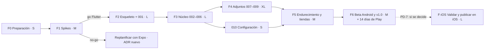

# Plan maestro

> Versión 1.0 · 2026-09-24 · Estado: **planificación cerrada; F0 pendiente**.
> Etiquetas: **[Hecho]**, **[Suposición]** y **[Pendiente]**. Las decisiones D1–D19 salen de la ronda de preguntas con el propietario; los ADR, en `docs/adr/`.

## 1. Resumen

App móvil (iOS + Android) local y sin conexión que muestra **una tarea a la vez** y permite que un único elemento (foto, PDF, web) quede **a pantalla completa nada más abrirla**. Stack provisional: **Flutter** (ADR-0001), a confirmar con pruebas técnicas desechables (spikes, F1). Metodología: SDD con la constitución de `specs/constitution.md`.

## 2. Decisiones cerradas con el propietario

| # | Decisión |
|---|---|
| D1 | No domina TS ni Dart → stack elegido por criterios técnicos |
| D2 | Sin cuentas de Apple Developer ni Google Play todavía → hasta crearlas: simulador, emulador, APK directo y web |
| D3 | Repo **público, todos los derechos reservados** |
| D4 | Web en Vercel **solo para pruebas** |
| D5 | Los documentos van **siempre arriba** (manda R5, no el prototipo) |
| D6 | **PDF dentro** de la tarea; el resto, con el visor del sistema |
| D7 | Eliminar es **definitivo**: sin deshacer y sin "Nada pendiente."; queda una marca de borrado sin contenido (propietario, 2026-09-26; ADR-0011 sustituye a ADR-0006) |
| D8 | Las completadas **conservan el adjunto** |
| D9 | URL: **captura de página completa** para verla sin conexión |
| D10 | Visor: **zoom + pantalla encendida**; sin brillo máximo ni horizontal |
| D11 | Sin biometría en la v1 |
| D12 | Mínimos: **iOS 16 / Android 8 (API 26)** |
| D13 | Menú: **"Configuración"** mínima, sin perfil |
| D14 | Backups del sistema **incluidos** |
| D15 | Bundle ID con un dominio neutro que se comprará → **[Pendiente]** |
| D16 | Código en inglés; documentación en español |
| D17 | **Android primero** (2026-09-24): se desarrolla y valida todo en Android (emulador + web de pruebas) sin instalar Xcode. iOS se aborda al final, en la fase **F-iOS**, y solo si el propietario decide seguir (PD-7). La arquitectura sigue siendo multiplataforma; CI compila iOS sin firmar desde F2 |
| D18 | **PDF de 10 MB como máximo** (2026-09-24). El resto de documentos, 25 MB; las imágenes, 30 MB y 50 MP |
| D19 | **TXT, CSV y MD se muestran dentro de la app** como texto plano, sin interpretar marcado (2026-09-24, resuelve PD-8). Word, Excel, PowerPoint, ODF, RTF e iWork siguen con el visor del sistema |
| — | Skills, plugins y MCP **solo a nivel de proyecto**, revisados antes de instalar y nunca con `-g`/`-y` |

## 3. Fases e hitos

Tamaños relativos: **S** (≈ 1–3 días de trabajo efectivo), **M** (≈ 1 semana), **L** (≈ 2 semanas), **XL** (≈ 3–4 semanas). **[Suposición]** Son estimaciones para una persona con Claude Code; se recalibran tras F2.

| Fase | Contenido | Tamaño | Depende de | Criterio de salida |
|---|---|---|---|---|
| **F0 Preparación** | Liberar espacio ✅; Android Studio + SDK + Command-line Tools + emulador Pixel 6a (API 37) ✅; Flutter fijado en `.fvmrc` e instalado con `tools/install-flutter.sh` (FVM opcional); `gh` (opcional); repo en GitHub ✅ y seguridad activada; conectar Vercel; comprar el dominio neutro; cuenta de Google Play. **Xcode aplazado (D17)** | S | — | `flutter doctor` sin errores para Android y web; repo con CI verde ✅; reglas de rama en `main`; dominio → bundle ID definitivo en ADR |
| **F1 Spikes (Android + web)** | S1 arranque (Android) · S2 animaciones · S3 PDF y visor del sistema (Android: intent) · S4 captura web (Android) · S5 importación y backup (Android) · S6 web + Vercel. Las partes iOS de S1, S3, S4 y S5 pasan a F-iOS (D17). Código **desechable** en `spikes/` (rama propia, no se fusiona). **Requiere aprobación.** | M | F0 | Criterios de ADR-0001 cumplidos en Android → ADR-0001 **Aceptado para Android**, provisional para iOS; si no → ADR de cambio a Expo |
| **F2 Esqueleto + 001** *(✅ completada el 2026-09-25, PR #3)* | `app/` + identidad + l10n + tokens + BD v1 + repositorio + CI + web + la spec 001 completa | L | F1 | CA-001 en verde; arranque p50 < 1 s medido; preview en Vercel por PR |
| **F3 Núcleo** *(en curso: 002, 003 y 005 ✅ 2026-09-25; 004 ✅ 2026-09-26)* | 002 crear y posición → 003 completar → 004 eliminar → 005 menú y editar → 006 listado | L | F2 | CA de 002–006 en verde; *goldens* frente al prototipo aprobados |
| **F4 Adjuntos** | 007 imagen (canal de importación + visor) → 008 documento → 009 URL | XL | F3 | CA de 007–009; revisión de seguridad T-3 a T-6 superada; S4 en producción en ambas plataformas |
| **010** | Idioma y Configuración (tras diseñar la pantalla) | S | F3 (se puede hacer en paralelo con F4) | CA-010 en verde |
| **F5 Endurecimiento** | Auditoría de accesibilidad (VoiceOver, TalkBack, Switch, texto grande), pruebas MASTG, presupuesto de rendimiento y tamaño, política de privacidad, fichas de tienda, capturas, manifiesto de privacidad y Data Safety, iconos | M | F4, 010 | Checklist de publicación completa; 0 hallazgos altos |
| **F6 Beta Android y v1.0** | Play: Internal testing y prueba cerrada con **12 testers durante 14 días** (cuenta personal nueva), corrección de errores, v1.0 en Google Play | M + 14 días | F5 + cuenta de Play | Aprobación en Google Play; feedback de los testers (sin telemetría: formulario o correo) |
| **F-iOS** *(si PD-7 = sí)* | Instalar Xcode; partes iOS de los spikes (S1 arranque < 0,6 s, S3 QuickLook, S4 captura con WKWebView, S5 backup iCloud y Data Protection); ajustes de plataforma (Info.plist, PrivacyInfo.xcprivacy, permisos, splash); tests de integración en simulador; auditoría VoiceOver; cuenta de Apple Developer; TestFlight → App Store | L | F6 (o antes, en paralelo con F5, si se decide) | Criterios iOS de ADR-0001; CA de todas las specs en verde en iOS; aprobación en App Store |

**Camino crítico:** F0 → F1 → F2 → F3 → F4 → F5 → F6 (→ F-iOS si PD-7). **Tareas con plazo propio que conviene adelantar:** la cuenta de Google Play y el reclutamiento de 12 testers (el reloj de 14 días) y la compra del dominio (bloquea la primera subida).

## 4. Orden de implementación dentro de F3/F4 y motivo

1. **002** antes que 003/004: sin varias tareas no se pueden probar completar ni reordenar.
2. **003** antes que **004**: comparten la infraestructura de animación y el estado vacío; completar es más central.
3. **005** después de 004: el menú enlaza con eliminar.
4. **006** cierra el núcleo (depende de todo lo anterior).
5. **007** establece el canal de importación y el visor que reutilizan 008 y 009.
6. **009** al final: mayor riesgo técnico (captura web) y de seguridad.

## 5. Registro de riesgos

Probabilidad (P) e impacto (I): Baja/Media/Alta.

| ID | Riesgo | P | I | Mitigación | Disparador o seguimiento |
|---|---|---|---|---|---|
| R-01 | **Espacio en disco** insuficiente (30 GB libres; **79 GB tras liberar, 2026-09-24**) para Xcode, simuladores, Android y compilaciones | Alta | Alta | Liberar ≥ 60 GB antes de F0; un solo runtime de simulador; limpiar DerivedData y AVD que no se usen | F0 |
| R-02 | Arranque en frío > 1 s en Android de gama media | **Baja** (S1 en gama alta: ~0,25 s, margen ×4) | Alta | Tarea actual antes del primer fotograma (I-1), versión de pantalla JPEG (I-2); medir en gama media con un móvil prestado o en la beta cerrada | F2 o F6 |
| R-03 | Animaciones (arrugar y romper) con tirones | **Baja** (S2: p90 ≈ 4,5 ms a 120 Hz con Vulkan) | Media | Precaptura (I-3); medir en gama media | F3 |
| R-04 | ~~`flutter_inappwebview` sin mantenimiento~~ **Materializado (S4): estable de 2024** | — | — | **Mitigado:** `webview_flutter` oficial + captura nativa propia (ADR-0007) | Cerrado |
| R-05 | Captura de página completa poco fiable en Android | Media | Media | S4; plan B: desplazar y coser o PDF → raster | S4 |
| R-06 | Migraciones de datos que rompen datos reales tras publicar | Baja | Alta | Tests de migración obligatorios desde la v1; *fixtures* de BD reales anonimizadas | Cada cambio de esquema |
| R-07 | **Google Play: 12 testers durante 14 días** retrasa la v1.0 | Alta | Media | Crear la cuenta en F0–F2 y reclutar testers en paralelo | F2 |
| R-08 | Bundle ID sin dominio definitivo | Media | Alta (permanente) | Comprar el dominio en F0; marcador solo en desarrollo; prohibido subir a una tienda con el marcador | F0 |
| R-09 | Curva de aprendizaje de Dart y Flutter del propietario | Alta | Media | CLAUDE.md, specs en español, subagentes revisores, explicaciones en cada PR | Continuo |
| R-10 | **Confirmado (S5):** superar los 25 MB de backup de Android hace que se descarte **toda** la copia | Alta | Alta | `BackupAgent` con presupuesto de 20 MB y prioridades (ADR-0004 revisado); la app tolera adjuntos ausentes | F4 |
| R-11 | Documentos no PDF sin app para abrirlos en Android | Media | Baja | Mensaje claro; D6 revisable | F4 |
| R-12 | Rechazo en App Store (p. ej. por la guideline 4.2 de funcionalidad mínima o por la WebView) | Baja | Media | Funcionalidad nativa clara; la WebView es secundaria; notas de revisión | F6 |
| R-13 | Clones de la app (repo público) | Media | Baja | "Todos los derechos reservados"; marca; se puede hacer privado en cualquier momento (la historia ya publicada queda expuesta) | Continuo |
| R-14 | Dependencia o acción de CI comprometida | Baja | Alta | Lockfiles, SHA fijados, OSV, dependency-review, permisos mínimos | CI |
| R-15 | Web de pruebas poco representativa (canvas, accesibilidad) | Alta | Baja | Los criterios de accesibilidad y rendimiento se verifican solo en dispositivo | — |
| R-16 | Deriva entre prototipo e implementación | Media | Media | `screen-map.md`, `prototype-deviations.md` y *goldens* | Cada PR de UI |
| R-18 | **iOS aplazado (D17):** problemas propios de iOS (arranque, captura con WKWebView, QuickLook, Data Protection, revisión de App Store) se descubren tarde y obligan a rehacer trabajo | Media | Media | Toda la integración nativa detrás de puertos (`SystemViewer`, `WebSnapshotter`, `ImageSanitizer`) con implementación Android primero; nada de APIs solo de Android en el dominio; **CI compila iOS sin firmar desde F2** (macOS runner, gratis en repo público) para detectar roturas de compilación; F-iOS empieza por los spikes iOS | Cada PR (job iOS de CI); inicio de F-iOS |
| R-17 | Pantallas sin diseño (Configuración, visor, errores) | Alta | Media | Diseñarlas en Claude Design antes de su spec (010, 007–009) | Antes de F3/F4 |
| R-19 | Tamaño del APK por encima del presupuesto (27,6 MB arm64 en el spike, con PDFium, SQLite y WebView) | Media | Baja | App bundle por ABI, sin símbolos, `--analyze-size` en CI; revisar dependencias | F2 |

## 6. Trazabilidad de reglas → specs

| Regla | Spec(s) | Criterios clave |
|---|---|---|
| R1 bienvenida | 001 | CA-001-01, 05 |
| R2 nada hasta la primera tarea | 001 | CA-001-02, 03, 04 |
| R3 crear con texto / foto / imagen / documento / URL | 002, 007, 008, 009 | CA-002-01; CA-007-02/03; CA-008-01; CA-009-01/03 |
| R4 ¿dónde va? (texto) | 002 | CA-002-02 a 06 |
| R5 adjuntos siempre arriba | 002, 007, 008, 009 | CA-002-09, CA-007-05, CA-008-03, CA-009-03 |
| R6 solo una tarea | 001 | CA-001-06 |
| R7 listado en ≥ 2 interacciones | 005, 006 | CA-005-01/03, CA-006-01 |
| R8 abrir → tarea actual rápido | 001, 007, 008, 009 | CA-001-09, CA-007-07, CA-008-04, CA-009-05/06 |
| R9 completar manteniendo pulsado + refuerzo | 003 | CA-003-01 a 04, 07, 08 |
| R10 eliminar con confirmación y arrugado | 004 | CA-004-01 a 06 |
| R11 editar, crear y menú | 005 | CA-005-01 a 09 |
| R12 estado vacío ("Todo hecho.") | 003, 004 | CA-003-05, CA-004-07/08 |
| R13 reordenar, editar y eliminar en el listado | 006, 004, 005 | CA-006-03 a 07, 10 |
| R14 histórico | 003 | CA-003-06 |
| R15 idioma | 010 (y P7 en todas) | CA-010-01 a 05 |

## 7. Decisiones pendientes

| ID | Pendiente | Quién | Cuándo | Recomendación |
|---|---|---|---|---|
| PD-1 | ~~Usuario u organización de GitHub~~ **Resuelto (2026-09-24): cuenta personal `svallev`** | Propietario | F0 | — |
| PD-2 | Dominio neutro → bundle ID y package name | Propietario | F0 | `com.<estudio>.<identificador-neutro>`, sin "una" |
| PD-3 | Cuentas de Apple Developer y Google Play | Propietario | Antes de F5 (Play, antes de F2 por R-07) | Crear la de Play pronto |
| PD-4 | ~~Aprobación de los spikes S1–S6~~ **Aprobados y ejecutados (2026-09-24).** S1–S5 ✅ en Android (S1/S2 en Xiaomi 15T Pro); S6 ✅ en local, falta conectar Vercel | Propietario | — | — |
| PD-8 | ~~¿TXT, CSV y MD dentro de la app?~~ **Resuelto: sí (D19)** | — | — | — |
| PD-7 | ¿Se hace la versión de iOS? (D17) | Propietario | Al terminar F6 (o antes si se quiere adelantar) | Decidir con la beta de Android en la mano |
| PD-5 | Diseño de las pantallas que faltan (R-17) | Propietario + Claude Design | Antes de F3 | — |
| P-1 | ~~¿Guardar el borrador del editor?~~ **Resuelto: no en la v1** | — | — | — |
| P-2 | ~~Vuelta desde segundo plano~~ **Resuelto: se conserva la pantalla si pasan < 10 min; si no, la tarea actual** | — | — | — |
| P-3 | ¿Confirmar al cancelar con texto? | Producto | Spec 002 | No |
| P-4 | ¿Deshacer al completar? | Producto | Spec 003 | No |
| P-5 | ¿Descripción alternativa de las imágenes escrita por el usuario? | Producto | Spec 007 | Sí, opcional, en la v1.1 |
| P-6 | ¿Una URL que apunta a un PDF se guarda como documento? | Producto | Spec 009 | Sí |

## 8. Hoja de ruta posterior (no se desarrolla ahora; la arquitectura la admite)

| Bloque | Contenido | Preparación ya incluida |
|---|---|---|
| 1 | Fecha límite, vista "hoy" con más de una tarea, agrupación por fecha en el listado | `dueDate`; **requiere un ADR** porque "hoy" puede mostrar más de una tarea (tensión con P1) |
| 2 | Creación en bloque, subtareas | `parentId`, `rank` por nivel |
| 3 | Importar de Todoist, Google Keep, Google Tasks, Microsoft To Do y Any.do | `source`, `externalId`, flag `imports`, T-14 |
| 4 | Histórico visible y borrable, theming (paletas), alertas (notificaciones locales) | `completedAt`, `palette.*`, flag `notifications` |
| 5 | Configuración completa, páginas legales, ayuda, exportar/importar `.zip` | Pantalla Configuración, ADR-0004 |
| — | Landing | ADR-0009 (`landing/`) |
| — | Widgets de pantalla de inicio y bloqueo | ADR-0001 (home_widget), ADR-0005 (clase de protección) |
| Mucho después | Cuentas, sincronización, compartir | UUIDv7, `updatedAt`, tombstones, `TaskRepository` |

### Formatos de exportación para el Bloque 3 (sin APIs en la nube)

| Servicio | Exportación del usuario | Formato | Estado |
|---|---|---|---|
| Todoist | Copias de seguridad automáticas (Configuración → Copias de seguridad) y exportar proyecto como plantilla | ZIP con CSV por proyecto / CSV | **[Suposición]** Verificar el esquema actual de columnas |
| Google Keep | Google Takeout | Por nota: JSON (título, `textContent`, `listContent`, fechas, archivada o en la papelera) + HTML + adjuntos | **[Suposición]** Verificar campos |
| Google Tasks | Google Takeout | JSON (`Tasks.json`: listas, título, notas, fecha, estado, `parent`) | **[Suposición]** Verificar |
| Microsoft To Do | No hay exportación de archivo propia conocida; vía Outlook clásico (tareas → PST/CSV) o solicitud de datos de la cuenta Microsoft | PST/CSV | **[Pendiente]** Investigar antes del Bloque 3 |
| Any.do | Exportación no documentada claramente; posible solicitud de datos (RGPD) | Desconocido | **[Pendiente]** Investigar |

Además: recibir texto, URL y archivos desde "Compartir" del sistema (*share extension* / intent), que resuelve parte de la importación sin parsers.

## 9. Siguiente paso concreto

**F0 (Android primero, D17):** espacio ✅ → Android Studio + emulador ✅ → repo `svallev/una` ✅ → instalar Flutter 3.47.5 (`.fvmrc`) y pasar `flutter doctor` → activar la seguridad del repo en GitHub → aprobar los spikes Android (PD-4).
