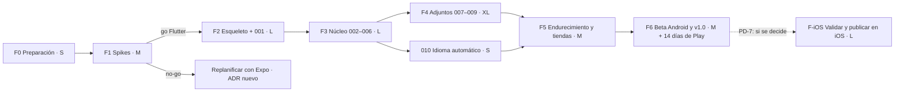

# Plan maestro

> Versión 1.0 · 2026-09-24 · Estado: **planificación cerrada; F0 pendiente**.
> Etiquetas: **[Hecho]**, **[Suposición]** y **[Pendiente]**. Las decisiones D1–D19 salen de la ronda de preguntas con el propietario; los ADR, en `docs/adr/`.

## 1. Resumen

App móvil (iOS + Android) local y sin conexión que muestra **una tarea a la vez** y permite que un único elemento (foto, PDF, web) quede **a pantalla completa nada más abrirla**. Stack provisional: **Flutter** (ADR-0001), a confirmar con pruebas técnicas desechables (spikes, F1). Metodología: SDD con la constitución de `specs/constitution.md`.

## 2. Decisiones cerradas con el propietario

| # | Decisión |
|---|---|
| D1 | No domina TS ni Dart → stack elegido por criterios técnicos |
| D2 | Sin cuentas de Apple Developer ni Google Play todavía → hasta crearlas: simulador, emulador, APK directo y web |
| D3 | Repo **público, todos los derechos reservados** |
| D4 | Web en Vercel **solo para pruebas** |
| D5 | Los documentos van **siempre arriba** (manda R5, no el prototipo) |
| D6 | **PDF dentro** de la tarea; el resto, con el visor del sistema — **Enmendada por el ADR-0014 (2026-09-27): en la v1 solo se adjuntan PDF**; los demás formatos quedan fuera de alcance |
| D7 | Eliminar es **definitivo**: sin deshacer y sin "Nada pendiente."; ~~queda una marca de borrado sin contenido~~ **no queda nada: la tarea se borra del todo** (propietario, 2026-09-26; ADR-0011 sustituye a ADR-0006; ADR-0012 sustituye a ADR-0011) |
| D8 | Las completadas **conservan el adjunto** — **Sustituida por el ADR-0012 (2026-09-26): no hay histórico; completar y eliminar borran la tarea del todo** |
| D9 | ~~URL: **captura de página completa** para verla sin conexión~~ **Sustituida por el ADR-0016 (2026-09-28): se guarda solo la dirección y la página se carga en vivo cada vez; sin conexión no se ve** (excepción a P3; función de uso ocasional) |
| D10 | Imagen: **pantalla encendida** (hasta 10 min sin tocar); sin brillo máximo. **Sin visor** (ADR-0013): la imagen al ancho con desplazamiento vertical en la tarea y pellizco que vuelve al soltar; **solo gira la tarea actual con imagen**, que en horizontal muestra solo la imagen y el logotipo (enmiendas del propietario, 2026-09-26 y 2026-09-27, spec 007). **También gira la tarea actual con PDF, exactamente igual**: en horizontal, el adjunto y el logotipo (~~y el botón "Volver a vertical"~~: quitado por el propietario el 2026-09-28, ADR-0015); el zoom del PDF se queda puesto (ADR-0014, spec 008). Pantalla encendida también con PDF |
| D11 | Sin biometría en la v1 |
| D12 | Mínimos: **iOS 16 / Android 8 (API 26)** |
| D13 | Menú: **"Configuración"** mínima, sin perfil. **Aplazada (propietario, 2026-09-29):** en la beta no hay pantalla de Configuración; la entrada "Configuración y perfil" se queda en el menú (DEV-05 revocada). **Cubierta en parte por la spec 012 (2026-09-30):** pantalla **temporal** con solo las licencias de código abierto y la política de privacidad (DEV-49; cierra DEV-18); la Configuración completa sigue en una spec futura con diseño del propietario, que sustituirá a DEV-49 |
| D14 | Backups del sistema **incluidos** |
| D15 | Bundle ID con un dominio neutro que se comprará → **[Pendiente]** |
| D16 | Código en inglés; documentación en español |
| D17 | **Android primero** (2026-09-24): se desarrolla y valida todo en Android (emulador + web de pruebas) sin instalar Xcode. iOS se aborda al final, en la fase **F-iOS**, y solo si el propietario decide seguir (PD-7). La arquitectura sigue siendo multiplataforma; CI compila iOS sin firmar desde F2 |
| D18 | **PDF de 10 MB como máximo** (2026-09-24) **y 20 páginas** (2026-09-27, spec 008: consulta rápida). ~~El resto de documentos, 25 MB~~ (sin otros documentos en la v1, ADR-0014); las imágenes, 30 MB y **64 MP**, guardadas como mucho a 24 MP y sin límite de lado (spec 007, 2026-09-26) |
| D19 | ~~**TXT, CSV y MD se muestran dentro de la app** como texto plano, sin interpretar marcado (2026-09-24, resuelve PD-8). Word, Excel, PowerPoint, ODF, RTF e iWork siguen con el visor del sistema~~ **Aplazada por el ADR-0014 (2026-09-27): en la v1 solo se adjuntan PDF** |
| — | Skills, plugins y MCP **solo a nivel de proyecto**, revisados antes de instalar y nunca con `-g`/`-y` |

## 3. Fases e hitos

Tamaños relativos: **S** (≈ 1–3 días de trabajo efectivo), **M** (≈ 1 semana), **L** (≈ 2 semanas), **XL** (≈ 3–4 semanas). **[Suposición]** Son estimaciones para una persona con Claude Code; se recalibran tras F2.

```mermaid
flowchart LR
  F0[F0 Preparación · S] --> F1[F1 Spikes · M]
  F1 -->|go Flutter| F2[F2 Esqueleto + 001 · L]
  F1 -->|no-go| ALT[Replanificar con Expo · ADR nuevo]
  F2 --> F3[F3 Núcleo 002–006 · L]
  F3 --> F4[F4 Adjuntos 007–009 · XL]
  F3 --> F5a[010 Idioma automático · S]
  F4 --> F5[F5 Endurecimiento y tiendas · M]
  F5a --> F5
  F5 --> F6[F6 Beta Android y v1.0 · M + 14 días de Play]
  F6 -.->|PD-7: si se decide| FI[F-iOS Validar y publicar en iOS · L]
```

| Fase | Contenido | Tamaño | Depende de | Criterio de salida |
|---|---|---|---|---|
| **F0 Preparación** | Liberar espacio ✅; Android Studio + SDK + Command-line Tools + emulador Pixel 6a (API 37) ✅; Flutter fijado en `.fvmrc` e instalado con `tools/install-flutter.sh` (FVM opcional); `gh` (opcional); repo en GitHub ✅ y seguridad activada; conectar Vercel; comprar el dominio neutro; cuenta de Google Play. **Xcode aplazado (D17)** | S | — | `flutter doctor` sin errores para Android y web; repo con CI verde ✅; reglas de rama en `main`; dominio → bundle ID definitivo en ADR |
| **F1 Spikes (Android + web)** | S1 arranque (Android) · S2 animaciones · S3 PDF y visor del sistema (Android: intent) · S4 captura web (Android) · S5 importación y backup (Android) · S6 web + Vercel. Las partes iOS de S1, S3, S4 y S5 pasan a F-iOS (D17). Código **desechable** en `spikes/` (rama propia, no se fusiona). **Requiere aprobación.** | M | F0 | Criterios de ADR-0001 cumplidos en Android → ADR-0001 **Aceptado para Android**, provisional para iOS; si no → ADR de cambio a Expo |
| **F2 Esqueleto + 001** *(✅ completada el 2026-09-25, PR #3)* | `app/` + identidad + l10n + tokens + BD v1 + repositorio + CI + web + la spec 001 completa | L | F1 | CA-001 en verde; arranque p50 < 1 s medido; preview en Vercel por PR |
| **F3 Núcleo** ✅ *(002, 003 y 005 el 2026-09-25; 004 y 006 el 2026-09-26)* | 002 crear y posición → 003 completar → 004 eliminar → 005 menú y editar → 006 listado | L | F2 | CA de 002–006 en verde; *goldens* frente al prototipo aprobados |
| **F4 Adjuntos** *(en curso: 007 y ADR-0012 fusionadas en `main`, PR svallev/una#11 y #12, 2026-09-27; 008 fusionada en `main`, PR svallev/una#14, 2026-09-28; 009 fusionada en `main`, PR svallev/una#17, 2026-09-29: F4 completa; siguiente: 010, idioma automático)* | 007 imagen (canal de importación; sin visor, ADR-0013) → 008 PDF (solo PDF en la v1, ADR-0014) → 009 URL | XL | F3 | CA de 007–009; revisión de seguridad T-3 a T-6 superada; WebView endurecida en producción (ADR-0007/0016; sin captura) |
| **010** | Idioma automático: solo ES/EN, lo decide el sistema, sin selector. **Alcance reducido (propietario, 2026-09-29):** sin pantalla de Configuración completa en la beta (spec futura; la 012 añade una pantalla temporal, DEV-49, que cierra DEV-18) | S | F3 | CA-010-01, 02, 04–07 y 10–12 en verde |
| **011** | Ocultar el contenido en "Recientes" sin bloquear las capturas (ADR-0019): `setRecentsScreenshotEnabled(false)` en Android 13+ y `FLAG_SECURE` solo en pausa en Android 8–12; todo nativo, sin Dart, ajustes, datos ni dependencias. **Implementada parcialmente (2026-09-30):** T-011-01 a 08 hechas; CA-011-01 a 08 verificados en el emulador de API 37; en el Xiaomi (HyperOS) solo la tarjeta (CL-011-9, CA-011-01, CA-011-08 y CA-011-04 con `adb`). **Falta PD-10 / T-011-09** (Android 8 y 12L, mecanismo B sin verificar) y en el Xiaomi la duración del blanco, la captura del sistema, la cámara y el selector y CL-011-14 | S | F3 (001, 007–009) | CA-011-01 a 08 en API 37 ✅; API 26 y 32 en PD-10 |
| **012** | Pantalla temporal de "Configuración y perfil": tres niveles a pantalla completa sobre el menú (opciones, lista de licencias de código abierto y texto de una licencia) y política de privacidad en el navegador tras confirmarla (hoy un marcador, `example.com`). Incluye `tools/check-licenses.sh` (completitud de licencias, en CI) y la puerta `tools/check-release-config.sh` (fuera de CI hasta F6). DEV-49 (temporal); cierra DEV-18. **Implementada parcialmente (2026-09-30):** T-012-01 a 11 hechas; 1423 tests en verde y verificada en el emulador de API 37; `security-reviewer` y `a11y-reviewer` sin altos (hallazgos bajos y medios sin corregir registrados más abajo). **[Pendiente]** en dispositivo (`specs/012-configuracion-temporal/dispositivo.md` §8: foco de TalkBack al volver, anuncio de carga y Reintentar, anillo con teclado real, Switch Access; p90 de raster y arranque ya medidos en el Xiaomi); *goldens* subidos, PR svallev/una#22 | S | F3, 005, 008–011 | CA-012-01 a 16 con test o casilla (spec §10) ✅; casillas manuales de dispositivo pendientes |
| **F5 Endurecimiento** | Auditoría de accesibilidad (VoiceOver, TalkBack, Switch, texto grande; incluye las excepciones de ADR-0013: lupa del sistema en Android 8–11 y 12+, con teclado y conmutadores, y Switch Access en horizontal; y la limitación de foco de TalkBack de CA-007-22), pruebas MASTG, presupuesto de rendimiento y tamaño, política de privacidad, fichas de tienda, capturas, manifiesto de privacidad y Data Safety, iconos. *Añadido el 2026-09-29 (alcance de la 010):* avisos de licencias de código abierto en la app (requisito de publicación; antes CA-010-09), pantalla temporal de "Configuración y perfil" con licencias y política de privacidad (spec 012, **Implementada parcialmente 2026-09-30**: faltan las casillas manuales de dispositivo; sustituye a "licencias de código abierto en la app" de más abajo; hallazgos sin corregir en "Hallazgos de la 012 para la auditoría de F5"), ocultar el contenido en la miniatura de "Recientes" (spec 011, **Implementada parcialmente 2026-09-30**: falta PD-10 / T-011-09; antes pendiente de la 010: CL-007-11, CL-008-13, CL-009-10) y anuncios de TalkBack con la voz del sistema (CA-010-10). *Añadido el 2026-09-30 (auditoría de la 011, revisión de `a11y-reviewer` y decisiones del propietario):* lupa del sistema con la app delante (no activable por `adb`; **[Suposición]** funciona porque la ventana no lleva `FLAG_SECURE`, spec 011 §6); TalkBack al volver a la app desde "Recientes" (con el blanco intermedio y el foco) y **TalkBack en español y en HyperOS** (solo se leyó la tarjeta en inglés en el emulador: "Una.. 4 of 4"); **modo oscuro y arranque en negro**: el arranque en frío (proceso muerto) con el sistema en modo oscuro es **negro ≈ 0,5 s**, igual que antes de la 011 (no cuenta para CA-011-03; decisión del propietario 2026-09-30) y se aplaza aquí junto a la mitigación de usar `paper` en `launch_background` (y su versión para modo oscuro, `docs/architecture.md` §2); Switch Access y teclado con la app delante y tras volver de "Recientes"; y la pantalla en negro tras usar un WebView (TD-2) | M | F4, 010 | Checklist de publicación completa; 0 hallazgos altos |
| **F6 Beta Android y v1.0** | Play: Internal testing y prueba cerrada con **12 testers durante 14 días** (cuenta personal nueva), corrección de errores, v1.0 en Google Play. **Riesgo (spec 012, CA-012-05):** la política de privacidad enlaza hoy a un marcador (`https://example.com/privacy`) y `docs/legal/privacy-policy.md` tiene huecos; `tools/check-release-config.sh` lo impide, pero **no está en `ci.yml`**: al crear el trabajo de CI que genere el AAB de publicación hay que añadirlo, y mientras tanto se ejecuta en `/release-checklist` (y la dirección debe coincidir con la de la ficha de la tienda) | M + 14 días | F5 + cuenta de Play | Aprobación en Google Play; feedback de los testers (sin telemetría: formulario o correo) |
| **F-iOS** *(si PD-7 = sí)* | Instalar Xcode; partes iOS de los spikes (S1 arranque < 0,6 s, S3 QuickLook, S4 captura con WKWebView, S5 backup iCloud y Data Protection); ajustes de plataforma (Info.plist, PrivacyInfo.xcprivacy, permisos, splash); tests de integración en simulador; auditoría VoiceOver; cuenta de Apple Developer; TestFlight → App Store | L | F6 (o antes, en paralelo con F5, si se decide) | Criterios iOS de ADR-0001; CA de todas las specs en verde en iOS; aprobación en App Store |

### Hallazgos de la 012 para la auditoría de F5

Registrados en el cierre de la spec 012 (2026-09-30). Los corregidos (M1, M2 y B1 del lector de pantalla) constan en `7448f4e`; el resto, por decisión del propietario, **se deja para F5**. Sin hallazgos altos en ninguna revisión.

**`security-reviewer` (0 altos, 0 medios, 5 bajos):**

- **012-S1** `LinkOpener.kt:36-55` no mira `userInfo` ni `host` en la rama web: la garantía "https sin usuario" solo está en Dart; hoy no es explotable. **[Pendiente]** repetirla en Kotlin.
- **012-S2** `check-release-config.sh` valida `identity.yaml`, pero no que `app_identity.g.dart` esté al día con él. **[Pendiente]**
- **012-S3** La puerta de publicación no está en CI (aceptado hasta F6; ya en la fila F6). **[Pendiente]** añadirla con el trabajo del AAB.
- **012-S4** La puerta no detecta las ~12 marcas `[Suposición]`/`[Assumption]` de `docs/legal/privacy-policy.md`. **[Pendiente]** decidir si también deben bloquear.
- **012-S5** Lista de dominios reservados incompleta (`.local`, `.internal`, `.lan`, `.localdomain`, `home.arpa`, `xn--` de prueba, `yourdomain.com`). **[Pendiente]**
- **012-S6** (observación, previa a la 012) `gradle-wrapper` sin `distributionSha256Sum`. **[Pendiente]** antes de F6.

**`a11y-reviewer` (0 críticos, 0 altos; medios y bajos sin corregir):**

- **012-A-M3** (medio) "Bibliotecas de Android (AndroidX, Kotlin)" sale fijo en español y sin marca de idioma con la app en inglés (WCAG 3.1.2, P7). **[Pendiente]** clave ARB o `localeForSubtree` (la spec pide ese nombre tal cual).
- **012-A-B2** Los anuncios no llevan `locale`: con el sistema en `ca` los dice la voz catalana y con gl/eu la del sistema. **[Pendiente]**
- **012-A-B3** "Volver" es el último en el orden de lector y hay un `Focus` sin etiqueta en `license_detail_screen.dart:148-152`. **[Pendiente]** mirarlo con TalkBack.
- **012-A-B4** La animación de pulsación de `BrutalButton` y `SquareIconButton` ignora "reducir movimiento" (previa a la 012). **[Pendiente]**
- **012-A-B5** `UnaLinkButton` mide 44, Android pide 48 (WCAG 2.5.8 se cumple; guía de Material). **[Pendiente]**
- **012-A-B6** Los tests no usan las guías `androidTapTarget` ni `textContrast`; el contraste lo garantiza `validate-tokens`. **[Pendiente]**
- **012-T-TD1** La 012 añade 4 `height: 1.5` escritos a mano (`licenses_screen.dart`, `license_detail_screen.dart`): suben a 23 los de TD-1.

Las casillas de comprobación a mano de estos hallazgos y de T-012-09 están en `specs/012-configuracion-temporal/dispositivo.md` §8.

**Camino crítico:** F0 → F1 → F2 → F3 → F4 → F5 → F6 (→ F-iOS si PD-7). **Tareas con plazo propio que conviene adelantar:** la cuenta de Google Play y el reclutamiento de 12 testers (el reloj de 14 días) y la compra del dominio (bloquea la primera subida).

## 4. Orden de implementación dentro de F3/F4 y motivo

1. **002** antes que 003/004: sin varias tareas no se pueden probar completar ni reordenar.
2. **003** antes que **004**: comparten la infraestructura de animación y el estado vacío; completar es más central.
3. **005** después de 004: el menú enlaza con eliminar.
4. **006** cierra el núcleo (depende de todo lo anterior).
5. **007** establece el canal de importación que reutilizan 008 y 009 (sin visor de imágenes, ADR-0013).
6. **009** al final: mayor riesgo técnico (captura web) y de seguridad.

## 5. Registro de riesgos

Probabilidad (P) e impacto (I): Baja/Media/Alta.

| ID | Riesgo | P | I | Mitigación | Disparador o seguimiento |
|---|---|---|---|---|---|
| R-01 | **Espacio en disco** insuficiente (30 GB libres; **79 GB tras liberar, 2026-09-24**) para Xcode, simuladores, Android y compilaciones | Alta | Alta | Liberar ≥ 60 GB antes de F0; un solo runtime de simulador; limpiar DerivedData y AVD que no se usen | F0 |
| R-02 | Arranque en frío > 1 s en Android de gama media | **Baja** (S1 en gama alta: ~0,25 s, margen ×4) | Alta | Tarea actual antes del primer fotograma (I-1), versión de pantalla JPEG (I-2); medir en gama media con un móvil prestado o en la beta cerrada | F2 o F6 |
| R-03 | Animaciones (arrugar y romper) con tirones | **Baja** (S2: p90 ≈ 4,5 ms a 120 Hz con Vulkan) | Media | Precaptura (I-3); medir en gama media | F3 |
| R-04 | ~~`flutter_inappwebview` sin mantenimiento~~ **Materializado (S4): estable de 2024** | — | — | **Mitigado:** `webview_flutter` oficial + captura nativa propia (ADR-0007) | Cerrado |
| R-05 | ~~Captura de página completa poco fiable en Android~~ **Evitado (ADR-0016): sin captura** | — | — | — | Cerrado |
| R-20 | Usuarios que esperan ver la tarea web sin conexión (ADR-0016) | Media | Baja | Aviso claro sin conexión; la imagen y el PDF como alternativa sin cobertura | Feedback de la beta (F6) |
| R-21 | Una actualización de `webview_flutter_android` rompe el envoltorio de su `WebViewClient` (ADR-0017) y un fallo del proceso de la página vuelve a cerrar la app, o deja de llegar antes el aviso de redirección del servidor (`isRedirect`, T-009-12, 2026-09-29) y la carga inicial sigue navegaciones de la página | Baja | Alta | Versión fijada; se comprueba que el envoltorio está puesto cada vez que se aplica; se repite la prueba de `chrome://crash`, de los callbacks y de las redirecciones (integración web) | Cada actualización del paquete |
| R-06 | Migraciones de datos que rompen datos reales tras publicar | Baja | Alta | Tests de migración obligatorios desde la v1; *fixtures* de BD reales anonimizadas | Cada cambio de esquema |
| R-07 | **Google Play: 12 testers durante 14 días** retrasa la v1.0 | Alta | Media | Crear la cuenta en F0–F2 y reclutar testers en paralelo | F2 |
| R-08 | Bundle ID sin dominio definitivo | Media | Alta (permanente) | Comprar el dominio en F0; marcador solo en desarrollo; prohibido subir a una tienda con el marcador | F0 |
| R-09 | Curva de aprendizaje de Dart y Flutter del propietario | Alta | Media | CLAUDE.md, specs en español, subagentes revisores, explicaciones en cada PR | Continuo |
| R-10 | **Confirmado (S5):** superar los 25 MB de backup de Android hace que se descarte **toda** la copia | Alta | Alta | `BackupAgent` con presupuesto de 20 MB y prioridades (ADR-0004 revisado); la app tolera adjuntos ausentes | F4 |
| R-11 | ~~Documentos no PDF sin app para abrirlos en Android~~ **Evitado en la v1 (ADR-0014): solo PDF, sin abrir con otras apps** | — | — | Se retoma si se admiten otros formatos | — |
| R-12 | Rechazo en App Store (p. ej. por la guideline 4.2 de funcionalidad mínima o por la WebView) | Baja | Media | Funcionalidad nativa clara; la WebView es secundaria; notas de revisión | F6 |
| R-13 | Clones de la app (repo público) | Media | Baja | "Todos los derechos reservados"; marca; se puede hacer privado en cualquier momento (la historia ya publicada queda expuesta) | Continuo |
| R-14 | Dependencia o acción de CI comprometida | Baja | Alta | Lockfiles, SHA fijados, OSV, dependency-review, permisos mínimos | CI |
| R-15 | Web de pruebas poco representativa (canvas, accesibilidad) | Alta | Baja | Los criterios de accesibilidad y rendimiento se verifican solo en dispositivo | — |
| R-16 | Deriva entre prototipo e implementación | Media | Media | `screen-map.md`, `prototype-deviations.md` y *goldens* | Cada PR de UI |
| R-18 | **iOS aplazado (D17):** problemas propios de iOS (arranque, captura con WKWebView, QuickLook, Data Protection, revisión de App Store) se descubren tarde y obligan a rehacer trabajo | Media | Media | Toda la integración nativa detrás de puertos (`SystemViewer`, `WebSnapshotter`, `ImageSanitizer`) con implementación Android primero; nada de APIs solo de Android en el dominio; **CI compila iOS sin firmar desde F2** (macOS runner, gratis en repo público) para detectar roturas de compilación; F-iOS empieza por los spikes iOS | Cada PR (job iOS de CI); inicio de F-iOS |
| R-17 | Pantallas sin diseño (Configuración, visor de documentos, errores) | Alta | Media | Diseñarlas en Claude Design antes de su spec (007–009). Configuración: aplazada a una spec futura, que diseñará el propietario (2026-09-29) | Antes de F3/F4 |
| R-19 | Tamaño del APK por encima del presupuesto (27,6 MB arm64 en el spike, con PDFium, SQLite y WebView) | Media | Baja | App bundle por ABI, sin símbolos, `--analyze-size` en CI; revisar dependencias | F2 |

## 6. Trazabilidad de reglas → specs

| Regla | Spec(s) | Criterios clave |
|---|---|---|
| R1 bienvenida | 001 | CA-001-01, 05 |
| R2 nada hasta la primera tarea | 001 | CA-001-02, 03, 04 |
| R3 crear con texto / foto / imagen / documento / URL | 002, 007, 008, 009 | CA-002-01; CA-007-02/03; CA-008-01; CA-009-01/03 |
| R4 ¿dónde va? (texto) | 002 | CA-002-02 a 06 |
| R5 adjuntos siempre arriba | 002, 007, 008, 009 | CA-002-09, CA-007-05, CA-008-05, CA-009-03 |
| R6 solo una tarea | 001 | CA-001-06 |
| R7 listado en ≥ 2 interacciones | 005, 006 | CA-005-01/03, CA-006-01 |
| R8 abrir → tarea actual rápido | 001, 007, 008, 009 | CA-001-09, CA-007-07, CA-008-08, CA-009-05/06 |
| R9 completar manteniendo pulsado + refuerzo | 003 | CA-003-01 a 04, 07, 08 |
| R10 eliminar con confirmación y arrugado | 004 | CA-004-01 a 06 |
| R11 editar, crear y menú | 005 | CA-005-01 a 09 |
| R12 estado vacío ("Todo hecho.") | 003, 004 | CA-003-05, CA-004-07/08 |
| R13 reordenar, editar y eliminar en el listado | 006, 004, 005 | CA-006-04 a 16 |
| R14 histórico | 003 | CA-003-06 — **retirada por el ADR-0012 (2026-09-26)** |
| R15 idioma | 010 (y P7 en todas) | CA-010-01, 02, 04–07 y 10–12 |

## 7. Decisiones pendientes

| ID | Pendiente | Quién | Cuándo | Recomendación |
|---|---|---|---|---|
| PD-1 | ~~Usuario u organización de GitHub~~ **Resuelto (2026-09-24): cuenta personal `svallev`** | Propietario | F0 | — |
| PD-2 | Dominio neutro → bundle ID y package name | Propietario | F0 | `com.<estudio>.<identificador-neutro>`, sin "una" |
| PD-3 | Cuentas de Apple Developer y Google Play | Propietario | Antes de F5 (Play, antes de F2 por R-07) | Crear la de Play pronto |
| PD-4 | ~~Aprobación de los spikes S1–S6~~ **Aprobados y ejecutados (2026-09-24).** S1–S5 ✅ en Android (S1/S2 en Xiaomi 15T Pro); S6 ✅ en local, falta conectar Vercel | Propietario | — | — |
| PD-8 | ~~¿TXT, CSV y MD dentro de la app?~~ **Resuelto: sí (D19)**; aplazado por el ADR-0014 (v1: solo PDF) | — | — | — |
| PD-7 | ¿Se hace la versión de iOS? (D17) | Propietario | Al terminar F6 (o antes si se quiere adelantar) | Decidir con la beta de Android en la mano |
| PD-5 | Diseño de las pantallas que faltan (R-17). Configuración y perfil: la diseñará el propietario para una spec futura, después de la beta (2026-09-29) | Propietario + Claude Design | Antes de F3 | — |
| P-1 | ~~¿Guardar el borrador del editor?~~ **Resuelto: no en la v1** | — | — | — |
| P-2 | ~~Vuelta desde segundo plano~~ **Resuelto: se conserva la pantalla si pasan < 10 min; si no, la tarea actual** | — | — | — |
| P-3 | ¿Confirmar al cancelar con texto? | Producto | Spec 002 | No |
| P-4 | ¿Deshacer al completar? | Producto | Spec 003 | No |
| P-5 | ¿Descripción alternativa de las imágenes escrita por el usuario? | Producto | Spec 007 | Sí, opcional, en la v1.1 |
| PD-9 | Safe Browsing de la WebView (activado, spec 009) frente a la ficha Data Safety de Play: confirmar que no hay que declarar nada | Propietario | F5, antes de publicar | **[Suposición]** No se declara: lo hace la WebView del sistema (Google Play Services), no la app; revisarlo con la guía de Play vigente |
| P-6 | ~~¿Una URL que apunta a un PDF se guarda como documento?~~ **Resuelto (2026-09-28): fuera de la v1** (spec 009, CL-009-4) | — | — | — |
| PD-10 | **Verificación en Android 8–12 (aplazada, propietario, 2026-09-30):** instalar emuladores de Android 8 (API 26) y Android 12L (API 32) y verificar en ellos lo que quedó sin comprobar (spec 011, **T-011-09**: T-011-03 a–d, CL-011-4 y CL-011-5, y CA-011-01, 03, 04 y 08 en API 26–32; si el mecanismo B no oculta la miniatura, se aplica la regla de desempate y **se retira B**, ADR-0019; y lo mismo de las specs siguientes que lo necesiten). Con esto la spec 011 pasa a **Implementada** | Propietario + Claude Code | Cuando la app esté más avanzada y **antes de dar la beta a testers** (F6) | **[Suposición]** Un solo paso para todas las specs, con ~1,5–2 GB por imagen |
| TD-1 | **Tarea registrada (2026-09-29, propietario):** token de interlineado (`lineHeight.*`) en `design/tokens.json` → `tokens.g.dart`, y sustituir los `height: 1.x` escritos a mano en `app/lib` (19 al abrir la tarea; 23 tras la 012, que añadió 4 con `1.5`) (hallazgo de `/tokens-validate` en T-009-21; no es nuevo de la 009) | Claude Code | **[Suposición]** Tarea propia, antes de F5 | PR aparte; regenerar los *goldens* que cambien |
| TD-2 | **Tarea registrada (2026-09-30, propietario; hallazgo H-4 de T-011-03):** en el emulador (API 37), tras mostrar una tarea web y luego otra pantalla, el siguiente paso a segundo plano y vuelta deja la app en negro hasta que el proceso muere (`EGL_BAD_ACCESS`, Impeller sobre `gfxstream`). Se reproduce igual sin la 011. **[Suposición]** fallo de emulador + WebView + Impeller; no visto en el móvil. Investigar y, si procede, comprobar en el Xiaomi (con permiso del propietario) | Claude Code | Antes de F5 | Tarea aparte; sin relación con la 011 |

## 8. Hoja de ruta posterior (no se desarrolla ahora; la arquitectura la admite)

| Bloque | Contenido | Preparación ya incluida |
|---|---|---|
| 1 | Fecha límite, vista "hoy" con más de una tarea, agrupación por fecha en el listado | `dueDate`; **requiere un ADR** porque "hoy" puede mostrar más de una tarea (tensión con P1) |
| 2 | Creación en bloque, subtareas | `parentId`, `rank` por nivel |
| 3 | Importar de Todoist, Google Keep, Google Tasks, Microsoft To Do y Any.do | `source`, `externalId`, flag `imports`, T-14 |
| 4 | ~~Histórico visible y borrable~~ (retirado por el ADR-0012), theming (paletas), alertas (notificaciones locales) | `palette.*`, flag `notifications` |
| 5 | Configuración completa (spec futura de Configuración y perfil; sustituirá a la pantalla temporal DEV-49 de la 012, que ya cerró DEV-18), páginas legales, ayuda, exportar/importar `.zip` | Pantalla Configuración, ADR-0004 |
| — | Landing | ADR-0009 (`landing/`) |
| — | Widgets de pantalla de inicio y bloqueo | ADR-0001 (home_widget), ADR-0005 (clase de protección) |
| Mucho después | Cuentas, sincronización, compartir | UUIDv7, `updatedAt`, tombstones, `TaskRepository` |

### Formatos de exportación para el Bloque 3 (sin APIs en la nube)

| Servicio | Exportación del usuario | Formato | Estado |
|---|---|---|---|
| Todoist | Copias de seguridad automáticas (Configuración → Copias de seguridad) y exportar proyecto como plantilla | ZIP con CSV por proyecto / CSV | **[Suposición]** Verificar el esquema actual de columnas |
| Google Keep | Google Takeout | Por nota: JSON (título, `textContent`, `listContent`, fechas, archivada o en la papelera) + HTML + adjuntos | **[Suposición]** Verificar campos |
| Google Tasks | Google Takeout | JSON (`Tasks.json`: listas, título, notas, fecha, estado, `parent`) | **[Suposición]** Verificar |
| Microsoft To Do | No hay exportación de archivo propia conocida; vía Outlook clásico (tareas → PST/CSV) o solicitud de datos de la cuenta Microsoft | PST/CSV | **[Pendiente]** Investigar antes del Bloque 3 |
| Any.do | Exportación no documentada claramente; posible solicitud de datos (RGPD) | Desconocido | **[Pendiente]** Investigar |

Además: recibir texto, URL y archivos desde "Compartir" del sistema (*share extension* / intent), que resuelve parte de la importación sin parsers.

## 9. Siguiente paso concreto

**F0 (Android primero, D17):** espacio ✅ → Android Studio + emulador ✅ → repo `svallev/una` ✅ → instalar Flutter 3.47.5 (`.fvmrc`) y pasar `flutter doctor` → activar la seguridad del repo en GitHub → aprobar los spikes Android (PD-4).
