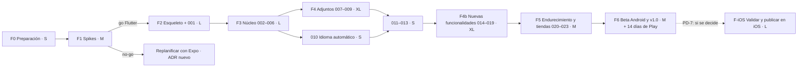

# Plan maestro

> Versión 1.1 · 2026-10-04 (plan F4b: nuevas funcionalidades; F5 renumerada) · Versión 1.0 · 2026-09-24.
> Etiquetas: **[Hecho]**, **[Suposición]** y **[Pendiente]**. Las decisiones D1–D19 salen de la ronda de preguntas con el propietario (2026-09-24) y las D20–D30, de la del plan F4b (2026-10-04); los ADR, en `docs/adr/`.

## 1. Resumen

App móvil (iOS + Android) local y sin conexión que muestra **una tarea a la vez** y permite que su elemento (una foto o un grupo de fotos, un PDF o una web) quede **a pantalla completa nada más abrirla**. *(Desde el plan F4b, 2026-10-04, una tarea puede tener varias fotos, en carrusel: sigue siendo una tarea a la vez, P1; lo registrará el ADR de la spec 016.)* Stack provisional: **Flutter** (ADR-0001), a confirmar con pruebas técnicas desechables (spikes, F1). Metodología: SDD con la constitución de `specs/constitution.md`.

## 2. Decisiones cerradas con el propietario

| # | Decisión |
|---|---|
| D1 | No domina TS ni Dart → stack elegido por criterios técnicos |
| D2 | Sin cuentas de Apple Developer ni Google Play todavía → hasta crearlas: simulador, emulador, APK directo y web |
| D3 | Repo **público, todos los derechos reservados** |
| D4 | Web en Vercel **solo para pruebas** |
| D5 | Los documentos van **siempre arriba** (manda R5, no el prototipo) |
| D6 | **PDF dentro** de la tarea; el resto, con el visor del sistema — **Enmendada por el ADR-0014 (2026-09-27): en la v1 solo se adjuntan PDF**; los demás formatos quedan fuera de alcance |
| D7 | **Enmendada por el plan F4b (2026-10-04; ADR de la spec 014):** eliminar **sin confirmación y con deshacer durante 4 s** (desde la tarea y desde el listado); pasado ese tiempo, definitivo y sin dejar nada. Sigue sin haber "Nada pendiente.". Texto anterior: eliminar es **definitivo**: sin deshacer y sin "Nada pendiente."; ~~queda una marca de borrado sin contenido~~ **no queda nada: la tarea se borra del todo** (propietario, 2026-09-26; ADR-0011 sustituye a ADR-0006; ADR-0012 sustituye a ADR-0011) |
| D8 | Las completadas **conservan el adjunto** — **Sustituida por el ADR-0012 (2026-09-26): no hay histórico; completar y eliminar borran la tarea del todo** |
| D9 | ~~URL: **captura de página completa** para verla sin conexión~~ **Sustituida por el ADR-0016 (2026-09-28): se guarda solo la dirección y la página se carga en vivo cada vez; sin conexión no se ve** (excepción a P3; función de uso ocasional) |
| D10 | **Enmendada por el plan F4b (2026-10-04, spec 015):** la pantalla encendida pasa a ser el ajuste **"Pantalla siempre activa"**, apagado por defecto y, encendido, **sin límite de tiempo** (con imagen, PDF o web; no con texto). Texto anterior: imagen: **pantalla encendida** (hasta 10 min sin tocar); sin brillo máximo. **Sin visor** (ADR-0013): la imagen al ancho con desplazamiento vertical en la tarea y pellizco que vuelve al soltar; **solo gira la tarea actual con imagen**, que en horizontal muestra solo la imagen y el logotipo (enmiendas del propietario, 2026-09-26 y 2026-09-27, spec 007). **También gira la tarea actual con PDF, exactamente igual**: en horizontal, el adjunto y el logotipo (~~y el botón "Volver a vertical"~~: quitado por el propietario el 2026-09-28, ADR-0015); el zoom del PDF se queda puesto (ADR-0014, spec 008). Pantalla encendida también con PDF |
| D11 | Sin biometría en la v1 |
| D12 | Mínimos: **iOS 16 / Android 8 (API 26)** |
| D13 | **Resuelta por el plan F4b (2026-10-04):** la Configuración completa es **Ajustes** (prototipo, tablero 16; spec 015), que sustituye a la pantalla temporal de la 012 (DEV-49). Texto anterior: menú: **"Configuración"** mínima, sin perfil. **Aplazada (propietario, 2026-09-29):** en la beta no hay pantalla de Configuración; la entrada "Configuración y perfil" se queda en el menú (DEV-05 revocada). **Cubierta en parte por la spec 012 (2026-09-30):** pantalla **temporal** con solo las licencias de código abierto y la política de privacidad (DEV-49; cierra DEV-18); la Configuración completa sigue en una spec futura con diseño del propietario, que sustituirá a DEV-49 |
| D14 | Backups del sistema **incluidos** |
| D15 | Bundle ID con un dominio neutro que se comprará → **[Pendiente]** |
| D16 | Código en inglés; documentación en español |
| D17 | **Android primero** (2026-09-24): se desarrolla y valida todo en Android (emulador + web de pruebas) sin instalar Xcode. iOS se aborda al final, en la fase **F-iOS**, y solo si el propietario decide seguir (PD-7). La arquitectura sigue siendo multiplataforma; CI compila iOS sin firmar desde F2 |
| D18 | **PDF de 10 MB como máximo** (2026-09-24) **y 20 páginas** (2026-09-27, spec 008: consulta rápida). ~~El resto de documentos, 25 MB~~ (sin otros documentos en la v1, ADR-0014); las imágenes, 30 MB y **64 MP**, guardadas como mucho a 24 MP y sin límite de lado (spec 007, 2026-09-26) |
| D19 | ~~**TXT, CSV y MD se muestran dentro de la app** como texto plano, sin interpretar marcado (2026-09-24, resuelve PD-8). Word, Excel, PowerPoint, ODF, RTF e iWork siguen con el visor del sistema~~ **Aplazada por el ADR-0014 (2026-09-27): en la v1 solo se adjuntan PDF** |
| D20 | **Deshacer al eliminar: 4 s** (2026-10-04). Si la card de una tarea está visible y se elimina otra, aparece la de la última y la anterior queda eliminada. Al eliminar, el foco del lector va a "Deshacer". Se alarga con el tiempo de accesibilidad del sistema y no caduca mientras el foco del lector está en "Deshacer"; lo confirman antes otro borrado, completar, crear o editar, abrir Ajustes y pasar a segundo plano; ir a otra pantalla (también el listado) o reordenar la hacen definitiva, «eso es que no querías deshacer» (propietario, 2026-10-04, al revisar la spec 014; enmienda la respuesta P-4 del plan F4b); abrir el menú, no. Si el diseño dice otra duración (3 s y "5 s" en el prototipo), manda esta (spec 014) |
| D21 | **Varias imágenes** (2026-10-04): solo desde "Subir imágenes" (galería), no con la cámara ni con documentos; **10 como máximo**; en el orden en que las devuelva Android; preselección apilada con la primera arriba; carrusel infinito con swipe, con desplazamiento vertical y pellizco como la imagen única, y gira igual; no se quitan de una en una y unas nuevas **reemplazan** a las anteriores (nunca se suman); si una falla al importarla, se omite y se avisa (spec 016). En el plan F4b: P-8 (10 fotos), P-17 (el carrusel como la imagen única, y gira igual), P-18 (omitir la que falla) y S8 descartado; **Q-016-1 a 3, 2026-10-06**: se abre siempre en la primera; la foto que falta se ve como "Foto no disponible"; los puntos del prototipo son solo informativos, sin botones (excepción a P6, ADR-0022, constitución 1.9); sin contador de fotos en la miniatura |
| D22 | **Ajustes** (2026-10-04), en este orden: Idioma, Notificaciones · Pantalla siempre activa, Bloquear zoom · Información (Política de privacidad, Licencias de terceros), Ayuda. **Todos los interruptores, apagados por defecto.** Al cambiar el idioma se vuelve a Ajustes, ya en el idioma nuevo, con el foco en "Idioma". Interruptor encendido con un token nuevo (`#FFDC58`) (specs 015, 017 y 019) |
| D23 | **Idioma** (2026-10-04): por defecto el del sistema (con las reglas de la 010: ca→es, gl/eu→en) y el usuario puede elegir español o inglés en una página de selección (spec 015) |
| D24 | **Bloquear zoom** (2026-10-04): solo en tareas con imagen; impide el pellizco, el desplazamiento y el swipe del carrusel, y la foto se ve entera. Sirve para dibujar encima de la foto. Ocultar también los controles, a decidir con un caso real (spec 017) |
| D25 | **Notificaciones** (2026-10-04): 1, 2 o 3 al día (1 por defecto) a las 08:55, 13:55 y 18:55, con la hora en el formato del sistema (12/24 h) y el idioma de la app. **Sin tareas, no se notifica.** La notificación muestra la tarea actual (su texto, o "Foto", "Imagen", "PDF" o el dominio) en la bandeja y una versión genérica con el móvil bloqueado, salvo que el usuario permita el contenido sensible en el sistema: **excepción a T-2 y al ADR-0005** (spec 019, con spike S7 antes) |
| D26 | **Licencias de terceros en una web** (2026-10-04), como la Política de privacidad y la Ayuda: se retiran las pantallas de licencias de la 012 (ADR propio en la spec 015) |
| D27 | **Webs sin dirección todavía** (2026-10-04): direcciones marcador (dominio reservado) en `identity.yaml`; la puerta de publicación impide publicar con ellas |
| D28 | **Solo móvil** (2026-10-04): sin soporte de tablet en esta versión |
| D29 | **Iconos** (2026-10-04, prototipo tablero 17): icono adaptable de Android con versión monocroma ("con tema") y Play 512 × 512, hechos a mano y sin dependencias; iOS 1024 cuando toque (D17) (spec 018) |
| D30 | **Numeración** (2026-10-04): las funcionalidades nuevas son las specs **014–019** (fase F4b) y el endurecimiento de F5 pasa a **020–023**. La beta espera a la 018; la 019 se decide tras el spike S7 |
| — | Skills, plugins y MCP **solo a nivel de proyecto**, revisados antes de instalar y nunca con `-g`/`-y` |

## 3. Fases e hitos

Tamaños relativos: **S** (≈ 1–3 días de trabajo efectivo), **M** (≈ 1 semana), **L** (≈ 2 semanas), **XL** (≈ 3–4 semanas). **[Suposición]** Son estimaciones para una persona con Claude Code; se recalibran tras F2.

```mermaid
flowchart LR
  F0[F0 Preparación · S] --> F1[F1 Spikes · M]
  F1 -->|go Flutter| F2[F2 Esqueleto + 001 · L]
  F1 -->|no-go| ALT[Replanificar con Expo · ADR nuevo]
  F2 --> F3[F3 Núcleo 002–006 · L]
  F3 --> F4[F4 Adjuntos 007–009 · XL]
  F3 --> F5a[010 Idioma automático · S]
  F4 --> F4x[011–013 · S]
  F5a --> F4x
  F4x --> F4b[F4b Nuevas funcionalidades 014–019 · XL]
  F4b --> F5[F5 Endurecimiento y tiendas 020–023 · M]
  F5 --> F6[F6 Beta Android y v1.0 · M + 14 días de Play]
  F6 -.->|PD-7: si se decide| FI[F-iOS Validar y publicar en iOS · L]
```

| Fase | Contenido | Tamaño | Depende de | Criterio de salida |
|---|---|---|---|---|
| **F0 Preparación** | Liberar espacio ✅; Android Studio + SDK + Command-line Tools + emulador Pixel 6a (API 37) ✅; Flutter fijado en `.fvmrc` e instalado con `tools/install-flutter.sh` (FVM opcional); `gh` (opcional); repo en GitHub ✅ y seguridad activada; conectar Vercel; comprar el dominio neutro; cuenta de Google Play. **Xcode aplazado (D17)** | S | — | `flutter doctor` sin errores para Android y web; repo con CI verde ✅; reglas de rama en `main`; dominio → bundle ID definitivo en ADR |
| **F1 Spikes (Android + web)** | S1 arranque (Android) · S2 animaciones · S3 PDF y visor del sistema (Android: intent) · S4 captura web (Android) · S5 importación y backup (Android) · S6 web + Vercel. Las partes iOS de S1, S3, S4 y S5 pasan a F-iOS (D17). Código **desechable** en `spikes/` (rama propia, no se fusiona). **Requiere aprobación.** | M | F0 | Criterios de ADR-0001 cumplidos en Android → ADR-0001 **Aceptado para Android**, provisional para iOS; si no → ADR de cambio a Expo |
| **F2 Esqueleto + 001** *(✅ completada el 2026-09-25, PR #3)* | `app/` + identidad + l10n + tokens + BD v1 + repositorio + CI + web + la spec 001 completa | L | F1 | CA-001 en verde; arranque p50 < 1 s medido; preview en Vercel por PR |
| **F3 Núcleo** ✅ *(002, 003 y 005 el 2026-09-25; 004 y 006 el 2026-09-26)* | 002 crear y posición → 003 completar → 004 eliminar → 005 menú y editar → 006 listado | L | F2 | CA de 002–006 en verde; *goldens* frente al prototipo aprobados |
| **F4 Adjuntos** *(en curso: 007 y ADR-0012 fusionadas en `main`, PR svallev/una#11 y #12, 2026-09-27; 008 fusionada en `main`, PR svallev/una#14, 2026-09-28; 009 fusionada en `main`, PR svallev/una#17, 2026-09-29: F4 completa; siguiente: 010, idioma automático)* | 007 imagen (canal de importación; sin visor, ADR-0013) → 008 PDF (solo PDF en la v1, ADR-0014) → 009 URL | XL | F3 | CA de 007–009; revisión de seguridad T-3 a T-6 superada; WebView endurecida en producción (ADR-0007/0016; sin captura) |
| **010** | Idioma automático: solo ES/EN, lo decide el sistema, sin selector. **Alcance reducido (propietario, 2026-09-29):** sin pantalla de Configuración completa en la beta (spec futura; la 012 añade una pantalla temporal, DEV-49, que cierra DEV-18) | S | F3 | CA-010-01, 02, 04–07 y 10–12 en verde |
| **011** | Ocultar el contenido en "Recientes" sin bloquear las capturas (ADR-0019): `setRecentsScreenshotEnabled(false)` en Android 13+ y `FLAG_SECURE` solo en pausa en Android 8–12; todo nativo, sin Dart, ajustes, datos ni dependencias. **Implementada parcialmente (2026-09-30):** T-011-01 a 08 hechas; CA-011-01 a 08 verificados en el emulador de API 37; en el Xiaomi (HyperOS) solo la tarjeta (CL-011-9, CA-011-01, CA-011-08 y CA-011-04 con `adb`). **Falta PD-10 / T-011-09** (Android 8 y 12L, mecanismo B sin verificar) y en el Xiaomi la duración del blanco, la captura del sistema, la cámara y el selector y CL-011-14 | S | F3 (001, 007–009) | CA-011-01 a 08 en API 37 ✅; API 26 y 32 en PD-10 |
| **012** | **Sustituida por la spec 015 (2026-10-05; la pantalla y las de licencias ya no existen, ADR-0026).** Pantalla temporal de "Configuración y perfil": tres niveles a pantalla completa sobre el menú (opciones, lista de licencias de código abierto y texto de una licencia) y política de privacidad en el navegador tras confirmarla (hoy un marcador, `example.com`). Incluye `tools/check-licenses.sh` (completitud de licencias, en CI) y la puerta `tools/check-release-config.sh` (fuera de CI hasta F6). DEV-49 (temporal); cierra DEV-18. **Implementada parcialmente (2026-09-30):** T-012-01 a 11 hechas; 1423 tests en verde y verificada en el emulador de API 37; `security-reviewer` y `a11y-reviewer` sin altos (hallazgos bajos y medios sin corregir registrados más abajo). **[Pendiente]** en dispositivo (`specs/012-configuracion-temporal/dispositivo.md` §8: foco de TalkBack al volver, anuncio de carga y Reintentar, anillo con teclado real, Switch Access; p90 de raster y arranque ya medidos en el Xiaomi); *goldens* subidos, PR svallev/una#22 | S | F3, 005, 008–011 | CA-012-01 a 16 con test o casilla (spec §10) ✅; casillas manuales de dispositivo pendientes |
| **F4b Nuevas funcionalidades** *(plan aprobado 2026-10-04; D20–D30)* | **014** Eliminar con deshacer (M; **spec Aprobada y ADR-0021 Aceptado, 2026-10-04**; **Implementada parcialmente** el 2026-10-04 en la rama `feat/014-eliminar-con-deshacer` (T-014-01 a T-014-12; PR sin abrir hasta que lo confirme el propietario); casillas de dispositivo en "Casillas de la 014") → **015** Ajustes: pantalla, Idioma, Pantalla siempre activa, Información y Ayuda; sustituye a la 012 (L; **spec y plan Aprobados y ADR-0023 y ADR-0026 Aceptados, 2026-10-05; implementada en la rama `feat/015-ajustes`, T-015-01 a 15 hechas, PR svallev/una#36 en revisión; cierre T-015-16 pendiente**; casillas de dispositivo en "Casillas de la 015") → **016** Varias imágenes y carrusel, esquema v3 (XL; **spec Aprobada y ADR-0022 y ADR-0024 Aceptados, 2026-10-06, `specs/016-varias-imagenes-carrusel/spec.md`**; constitución 1.9; siguiente: plan y tareas) → **017** Bloquear zoom (S) → **018** Iconos (S) → **019** Notificaciones (L; spike S7 antes). Una spec cada vez, en este orden. ADR, cada uno con su spec: borrado con deshacer (014, ADR-0021), idioma elegido en la app y revisión del ADR-0020 (015, ADR-0023 aceptado), licencias en la web (015, ADR-0026 aceptado), interacción con varias fotos y Bloquear zoom (016/017), adjuntos 1→N con orden (016) y notificaciones locales (019) | XL | 013 | CA de 014–019 en verde; casillas de dispositivo, en la 022 |
| **F5 Endurecimiento** *(renumerada el 2026-10-04: 020 seguridad y puerta de publicación, 021 modo oscuro y arranque, 022 auditoría en dispositivo, 023 privacidad y ficha de tienda)* | Auditoría de accesibilidad (VoiceOver, TalkBack, Switch, texto grande; incluye las excepciones de ADR-0013: lupa del sistema en Android 8–11 y 12+, con teclado y conmutadores, y Switch Access en horizontal; y la limitación de foco de TalkBack de CA-007-22), pruebas MASTG, presupuesto de rendimiento y tamaño, política de privacidad, fichas de tienda, capturas, manifiesto de privacidad y Data Safety, iconos. *Añadido el 2026-09-29 (alcance de la 010):* avisos de licencias de código abierto en la app (requisito de publicación; antes CA-010-09), pantalla temporal de "Configuración y perfil" con licencias y política de privacidad (spec 012, **Implementada parcialmente 2026-09-30**: faltan las casillas manuales de dispositivo; sustituye a "licencias de código abierto en la app" de más abajo; hallazgos sin corregir en "Hallazgos de la 012 para la auditoría de F5"), ocultar el contenido en la miniatura de "Recientes" (spec 011, **Implementada parcialmente 2026-09-30**: falta PD-10 / T-011-09; antes pendiente de la 010: CL-007-11, CL-008-13, CL-009-10) y anuncios de TalkBack con la voz del sistema (CA-010-10; **aceptados** el 2026-10-01, ADR-0020, spec 013). *Añadido el 2026-09-30 (auditoría de la 011, revisión de `a11y-reviewer` y decisiones del propietario):* lupa del sistema con la app delante (no activable por `adb`; **[Suposición]** funciona porque la ventana no lleva `FLAG_SECURE`, spec 011 §6); TalkBack al volver a la app desde "Recientes" (con el blanco intermedio y el foco) y **TalkBack en español y en HyperOS** (solo se leyó la tarjeta en inglés en el emulador: "Una.. 4 of 4"); **modo oscuro y arranque en negro**: el arranque en frío (proceso muerto) con el sistema en modo oscuro es **negro ≈ 0,5 s**, igual que antes de la 011 (no cuenta para CA-011-03; decisión del propietario 2026-09-30) y se aplaza aquí junto a la mitigación de usar `paper` en `launch_background` (y su versión para modo oscuro, `docs/architecture.md` §2); Switch Access y teclado con la app delante y tras volver de "Recientes"; y la pantalla en negro tras usar un WebView (TD-2) | M | F4, 010, F4b | Checklist de publicación completa; 0 hallazgos altos |
| **F6 Beta Android y v1.0** | Play: Internal testing y prueba cerrada con **12 testers durante 14 días** (cuenta personal nueva), corrección de errores, v1.0 en Google Play. **Riesgo (spec 012, CA-012-05):** la política de privacidad enlaza hoy a un marcador (`https://example.com/privacy`) y `docs/legal/privacy-policy.md` tiene huecos; `tools/check-release-config.sh` lo impide, pero **no está en `ci.yml`**: al crear el trabajo de CI que genere el AAB de publicación hay que añadirlo, y mientras tanto se ejecuta en `/release-checklist` (y la dirección debe coincidir con la de la ficha de la tienda) | M + 14 días | F5 + cuenta de Play | Aprobación en Google Play; feedback de los testers (sin telemetría: formulario o correo) |
| **F-iOS** *(si PD-7 = sí)* | Instalar Xcode; partes iOS de los spikes (S1 arranque < 0,6 s, S3 QuickLook, S4 captura con WKWebView, S5 backup iCloud y Data Protection); ajustes de plataforma (Info.plist, PrivacyInfo.xcprivacy, permisos, splash); tests de integración en simulador; auditoría VoiceOver; cuenta de Apple Developer; TestFlight → App Store | L | F6 (o antes, en paralelo con F5, si se decide) | Criterios iOS de ADR-0001; CA de todas las specs en verde en iOS; aprobación en App Store |

### Hallazgos de la 012 para la auditoría de F5

> **Spec 015 (implementada; en vigor):** las pantallas de licencias se retiran (ADR-0026). **Se anulan** 012-A-M3 y 012-A-B3 (ya corregidos en la 013; el nodo y la lista desaparecen) y 012-T-TD1 (los cuatro `height: 1.5` de `licenses_screen.dart` y `license_detail_screen.dart` desaparecen con los archivos). **Pasan a la auditoría 022, sobre Ajustes:** las casillas de la 012 que no eran de las licencias (`specs/012-configuracion-temporal/dispositivo.md` §8). 012-S1 se acepta como riesgo residual (T-5, `threat-model.md`).

Registrados en el cierre de la spec 012 (2026-09-30). Los corregidos (M1, M2 y B1 del lector de pantalla) constan en `7448f4e`; el resto, por decisión del propietario, **se deja para F5**. Sin hallazgos altos en ninguna revisión.

**`security-reviewer` (0 altos, 0 medios, 5 bajos):**

- **012-S1** `LinkOpener.kt:36-55` no mira `userInfo` ni `host` en la rama web: la garantía "https sin usuario" solo está en Dart; hoy no es explotable. **[Pendiente]** repetirla en Kotlin. **Aceptado como riesgo residual en la 015** (`threat-model.md`, T-5): sin código nativo nuevo, con tres constantes de compilación.
- **012-S2** `check-release-config.sh` valida `identity.yaml`, pero no que `app_identity.g.dart` esté al día con él. **[Pendiente]** **Corregido en la 015** (T-015-06: `check-release-config.sh` ejecuta `gen_identity.dart --check`).
- **012-S3** La puerta de publicación no está en CI (aceptado hasta F6; ya en la fila F6). **[Pendiente]** añadirla con el trabajo del AAB.
- **012-S4** La puerta no detecta las ~12 marcas `[Suposición]`/`[Assumption]` de `docs/legal/privacy-policy.md`. **[Pendiente]** decidir si también deben bloquear.
- **012-S5** Lista de dominios reservados incompleta (`.local`, `.internal`, `.lan`, `.localdomain`, `home.arpa`, `xn--` de prueba, `yourdomain.com`). **[Pendiente]** **Corregido en la 015** (T-015-06: ampliada la lista y con las tres direcciones).
- **012-S6** (observación, previa a la 012) `gradle-wrapper` sin `distributionSha256Sum`. **[Pendiente]** antes de F6.

**`a11y-reviewer` (0 críticos, 0 altos; medios y bajos sin corregir):**

- **012-A-M3** (medio) "Bibliotecas de Android (AndroidX, Kotlin)" sale fijo en español y sin marca de idioma con la app en inglés (WCAG 3.1.2, P7). **[Pendiente]** clave ARB o `localeForSubtree` (la spec pide ese nombre tal cual). **Corregido** en la spec 013 (CA-013-01, 2026-10-01).
- **012-A-B2** Los anuncios no llevan `locale`: con el sistema en `ca` los dice la voz catalana y con gl/eu la del sistema. **[Pendiente]** **Aceptado** (propietario, 2026-10-01; ADR-0020).
- **012-A-B3** "Volver" es el último en el orden de lector y hay un `Focus` sin etiqueta en `license_detail_screen.dart:148-152`. **[Pendiente]** mirarlo con TalkBack. **→ spec 013:** el orden se mantiene (D-013-1) y se corrige el nodo sin nombre (CA-013-04). **Corregido** en la spec 013 (2026-10-01); el aviso se lee ya después de las opciones (CA-013-05).
- **012-A-B4** La animación de pulsación de `BrutalButton` y `SquareIconButton` ignora "reducir movimiento" (previa a la 012). **[Pendiente]** **Corregido** en la spec 013 (CA-013-03, DEV-50, 2026-10-01).
- **012-A-B5** `UnaLinkButton` mide 44, Android pide 48 (WCAG 2.5.8 se cumple; guía de Material). **[Pendiente]** **Aceptado** (propietario, 2026-10-01; D-013-3: se queda en 44).
- **012-A-B6** Los tests no usan las guías `androidTapTarget` ni `textContrast`; el contraste lo garantiza `validate-tokens`. **[Pendiente]** **Aceptado** (propietario, 2026-10-01; D-013-3).
- **012-T-TD1** La 012 añade 4 `height: 1.5` escritos a mano (`licenses_screen.dart`, `license_detail_screen.dart`): suben a 23 los de TD-1.

**Hallazgos de la 013 (cierre, 2026-10-01; `a11y-reviewer`: 0 altos; `security-reviewer`: sin hallazgos). F-1 y F-2 del emulador, ya corregidos.** Sin corregir, para la 016 o una spec aparte:

- **013-A-M1** (medio, previo a la 013) Las dos opciones de "¿Dónde la pones?" (`placement_sheet.dart`, `_Option`) son un `GestureDetector` sin `Focus`: con teclado físico no se llega a ellas ni muestran anillo (WCAG 2.1.1 y 2.4.7). TalkBack y Switch Access sí funcionan. **[Pendiente]** envolverlas como `BrutalButton` (`FocusableActionDetector` + `FocusRing`), con un solo nodo semántico.
- **013-A-B1** `_focusedName()` (`licenses_screen.dart`) solo ve el foco de **teclado**: si el foco de TalkBack está en una fila y cambia de sitio al cambiar el idioma, no se recoloca. **[Pendiente]** `onDidGainAccessibilityFocus` en la fila, o documentarlo en la 016.
- **013-A-B2** (de la 012) Con error en el nivel 2 el lector dice el error y luego "Reintentar, <mismo error>" (el `hint` repite el texto). **[Pendiente]**
- **013-A-B3** Nivel 3 con TalkBack y teclado físico: el área de texto no tiene nodo propio (`includeSemantics: false`, aceptado en el plan §7); anillo sin ver en el emulador. **[Pendiente]** comprobarlo en la 016.

Las casillas de comprobación a mano de estos hallazgos y de T-012-09 están en `specs/012-configuracion-temporal/dispositivo.md` §8.

**Casillas de la 014 para la auditoría en dispositivo (022; registradas en T-014-11, 2026-10-04).** Detalle y resultados en `specs/014-eliminar-con-deshacer/dispositivo.md`; todo lo de abajo está sin hacer salvo lo marcado **[Hecho]**. Primero, las **decisiones del propietario** (todas tomadas: hallazgo 3 el 2026-10-04; hallazgo 1, M2, M3 y B5 el 2026-10-05, tras comprobarlo el propietario con TalkBack en el Xiaomi):

- **[Cerrado, decisión del propietario 2026-10-05] Hallazgo 1 de T-014-10 ("Tarea recuperada" no se oye en API 37).** Ni `a11yUndone` ni un anuncio de control (`SemanticsService.sendAnnouncement` suelto) salen en el panel de voz de TalkBack de API 37; sí salen el foco, los giros y los avisos de error (región en vivo). Afectaría a **todos** los anuncios de la app (specs 002–013). **Resultado:** el propietario lo comprobó con TalkBack en el Xiaomi y el anuncio **sí se oye**; solo fallaba en el panel de voz del emulador de API 37. Sin cambios de código ni spec aparte.
- **[Hecho, decisión del propietario 2026-10-04] Hallazgo 3 de T-014-10 (600 dp).** En una pantalla de 600 dp o más con una tarea de texto, la card mide 600 dp centrada (`appFrame`), no "a todo el ancho" (CA-014-03). **Aceptado** tras ver la captura a 720 dp (coherente con CL-001-7); anotado en DEV-51. A 390 dp la card ya va al 100 % del ancho y pegada abajo.
- **[Hecho] Hallazgo 2 (Switch Access contaba como lector):** resuelto en T-014-10b (canal `una/a11y` con `touchExploration`).
- **[Pendiente]** TalkBack: mover el foco **fuera** de la card en el listado con un gesto real (la pausa y su reanudación; `FocusSemanticEvent`/`previousFocus()` no lo siguen allí); "Todo hecho." con la voz; tiempo exacto hasta el primer foco; la **voz real** en español y en HyperOS (el emulador está en inglés); TalkBack y Switch Access a la vez (**[Suposición]** el cambio no hace releer el canal; la siguiente eliminación sí).
- **[Pendiente]** Voice Access; **Android 8 y 9 (API 26 y 28)**: la card dura 10 s con un servicio de accesibilidad y 4 s sin él (CA-014-06), y no hay "Tiempo para actuar"; PD-10 / T-011-09 repetido **con la card a la vista** (`tools/check-recents.sh`; en horizontal el script falla igual con y sin la card: límite del script).
- **[Hecho, 2026-10-05]** *Goldens* de la 014 (10): la card sola ×1,0 y ×2,0 (sin y con foco; la de ×2,0 en dos filas), la card en la tarea ×1,0 y ×2,0, en "Todo hecho.", en horizontal y en el listado ×1,0 y ×2,0. Generados en CI (etiqueta `actualizar-goldens`) y revisados a ojo.
- **[Pendiente]** El propietario revisa en el móvil el texto al 200 % a 360 dp y en horizontal con la navegación de 3 botones (capturas del emulador en T-014-10); la barra al 70 % vista una vez en T-014-06 no se reprodujo en 5 pasadas más.
- **[Hecho en el Xiaomi, 2026-10-04]** p90 de raster del arrugado: 5,9 ms frente a 5,6 del baseline (+0,3, sin empeoramiento; `dispositivo.md`).
- **[Cerrado, descartado por el propietario 2026-10-05] Hallazgo M2 de `a11y-reviewer` (cierre, 2026-10-04): sin tope de espera al primer foco del lector.** Con TalkBack la cuenta no empieza hasta que la card recibe su foco (CA-014-17); si TalkBack no avisara nunca, la card no caduca y «Pulsa para completar» queda oculto hasta que algo haga definitiva la eliminación. Ya ocurrió en el listado antes del arreglo de T-014-08. **Decisión:** no se pone el tope. La cuenta empieza cuando el foco llega a «Deshacer» y se detiene mientras lo tiene (CA-014-17 y D20 como están); el propietario lo comprobó en el móvil y puede salir del foco de la card.
- **[Cerrado, aceptado por el propietario 2026-10-05] M3 (con el hallazgo 1):** el anuncio «Tarea recuperada» sale a los 160 ms (`sheetOut`), antes que el foco en el listado desde «Todo hecho.» (que espera 600 ms) y a la vez que él en el listado sin ruta nueva; el orden razonable es foco y después anuncio. No explica el hallazgo 1 (ni el anuncio suelto suena en API 37) pero conviene ajustarlo si la voz real sí lo anuncia. **Decisión:** se queda como está (el propietario probó el orden de lectura en el móvil: «me vale como está»).
- **[Pendiente] B4:** el aviso de error de recuperación (`delete_task_action.dart`) usa un margen inferior fijo (`padding.bottom` + card + barra); con texto al 200 % el botón que reaparece puede ser más alto y quedar parcialmente tapado (WCAG 2.4.11). Verificar a 200 % antes de tocar.
- **[Cerrado, descartado por el propietario 2026-10-05] B5:** Switch Access y Voice Access (servicio activo sin exploración táctil) tienen 4 s en Android 10 o posterior si no hay «Tiempo para actuar» definido; la excepción de 10 s es solo de Android 8 y 9. **Decisión:** no se amplía. O 10 s o el contador parado mientras la card tiene el foco, no las dos cosas; se queda el contador parado (CA-014-06 y la excepción de la constitución 1.6, solo Android 8 y 9, sin cambios).
- **[Pendiente] B6 (si hay iOS, D17):** sin canal, `touchExploration` es siempre `false`, y la card no esperaría al primer foco de VoiceOver (usar `MediaQuery.accessibleNavigation` allí).
- **[Pendiente] S2 de `security-reviewer` (bajo):** el barrido solo corre 2 s después del arranque; si el sistema mata la app en segundo plano antes de acabar el borrado de los archivos, esperan al siguiente arranque. Valorar repetirlo al reanudar. (El S1, `discardHeld` sin mirar la BD, se corrigió en `84a4aa3`.)
- **Observación para otras specs:** `task_list_screen.dart:761` (texto de ayuda del listado), `celebration_overlay` y `welcome_intro` siguen decidiendo "hay lector" con `MediaQuery.accessibleNavigation`, que en Android vale `true` también con Switch Access; revisar en la 022 o en su spec.

**Casillas de la 015 para la auditoría en dispositivo (022; registradas en T-015-15, 2026-10-05).** Detalle y resultados en `specs/015-ajustes/dispositivo.md` (emulador de API 37 completo en T-015-14; TalkBack a oído en el Xiaomi por el propietario tras T-015-10):

- **[Cerrado, decisión del propietario 2026-10-05] TalkBack al volver del navegador.** Con la app en segundo plano por abrir una web, TalkBack lleva su recuadro al título «Ajustes» (o, tras ≥ 10 minutos, al texto de la tarea) e ignora el aviso de foco a la fila o al botón de menú; no se arregla desde Dart. **Aceptado**: CA-015-20h y CA-015-16 enmendadas en la spec y el intento de código retirado. No queda casilla.
- **[Pendiente] Switch Access sobre Ajustes** (CA-015-21): las teclas DPAD de `adb` no llegan a su barrido; hace falta el móvil (con permiso del propietario) u otro método. El orden que seguiría (el del lector) está comprobado con `uiautomator dump`.
- **[Pendiente] Voz de «Idioma, Español» y de «Como el sistema»** (CA-015-11, R-26): el propietario la oyó bien en el Xiaomi tras T-015-10 (camino A); repetirla a oído con la versión final, con la app en español y en inglés sobre un sistema en español y en inglés, y comprobar que `ca`, `gl` y `eu` se comportan (CL-015-7).
- **[Pendiente]** Pasan de la 012 a Ajustes: anillo de foco con teclado real (hecho en el emulador, repetir en el móvil), reducir movimiento (hecho en el emulador a 1 fotograma), 200 % con navegación de tres botones (hecho en el emulador, con dos fallos corregidos; en el móvil, si se quiere), sistema en inglés y el aviso obsoleto (M2 de la 012).
- **[Hecho, 2026-10-05]** *Goldens* de Ajustes, del interruptor y de la página de Idioma (12 PNG, ES y EN × ×1,0 y ×2,0): generados en CI con `actualizar-goldens` y subidos (`201d97c`). **[Pendiente]** verlos en verde en el primer CI de la PR.
- **[Hecho, 2026-10-05]** Arranque en frío de Ajustes frente a `main`: p50 de 418-421 ms en el emulador y, en el Xiaomi (con permiso del propietario), medias de 217 ms la base y 223 ms la nueva (`docs/perf/baseline.md`, CA-015-23).
- **[Pendiente] Avisos con la voz del idioma de la app** (CA-015-12, **[Suposición]** de que TalkBack respete la marca de idioma en una región viva; `dispositivo.md` solo contó las frases por logcat): a oído en el móvil, con el sistema en inglés y la app en español (y al revés), provocando un fallo («No hay ninguna app…» y el aviso de guardado). Si no la respeta, se replantea la excepción de P6 (ADR-0023).
- **[Pendiente]** El paso de CI del archivo de avisos (`check-licenses.sh`, `upload-artifact`, paso negativo) no se ha corrido todavía en GitHub; verlo en la primera ejecución de la PR.
- **[Pendiente]** Revisión legal de ADR-0026 (R-27) antes de F6/023, punto bloqueante de `/release-checklist`; y, antes de F6/023, el referente `android-app://<paquete>` en `docs/legal/privacy-policy.md` y en Data Safety, y los ajustes que viajan en la copia.

**Hallazgos del cierre de la 015 sin corregir (T-015-16, 2026-10-06; ninguno alto).** Corregidos en `ef0ab0d`: a11y M1 (foco en el nodo semántico de `UnaRadioRow` y `UnaLinkButton`) y seguridad B-1 (`ref.read` dentro del `try`). Para la 020/022:

- **[Pendiente] a11y M2:** con el texto al 200 % y sin navegador, el aviso «No hay ninguna app…» (tras Ayuda) hace que `ensureVisible` desplace la pantalla y la fila que tenía el foco quede fuera de la vista; decidir si `_revealFocus` debe volver a mostrarla. Probar en el móvil (TalkBack).
- **[Pendiente] a11y B1:** el anillo de foco (3-9 px fuera de la fila) se recorta cuando `ensureVisible` deja la fila a ras del borde; inflar el rectángulo en `_revealFocus`. **B2:** si Ajustes se abre con el dedo, el primer Tab va a «Idioma» (ya anotado en `dispositivo.md`; CA-015-21a lo recoge ahora).
- **[Pendiente] Seguridad M-1 (medio):** `tools/check-release-config.sh` no corre en CI ni en el build; solo `/release-checklist` a mano impide publicar con los marcadores. **Recogerlo en la 020** (job con etiqueta `v*` o `workflow_dispatch`, o tarea de Gradle). **B-2:** la puerta no restringe la ruta (U+200B, bidi, `%2e`, `%5c`, `%00`); exigir `^/[A-Za-z0-9._~\-/]*$`. **B-3 y M8 de la spec-reviewer:** completar `_reservedTlds` (`.alt`, `.home`, `.corp`, `.mail`, `.intranet`, `.private`, `.arpa`) y contrastar `_idnTestTlds` con IANA (cierra la **[Suposición]**). **B-4:** limitar la lectura de `settings` en SQL (`length(value) > 16`). **B-5:** `firstRunDone` y `hasEverHadTasks` sin `_orDefault` en `readBootState` (CA-015-26 solo lo exige para `locale` y `keepScreenOn`). **B-6:** el comentario de `LinkOpener.kt` dice «ya confirmado en Dart» (ya no es cierto en Ajustes; CA-015-17 prohíbe Kotlin nuevo en esta PR, va aparte).
- **[Pendiente] Spec-reviewer menores:** M4 (la spec 010 conserva «Configuración y perfil» en §6, §7 y §8 sin la marca de enmienda), M5 (`LanguagePage._choose` con `!mounted`: aplica el idioma aunque se pulse Volver mientras guarda), M7 (el separador `', '` está en código, no en los ARB, en cuatro widgets; inocuo en ES y EN), M9 (TalkBack al volver del navegador, aceptado solo como enmienda de spec; si el propietario lo considera excepción a P6, ADR).
- ~~**I1:** la nota de P3 de la constitución 1.7 (línea 20) decía «tras confirmarlo» y contradecía CA-015-12a (sin confirmación).~~ ✅ Resuelta por el propietario el 2026-10-06: constitución 1.8 con la frase corregida.

**Troceado de F5 (propietario, 2026-10-01; renumerado el 2026-10-04, D30):** 013 deuda de accesibilidad del código (✅ fusionada, PR svallev/una#26) → ~~014~~ **020** seguridad y puerta de publicación (más la puerta para las direcciones nuevas y los permisos de la 019) → ~~015~~ **021** modo oscuro y arranque (más el fondo de arranque coherente con el icono de la 018) → ~~016~~ **022** auditoría en dispositivo (cierra la 011 y la 012, con PD-10, **más las casillas de dispositivo de 014–019** y el comportamiento en pantallas grandes, PD-11) → ~~017~~ **023** privacidad y ficha de tienda (PD-2, PD-3, PD-9; más notificaciones y ajustes en la política y en Data Safety). **En pausa (propietario, 2026-10-01) hasta terminar F4b.** Donde este documento dice "para la 016" o "para la 017" sobre F5, léase 022 y 023. TD-1, PR `chore` aparte. **Spec 013 Aprobada** (2026-10-01, `specs/013-deuda-accesibilidad/spec.md`): corrige 012-A-M3, B4 y la parte de código de B3; el propietario **acepta** B2 (voz del sistema en anuncios, acciones y títulos de hojas), B5 y B6 (objetivos de 44) y mantener "Volver" el último para el lector (2026-10-01; enmiendas aplicadas al aprobar la 013). B2 se formaliza en el **ADR-0020** (Aceptado; excepción a P6, constitución 1.5). Con "reducir movimiento", el hundido de los botones pasa a instantáneo (DEV-50) y el aviso de "No hay ninguna app…" se lee después de las opciones. **Para la 016 (casillas de la 013, `specs/013-deuda-accesibilidad/dispositivo.md` §6):** **[Pendiente]** foco real de TalkBack al volver del nivel 3 y al cerrar las hojas; anillo de foco con teclado físico y Switch Access (orden título, opciones, aviso, Volver); anuncio único del aviso y "Reintentar" con TalkBack; "reducir movimiento" a ojo en el móvil; *goldens* en CI. Las de `012/dispositivo.md` §8 se rehacen con el comportamiento de la 013. **Para la 017:** **[Suposición]** el informe previo al lanzamiento de Google Play puede avisar de objetivos táctiles de menos de 48 dp (se aceptan 44, D-013-3); no bloquea.

**Camino crítico:** F0 → F1 → F2 → F3 → F4 → F4b → F5 → F6 (→ F-iOS si PD-7). **Tareas con plazo propio que conviene adelantar:** la cuenta de Google Play y el reclutamiento de 12 testers (el reloj de 14 días) y la compra del dominio (bloquea la primera subida).

## 4. Orden de implementación dentro de F3/F4 y motivo

1. **002** antes que 003/004: sin varias tareas no se pueden probar completar ni reordenar.
2. **003** antes que **004**: comparten la infraestructura de animación y el estado vacío; completar es más central.
3. **005** después de 004: el menú enlaza con eliminar.
4. **006** cierra el núcleo (depende de todo lo anterior).
5. **007** establece el canal de importación que reutilizan 008 y 009 (sin visor de imágenes, ADR-0013).
6. **009** al final: mayor riesgo técnico (captura web) y de seguridad.

## 5. Registro de riesgos

Probabilidad (P) e impacto (I): Baja/Media/Alta.

| ID | Riesgo | P | I | Mitigación | Disparador o seguimiento |
|---|---|---|---|---|---|
| R-01 | **Espacio en disco** insuficiente (30 GB libres; **79 GB tras liberar, 2026-09-24**) para Xcode, simuladores, Android y compilaciones | Alta | Alta | Liberar ≥ 60 GB antes de F0; un solo runtime de simulador; limpiar DerivedData y AVD que no se usen | F0 |
| R-02 | Arranque en frío > 1 s en Android de gama media | **Baja** (S1 en gama alta: ~0,25 s, margen ×4) | Alta | Tarea actual antes del primer fotograma (I-1), versión de pantalla JPEG (I-2); medir en gama media con un móvil prestado o en la beta cerrada | F2 o F6 |
| R-03 | Animaciones (arrugar y romper) con tirones | **Baja** (S2: p90 ≈ 4,5 ms a 120 Hz con Vulkan) | Media | Precaptura (I-3); medir en gama media | F3 |
| R-04 | ~~`flutter_inappwebview` sin mantenimiento~~ **Materializado (S4): estable de 2024** | — | — | **Mitigado:** `webview_flutter` oficial + captura nativa propia (ADR-0007) | Cerrado |
| R-05 | ~~Captura de página completa poco fiable en Android~~ **Evitado (ADR-0016): sin captura** | — | — | — | Cerrado |
| R-20 | Usuarios que esperan ver la tarea web sin conexión (ADR-0016) | Media | Baja | Aviso claro sin conexión; la imagen y el PDF como alternativa sin cobertura | Feedback de la beta (F6) |
| R-21 | Una actualización de `webview_flutter_android` rompe el envoltorio de su `WebViewClient` (ADR-0017) y un fallo del proceso de la página vuelve a cerrar la app, o deja de llegar antes el aviso de redirección del servidor (`isRedirect`, T-009-12, 2026-09-29) y la carga inicial sigue navegaciones de la página | Baja | Alta | Versión fijada; se comprueba que el envoltorio está puesto cada vez que se aplica; se repite la prueba de `chrome://crash`, de los callbacks y de las redirecciones (integración web) | Cada actualización del paquete |
| R-22 | Android retira los anuncios del lector (obsoletos desde la API 36; ADR-0020) y dejan de oírse los avisos que la app anuncia (p. ej. CA-003-07, CA-012-15) | Baja | Media | Versión de Flutter fijada; si se anuncia la retirada, sustituir los anuncios por regiones vivas | Cada actualización de Flutter |
| R-06 | Migraciones de datos que rompen datos reales tras publicar | Baja | Alta | Tests de migración obligatorios desde la v1; *fixtures* de BD reales anonimizadas | Cada cambio de esquema |
| R-07 | **Google Play: 12 testers durante 14 días** retrasa la v1.0 | Alta | Media | Crear la cuenta en F0–F2 y reclutar testers en paralelo | F2 |
| R-08 | Bundle ID sin dominio definitivo | Media | Alta (permanente) | Comprar el dominio en F0; marcador solo en desarrollo; prohibido subir a una tienda con el marcador | F0 |
| R-09 | Curva de aprendizaje de Dart y Flutter del propietario | Alta | Media | CLAUDE.md, specs en español, subagentes revisores, explicaciones en cada PR | Continuo |
| R-10 | **Confirmado (S5):** superar los 25 MB de backup de Android hace que se descarte **toda** la copia | Alta | Alta | `BackupAgent` con presupuesto de 20 MB y prioridades (ADR-0004 revisado); la app tolera adjuntos ausentes | F4 |
| R-11 | ~~Documentos no PDF sin app para abrirlos en Android~~ **Evitado en la v1 (ADR-0014): solo PDF, sin abrir con otras apps** | — | — | Se retoma si se admiten otros formatos | — |
| R-12 | Rechazo en App Store (p. ej. por la guideline 4.2 de funcionalidad mínima o por la WebView) | Baja | Media | Funcionalidad nativa clara; la WebView es secundaria; notas de revisión | F6 |
| R-13 | Clones de la app (repo público) | Media | Baja | "Todos los derechos reservados"; marca; se puede hacer privado en cualquier momento (la historia ya publicada queda expuesta) | Continuo |
| R-14 | Dependencia o acción de CI comprometida | Baja | Alta | Lockfiles, SHA fijados, OSV, dependency-review, permisos mínimos | CI |
| R-15 | Web de pruebas poco representativa (canvas, accesibilidad) | Alta | Baja | Los criterios de accesibilidad y rendimiento se verifican solo en dispositivo | — |
| R-16 | Deriva entre prototipo e implementación | Media | Media | `screen-map.md`, `prototype-deviations.md` y *goldens* | Cada PR de UI |
| R-18 | **iOS aplazado (D17):** problemas propios de iOS (arranque, captura con WKWebView, QuickLook, Data Protection, revisión de App Store) se descubren tarde y obligan a rehacer trabajo | Media | Media | Toda la integración nativa detrás de puertos (`SystemViewer`, `WebSnapshotter`, `ImageSanitizer`) con implementación Android primero; nada de APIs solo de Android en el dominio; **CI compila iOS sin firmar desde F2** (macOS runner, gratis en repo público) para detectar roturas de compilación; F-iOS empieza por los spikes iOS | Cada PR (job iOS de CI); inicio de F-iOS |
| R-17 | Pantallas sin diseño (Configuración, visor de documentos, errores) | Alta | Media | Diseñarlas en Claude Design antes de su spec (007–009). Configuración: diseñada el 2026-10-03 (Ajustes, tablero 16, spec 015); faltan la página de Idioma y el aviso de permiso de notificaciones | Antes de F3/F4 |
| R-23 | **Notificaciones que no llegan a su hora o no llegan** (alarmas inexactas; HyperOS y el ahorro de batería) (D25) | Media | Media | Spike S7 antes de la 019; alarmas inexactas con ventana; reprogramar tras reinicio, cambio de hora y actualización | S7; spec 019 |
| R-24 | **Disco y memoria con varias fotos** por tarea (cada una con su versión completa de hasta 24 MP) (D21) | Media | Media | Límite de 10; solo la primera antes del primer fotograma; 3 decodificadas a la vez; medir arranque y tamaño en la 016 | Spec 016 |
| R-25 | **Pantallas grandes con Android 16:** con `targetSdk` 36, el sistema puede ignorar la orientación fija y dejar girar y redimensionar toda la app en tablets aunque sea solo para móvil (D28) | **[Suposición]** Media | Media | Verificar en un emulador de tablet (PD-11); decidir si se limita la distribución en Play a móviles | 020 o 022 |
| R-26 | **Voz de TalkBack con el idioma elegido:** con el sistema en inglés y la app en español (o al revés), los anuncios, las acciones y los títulos de las hojas los dice la voz del sistema (ADR-0020) (D23) | Alta | Media | **ADR-0023 (aceptado 2026-10-05):** se amplía la excepción del ADR-0020; todo lo que se recorre lleva el idioma de la app y se comprueba con un test (CA-015-11); la voz del idioma elegido **se oyó bien en el Xiaomi** (propietario, 2026-10-05, camino A de CA-015-11); repetirla con la versión final, en la 022. Se revisa en cada actualización de Flutter (¿idioma por anuncio o por acción?), con la migración de R-22 a regiones vivas o si lo señala la beta | Spec 015, 022 (ver "Casillas de la 015") |
| R-27 | **Licencias solo en la web:** las licencias MIT, BSD y Apache piden acompañar la distribución con sus avisos; sin conexión no se ven (P3) (D26) | Media | Media | **ADR-0026 (aceptado 2026-10-05):** los textos de licencia siguen dentro del paquete sin mostrarse (las OFL de las fuentes piden "cada copia"); el archivo de avisos publicado se emite del APK que pasa `check-licenses.sh`; la puerta de publicación impide publicar con una dirección marcador; `/release-checklist` comprueba que la web publica el archivo de esta versión. el script **emite y verifica** `third-party-notices.txt` (T-015-12) y CI lo sube (90 días; el paso de CI **aún no se ha corrido en GitHub**). **[Pendiente]** revisión legal antes de F6 (PD; punto bloqueante de `/release-checklist`) | Spec 015; revisión legal en F6/023 |
| R-19 | Tamaño del APK por encima del presupuesto (27,6 MB arm64 en el spike, con PDFium, SQLite y WebView) | Media | Baja | App bundle por ABI, sin símbolos, `--analyze-size` en CI; revisar dependencias | F2 |

## 6. Trazabilidad de reglas → specs

| Regla | Spec(s) | Criterios clave |
|---|---|---|
| R1 bienvenida | 001 | CA-001-01, 05 |
| R2 nada hasta la primera tarea | 001 | CA-001-02, 03, 04 |
| R3 crear con texto / foto / imagen / documento / URL | 002, 007, 008, 009 | CA-002-01; CA-007-02/03; CA-008-01; CA-009-01/03 |
| R4 ¿dónde va? (texto) | 002 | CA-002-02 a 06 |
| R5 adjuntos siempre arriba | 002, 007, 008, 009 | CA-002-09, CA-007-05, CA-008-05, CA-009-03 |
| R6 solo una tarea | 001 | CA-001-06 |
| R7 listado en ≥ 2 interacciones | 005, 006 | CA-005-01/03, CA-006-01 |
| R8 abrir → tarea actual rápido | 001, 007, 008, 009 | CA-001-09, CA-007-07, CA-008-08, CA-009-05/06 |
| R9 completar manteniendo pulsado + refuerzo | 003 | CA-003-01 a 04, 07, 08 |
| R10 eliminar con confirmación y arrugado → **sin confirmación, con deshacer de 4 s y arrugado** (D20) | 004 → 014 | CA-004-03 a 05; CA-014-01, 02, 19 (spec 014 Aprobada) |
| R11 editar, crear y menú | 005 | CA-005-01 a 09 |
| R12 estado vacío ("Todo hecho.") | 003, 004 | CA-003-05, CA-004-07/08 |
| R13 reordenar, editar y eliminar en el listado | 006, 004, 005 | CA-006-04 a 16 |
| R14 histórico | 003 | CA-003-06 — **retirada por el ADR-0012 (2026-09-26)** |
| R15 idioma | 010 (y P7 en todas); 013; **015** (elegido en la app, D23; spec implementada en `feat/015-ajustes`) | CA-010-01, 02, 04–07 y 10–12; CA-013-01 y 02; CA-015-06 a 11 y 26 |
| R16 deshacer al eliminar (D20) | 014 | CA-014-03 a 18 (Aprobada; ADR-0021 aceptado) |
| R17 varias imágenes con carrusel (D21) | 016 | CA-016-01 a 25 (spec 016 Aprobada) |
| R18 Ajustes: pantalla siempre activa, bloquear zoom e información (D22, D24, D26) | 015, 017 | CA-015-01a a 05, 12a a 14b y 26 (015, implementada); 017: — |
| R19 notificaciones (D25) | 019 | — |
| R20 icono (D29) | 018 | — |

## 7. Decisiones pendientes

| ID | Pendiente | Quién | Cuándo | Recomendación |
|---|---|---|---|---|
| PD-1 | ~~Usuario u organización de GitHub~~ **Resuelto (2026-09-24): cuenta personal `svallev`** | Propietario | F0 | — |
| PD-2 | Dominio neutro → bundle ID y package name | Propietario | F0 | `com.<estudio>.<identificador-neutro>`, sin "una" |
| PD-3 | Cuentas de Apple Developer y Google Play | Propietario | Antes de F5 (Play, antes de F2 por R-07) | Crear la de Play pronto |
| PD-4 | ~~Aprobación de los spikes S1–S6~~ **Aprobados y ejecutados (2026-09-24).** S1–S5 ✅ en Android (S1/S2 en Xiaomi 15T Pro); S6 ✅ en local, falta conectar Vercel | Propietario | — | — |
| PD-8 | ~~¿TXT, CSV y MD dentro de la app?~~ **Resuelto: sí (D19)**; aplazado por el ADR-0014 (v1: solo PDF) | — | — | — |
| PD-7 | ¿Se hace la versión de iOS? (D17) | Propietario | Al terminar F6 (o antes si se quiere adelantar) | Decidir con la beta de Android en la mano |
| PD-5 | **Resuelta en parte (2026-10-03):** Ajustes, deshacer, varias imágenes e icono, diseñados (tableros 12–17). Faltan la página de Idioma y el aviso de permiso de notificaciones (se hacen con componentes existentes, D22). Texto anterior: diseño de las pantallas que faltan (R-17). Configuración y perfil: la diseñará el propietario para una spec futura, después de la beta (2026-09-29) | Propietario + Claude Design | Antes de F3 | — |
| P-1 | ~~¿Guardar el borrador del editor?~~ **Resuelto: no en la v1** | — | — | — |
| P-2 | ~~Vuelta desde segundo plano~~ **Resuelto: se conserva la pantalla si pasan < 10 min; si no, la tarea actual** | — | — | — |
| P-3 | ¿Confirmar al cancelar con texto? | Producto | Spec 002 | No |
| P-4 | ¿Deshacer al completar? | Producto | Spec 003 | No |
| P-5 | ¿Descripción alternativa de las imágenes escrita por el usuario? | Producto | Spec 007 | Sí, opcional, en la v1.1 |
| PD-9 | Safe Browsing de la WebView (activado, spec 009) frente a la ficha Data Safety de Play: confirmar que no hay que declarar nada | Propietario | F5, antes de publicar | **[Suposición]** No se declara: lo hace la WebView del sistema (Google Play Services), no la app; revisarlo con la guía de Play vigente |
| P-6 | ~~¿Una URL que apunta a un PDF se guarda como documento?~~ **Resuelto (2026-09-28): fuera de la v1** (spec 009, CL-009-4) | — | — | — |
| PD-10 | **Verificación en Android 8–12 (aplazada, propietario, 2026-09-30):** instalar emuladores de Android 8 (API 26) y Android 12L (API 32) y verificar en ellos lo que quedó sin comprobar (spec 011, **T-011-09**: T-011-03 a–d, CL-011-4 y CL-011-5, y CA-011-01, 03, 04 y 08 en API 26–32, **también con la card de deshacer de la spec 014 a la vista**: tarea, "Todo hecho.", listado y aviso de error; si el mecanismo B no oculta la miniatura, se aplica la regla de desempate y **se retira B**, ADR-0019; y lo mismo de las specs siguientes que lo necesiten). Con esto la spec 011 pasa a **Implementada** | Propietario + Claude Code | Cuando la app esté más avanzada y **antes de dar la beta a testers** (F6) | **[Suposición]** Un solo paso para todas las specs, con ~1,5–2 GB por imagen |
| PD-11 | **Pantallas grandes (R-25, D28):** verificar en un emulador de tablet (API 36/37) qué hace la app con `targetSdk` 36 y decidir si se limita la distribución en Play a móviles | Claude Code + propietario | En la 022 (o en la 020 si afecta a la publicación) | **[Suposición]** Sin tablet, mantener vertical y ancho de 600 |
| S7 | **Spike aprobado (propietario, 2026-10-04):** notificaciones inexactas en el emulador (API 37, con Doze) y en el Xiaomi (HyperOS: app cerrada, tras reiniciar y con ahorro de batería). Código desechable en `spikes/`. El Xiaomi, solo avisando antes y sin capturas | Claude Code | Antes de `/spec-new 019` | — |
| TD-1 | **Tarea registrada (2026-09-29, propietario):** token de interlineado (`lineHeight.*`) en `design/tokens.json` → `tokens.g.dart`, y sustituir los `height: 1.x` escritos a mano en `app/lib` (19 al abrir la tarea; 23 tras la 012, que añadió 4 con `1.5`) (hallazgo de `/tokens-validate` en T-009-21; no es nuevo de la 009) | Claude Code | **[Suposición]** Tarea propia, antes de F5 | PR aparte; regenerar los *goldens* que cambien |
| TD-2 | **Tarea registrada (2026-09-30, propietario; hallazgo H-4 de T-011-03):** en el emulador (API 37), tras mostrar una tarea web y luego otra pantalla, el siguiente paso a segundo plano y vuelta deja la app en negro hasta que el proceso muere (`EGL_BAD_ACCESS`, Impeller sobre `gfxstream`). Se reproduce igual sin la 011. **[Suposición]** fallo de emulador + WebView + Impeller; no visto en el móvil. Investigar y, si procede, comprobar en el Xiaomi (con permiso del propietario) | Claude Code | Antes de F5 | Tarea aparte; sin relación con la 011 |

## 8. Hoja de ruta posterior (no se desarrolla ahora; la arquitectura la admite)

| Bloque | Contenido | Preparación ya incluida |
|---|---|---|
| 1 | Fecha límite, vista "hoy" con más de una tarea, agrupación por fecha en el listado | `dueDate`; **requiere un ADR** porque "hoy" puede mostrar más de una tarea (tensión con P1) |
| 2 | Creación en bloque, subtareas | `parentId`, `rank` por nivel |
| 3 | Importar de Todoist, Google Keep, Google Tasks, Microsoft To Do y Any.do | `source`, `externalId`, flag `imports`, T-14 |
| 4 | ~~Histórico visible y borrable~~ (retirado por el ADR-0012), theming (paletas), ~~alertas (notificaciones locales)~~ **adelantadas a la spec 019 (F4b)** | `palette.*`, flag `notifications` |
| 5 | ~~Configuración completa, páginas legales y ayuda~~ **adelantadas a la spec 015 (F4b: Ajustes)**; exportar/importar `.zip` | Pantalla Configuración, ADR-0004 |
| — | Landing | ADR-0009 (`landing/`) |
| — | Widgets de pantalla de inicio y bloqueo | ADR-0001 (home_widget), ADR-0005 (clase de protección) |
| Mucho después | Cuentas, sincronización, compartir | UUIDv7, `updatedAt`, tombstones, `TaskRepository` |

### Formatos de exportación para el Bloque 3 (sin APIs en la nube)

| Servicio | Exportación del usuario | Formato | Estado |
|---|---|---|---|
| Todoist | Copias de seguridad automáticas (Configuración → Copias de seguridad) y exportar proyecto como plantilla | ZIP con CSV por proyecto / CSV | **[Suposición]** Verificar el esquema actual de columnas |
| Google Keep | Google Takeout | Por nota: JSON (título, `textContent`, `listContent`, fechas, archivada o en la papelera) + HTML + adjuntos | **[Suposición]** Verificar campos |
| Google Tasks | Google Takeout | JSON (`Tasks.json`: listas, título, notas, fecha, estado, `parent`) | **[Suposición]** Verificar |
| Microsoft To Do | No hay exportación de archivo propia conocida; vía Outlook clásico (tareas → PST/CSV) o solicitud de datos de la cuenta Microsoft | PST/CSV | **[Pendiente]** Investigar antes del Bloque 3 |
| Any.do | Exportación no documentada claramente; posible solicitud de datos (RGPD) | Desconocido | **[Pendiente]** Investigar |

Además: recibir texto, URL y archivos desde "Compartir" del sistema (*share extension* / intent), que resuelve parte de la importación sin parsers.

## 9. Siguiente paso concreto

**F4b (2026-10-04):** ~~`/spec-new 014` con su ADR, revisiones y aprobación~~ ✅ (spec 014 Aprobada y ADR-0021 Aceptado, rama `feat/014-eliminar-con-deshacer`) → ~~plan y tareas de la 014~~ ✅ → ~~implementación T-014-01 a 11~~ ✅ → ~~cierre de la 014 (T-014-12)~~ ✅ (014 fusionada, PR svallev/una#29) → **spec 015 Ajustes Aprobada (2026-10-05, `specs/015-ajustes/spec.md`)**: Q-015-1 a 5 resueltas por el propietario (2026-10-05; «Todo hecho.» se queda sin menú); **ADR-0023 (idioma elegido; amplía la excepción del ADR-0020) y ADR-0026 (licencias en la web) Aceptados por el propietario el 2026-10-05; constitución 1.7**; revisada con `spec-reviewer`, `a11y-reviewer` y `security-reviewer` (revisión 1 y 2, sin bloqueantes) y aprobada por el propietario; siguiente, plan y tareas, cada uno en una sesión nueva. Después, la 016, y así hasta la 019 (con el spike S7 antes). → ~~plan y tareas de la 015~~ ✅ (Aprobados 2026-10-05) → ~~implementación T-015-01 a 15~~ ✅ (rama `feat/015-ajustes`, PR svallev/una#36 en revisión; TalkBack al volver del navegador: comportamiento del sistema aceptado por el propietario, 2026-10-05) → **cierre T-015-16** (revisores, DoD, `pr-description.md`).
