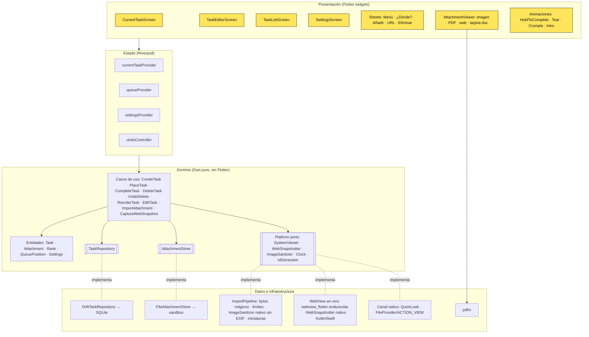
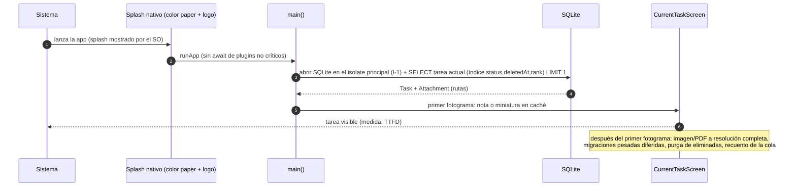
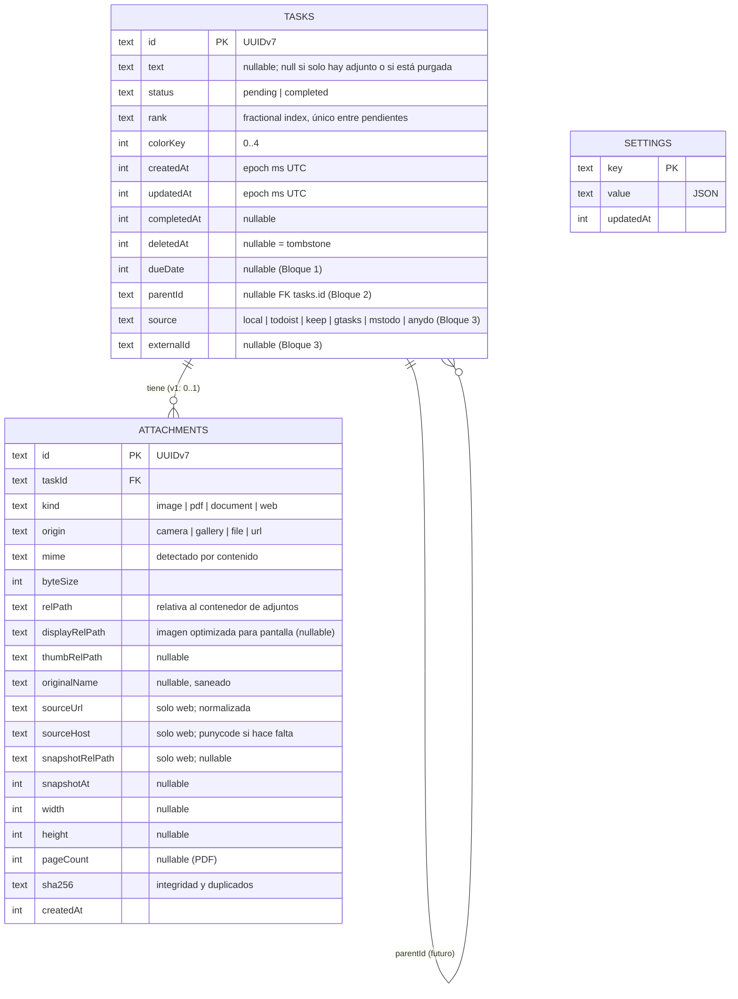
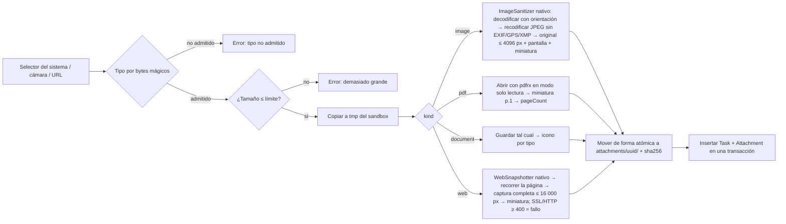

# Arquitectura

> Estado: diseño para la v1, pendiente de validación en los spikes (ADR-0001). Etiquetas: **[Hecho]**, **[Suposición]** y **[Pendiente]**.

## 1. Capas



**Reglas de dependencia:** `presentation → state → domain ← data`. El dominio **no importa** Flutter, drift ni plugins, y se prueba con tests de Dart puro. Toda la persistencia pasa por `TaskRepository` y `AttachmentStore` (así se puede añadir sincronización sin reescribir los casos de uso).

**Estructura prevista de `app/lib/`** (por funcionalidad y capas):

```
lib/
  app/            arranque, router, AppIdentity, FeatureFlags, tema (tokens.g.dart)
  l10n/           app_es.arb, app_en.arb (textos, fechas, plurales)
  domain/         entities/, usecases/, ports/ (interfaces)
  data/           db/ (drift: tablas, migraciones), attachments/, import/, web/, platform/
  features/
    current_task/ first_run/ editor/ placement/ complete/ delete/ task_list/ attachments/ settings/
  ui/             componentes base con tokens (StickyNote, BrutalButton, Sheet, Toast…)
```

**[Suposición]** Riverpod (sin generación de código) como gestor de estado, porque permite probar sin widgets y sobrescribir dependencias en los tests. Se confirma en el `plan.md` de la spec 001.

## 2. Arranque rápido (P2: < 1 s hasta ver la tarea actual)



- Fuentes empaquetadas (ya en el primer fotograma) y *shaders* precompilados.
- Imagen: se muestra primero la **versión de pantalla** pregenerada al importar, **JPEG al ancho físico exacto de la pantalla** (I-2; ~20 % más rápido que PNG en S1); el original se carga al hacer zoom.
- PDF: miniatura de la primera página pregenerada; pdfrx se inicializa tras el primer fotograma.
- Web: captura mostrada al instante; la WebView en vivo se inicializa detrás.
- Bienvenida (R1) **solo** en el primer uso; nunca retrasa R8.
- Migraciones: las de esquema se ejecutan al abrir la BD (rápidas); las de datos pesadas se trocean en segundo plano.

## 3. Modelo de datos (esquema v1)



- **Índices:** `tasks(status, deletedAt, rank)`; `attachments(taskId)`; `tasks(parentId)` y `tasks(source, externalId)` único parcial (futuro).
- **Invariantes (se prueban en el dominio):** una tarea tiene `text` no vacío **o** un adjunto (o ambos); una tarea web no lleva texto en la v1 (como el prototipo); `rank` es único entre las pendientes no borradas; `completedAt` no es nulo ⇔ `status = completed`; una tarea eliminada no aparece en ninguna consulta de UI.
- **Ajustes v1:** `locale` (`system | es | en`), `keepScreenOn` (bool, true), `palette` (`classic`), `firstRunDone` (bool), `notifications` (reservado). Las claves se versionan con el esquema.
- **Versionado:** `schemaVersion = 1` desde el primer build. Cada cambio → nueva versión, captura en `app/drift_schemas/`, paso de migración y **test de migración** generado (ADR-0002).

### Casos de uso ↔ reglas

| Caso de uso | Efecto en los datos | Regla |
|---|---|---|
| `CreateTask(text, position)` | inserta con `rank` antes de la primera (`top`) o después de la última (`end`); `colorKey` ≠ el de la actual | R3, R4 |
| `CreateTask(attachment)` | importa el archivo → inserta **top** siempre | R5 |
| `CompleteTask(current)` | `status = completed`, `completedAt = now`; conserva el adjunto | R9, R14, D8 |
| `DeleteTask(id)` | `deletedAt = now`; deshacer 6 s; purga del contenido | R10, ADR-0006 |
| `ReorderTask(id, newIndex)` | nuevo `rank` entre los vecinos; el índice 0 ⇒ pasa a ser la actual | R13 |
| `EditTask(id, text, attachment?)` | actualiza y conserva `rank` y `colorKey` | R11, R13 |

## 4. Adjuntos: canal de importación



Límites: imagen 30 MB (y 50 MP), **PDF 10 MB** (D18), documento 25 MB, captura web 20 000 px de alto. La importación va en un *isolate* (no bloquea la UI) y cancelar limpia los temporales. Detalle de seguridad en `docs/security/threat-model.md`.

### Decisiones de implementación de los spikes (F1)

| ID | Decisión | Evidencia |
|---|---|---|
| I-1 | La consulta de arranque usa SQLite en el **isolate principal**; las escrituras pesadas van a un isolate en segundo plano después del primer fotograma | S1: de ~900 ms a ~80 ms en el emulador |
| I-2 | Versión de pantalla de las imágenes en **JPEG al ancho físico** de la pantalla | S1: −20 % frente a PNG |
| I-3 | **Precapturar** la nota actual tras el primer fotograma (o `ImageFilter.shader` sin captura) para completar y eliminar | S2: primer fotograma de 40–105 ms |
| I-4 | **`ImageSanitizer` nativo** (Android `ImageDecoder` + `Bitmap.compress`; iOS ImageIO) | S5: 12 MP en 0,77 s frente a 12 s en Dart puro |
| I-5 | Captura web: SSL inválido (siempre cancelado) y HTTP ≥ 400 del marco principal = fallo | S4: sin esto se guardaba una página en blanco |
| I-6 | Captura web: recorrer la página por pasos antes de capturar | S4: huecos en webs que animan al hacer *scroll* |
| I-7 | Visor del sistema: comprobar si hay app antes de lanzar el intent y mostrar nuestro mensaje | S3: selector del sistema vacío y en inglés |

## 5. Plataforma e integración nativa

| Necesidad | iOS | Android |
|---|---|---|
| Fotos y archivos sin permisos amplios | PHPicker, UIDocumentPicker | Photo Picker, SAF (`ACTION_OPEN_DOCUMENT`) |
| Cámara | Permiso de cámara **al pulsar "Hacer foto"** | Ídem (o intent de cámara del sistema, que no necesita permiso) |
| Visor del sistema | QLPreviewController | `ACTION_VIEW` + FileProvider |
| Pantalla encendida | `isIdleTimerDisabled` mientras hay un adjunto visible | `FLAG_KEEP_SCREEN_ON` |
| Red | ATS por defecto (sin excepciones) | `network_security_config`: `cleartextTrafficPermitted=false` |
| Backup | Application Support incluido, Caches excluido | `dataExtractionRules` / `fullBackupContent` (ADR-0004) |
| Widgets (futuro) | WidgetKit (SwiftUI) + App Group | Glance/AppWidget + datos compartidos; puente `home_widget` |

## 6. Feature flags

`FeatureFlags` (constantes en compilación con `--dart-define`, sobrescribibles en desarrollo desde un menú oculto de debug):
`paletteThemes` (off), `historyScreen` (off), `dueDates` (off), `bulkCreate` (off), `imports` (off), `notifications` (off), `biometricLock` (off), `homeWidget` (off).
Regla: nada detrás de un flag llega a producción sin su spec aprobada.

## 7. Presupuestos de rendimiento y tamaño

| Métrica | Objetivo | Medición |
|---|---|---|
| Arranque en frío → tarea actual visible | p50 < 1,0 s, p90 < 1,3 s (Android de gama media); < 0,6 s (iPhone ≥ 12) | `integration_test` + marcas de tiempo; `flutter run --profile --trace-startup` |
| Arranque en caliente | < 300 ms | ídem |
| Animaciones | 60 fps, 0 fotogramas > 32 ms en el primer uso | DevTools / `FrameTiming` en un test de rendimiento |
| Abrir PDF (primera página) | < 500 ms | spike S3 |
| Tamaño de descarga | Android < 25 MB (por ABI, AAB); iOS < 40 MB | `flutter build --analyze-size` en CI (aviso si crece > 5 %) |
| Memoria | < 250 MB con una imagen de 50 MP visible | DevTools |

## 8. Internacionalización

- `flutter gen-l10n` con ARB (`app_es.arb` como plantilla, `app_en.arb`); ICU para plurales y selectores; fechas con `intl` en el idioma activo.
- Resolución: ajuste `locale` ≠ `system` → ese idioma. Si no: cualquier `es-*` del dispositivo → `es`; el resto → `en` (R15).
- El nombre de la app es la clave `appName` + `AppIdentity`. El nombre nativo va en InfoPlist.strings (es/en) y `strings.xml` (values, values-es), generados desde una única fuente (`app/identity.yaml`).
- CI: test que compara las claves de ES y EN (sin huecos) y lint que prohíbe literales de texto en los widgets (`custom_lint` o un script).
