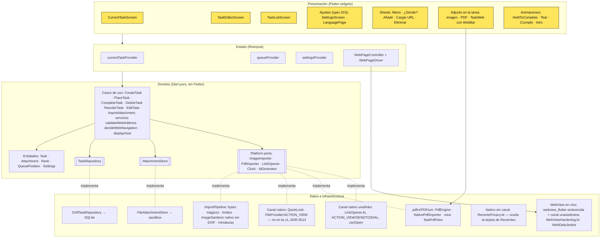
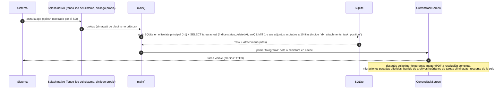
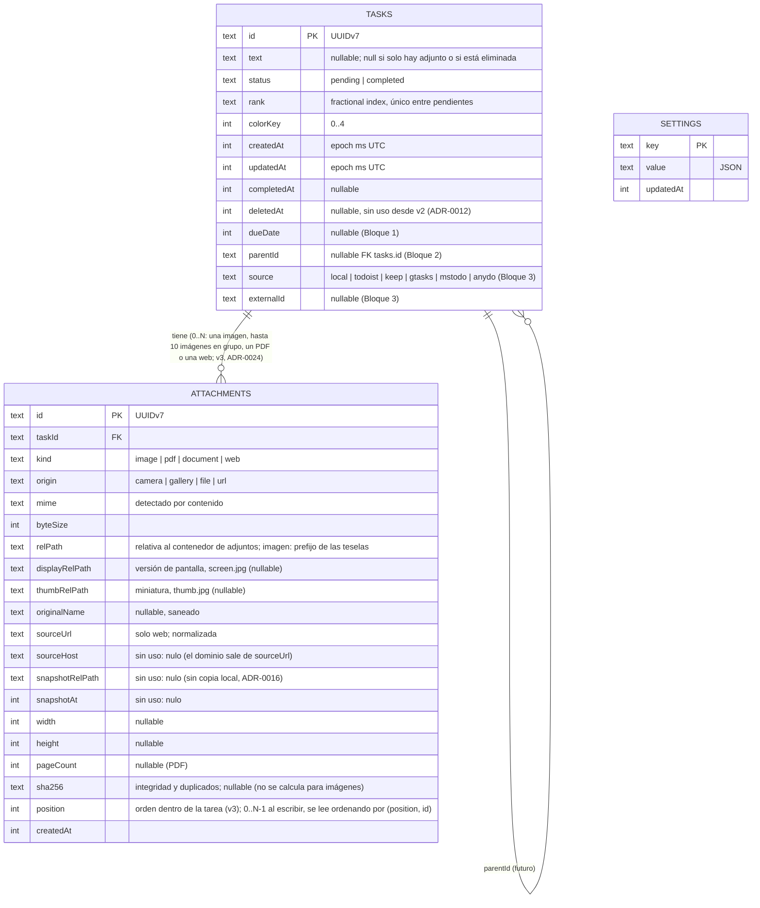
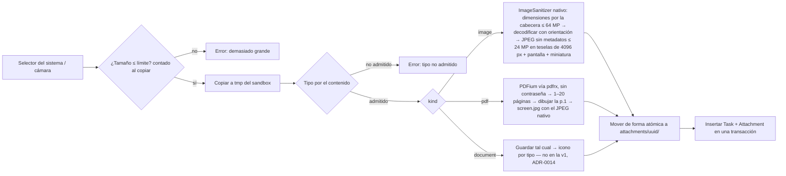

# Arquitectura

> Estado: diseño para la v1, pendiente de validación en los spikes (ADR-0001). Etiquetas: **[Hecho]**, **[Suposición]** y **[Pendiente]**.

## 1. Capas


```mermaid
flowchart TB
  subgraph UI["Presentación (Flutter widgets)"]
    S1[CurrentTaskScreen]:::ui
    S2[TaskEditorScreen]:::ui
    S3[TaskListScreen]:::ui
    S4["Ajustes (spec 015): SettingsScreen · LanguagePage"]:::ui
    SH[Sheets: Menú · ¿Dónde? · Añadir · Cargar URL · Eliminar]:::ui
    V[Adjunto en la tarea: imagen · PDF · TaskWeb con WebBar]:::ui
    FX[Animaciones: HoldToComplete · Tear · Crumple · Intro]:::ui
  end
  subgraph STATE["Estado (Riverpod)"]
    P1[currentTaskProvider]
    P2[queueProvider]
    P3[settingsProvider]
    P4[WebPageController + WebPageDriver]
  end
  subgraph DOMAIN["Dominio (Dart puro, sin Flutter)"]
    UC[Casos de uso: CreateTask · PlaceTask · CompleteTask · DeleteTask · ReorderTask · EditTask · ImportAttachment; servicios validateWebAddress · decideWebNavigation · displayHost]
    E[Entidades: Task · Attachment · Rank · QueuePosition · Settings]
    RP[[TaskRepository]]
    AS[[AttachmentStore]]
    PF[[Platform ports: ImageImporter · PdfImporter · LinkOpener · Clock · IdGenerator]]
  end
  subgraph DATA["Datos e infraestructura"]
    DR[DriftTaskRepository → SQLite]
    FS[FileAttachmentStore → sandbox]
    IMP[ImportPipeline: bytes mágicos · límites · ImageSanitizer nativo sin EXIF · miniaturas]
    WV[WebView en vivo: webview_flutter endurecida + canal una/webview, WebViewHardening.kt · WebDataJanitor]
    PDF[pdfrx/PDFium: PdfEngine · NativePdfImporter · visor TaskPdfView]
    LNK[Canal nativo una/links: LinkOpener.kt, ACTION_VIEW/SENDTO/DIAL, canOpen]
    RC[Nativo sin canal: RecentsPrivacy.kt — oculta la tarjeta de Recientes]
    NV[Canal nativo: QuickLook · FileProvider/ACTION_VIEW — no en la v1, ADR-0014]
  end
  UI --> STATE --> UC
  UC --> E
  UC --> RP & AS & PF
  RP -.implementa.- DR
  AS -.implementa.- FS
  PF -.implementa.- IMP & NV & PDF & LNK
  P4 --> WV
  V --> PDF
  classDef ui fill:#FFE55C,stroke:#111,color:#111
```

**Reglas de dependencia:** `presentation → state → domain ← data`. El dominio **no importa** Flutter, drift ni plugins, y se prueba con tests de Dart puro. Toda la persistencia pasa por `TaskRepository` y `AttachmentStore` (así se puede añadir sincronización sin reescribir los casos de uso).

**Estructura prevista de `app/lib/`** (por funcionalidad y capas):

```
lib/
  app/            arranque, router, AppIdentity, FeatureFlags, tema (tokens.g.dart)
  l10n/           app_es.arb, app_en.arb (textos, fechas, plurales)
  domain/         entities/, usecases/, ports/ (interfaces)
  data/           db/ (drift: tablas, migraciones), attachments/, import/, web/, platform/
  features/
    current_task/ first_run/ editor/ placement/ complete/ delete/ task_list/ attachments/ settings/
  ui/             componentes base con tokens (StickyNote, BrutalButton, Sheet, Toast…)
```

**[Suposición]** Riverpod (sin generación de código) como gestor de estado, porque permite probar sin widgets y sobrescribir dependencias en los tests. Se confirma en el `plan.md` de la spec 001.

## 2. Arranque rápido (P2: < 1 s hasta ver la tarea actual)


```mermaid
sequenceDiagram
  autonumber
  participant OS as Sistema
  participant N as Splash nativo (fondo liso del sistema, sin logo propio)
  participant M as main()
  participant DB as SQLite
  participant UI as CurrentTaskScreen
  OS->>N: lanza la app (splash mostrado por el SO)
  N->>M: runApp (sin await de plugins no críticos)
  M->>DB: abrir SQLite en el isolate principal (I-1) + SELECT tarea actual (índice status,deletedAt,rank) LIMIT 1 y sus adjuntos acotados a 10 filas (índice `idx_attachments_task_position`)
  DB-->>M: Task + Attachment (rutas)
  M->>UI: primer fotograma: nota o miniatura en caché
  UI-->>OS: tarea visible (medida: TTFD)
  Note over UI: después del primer fotograma: imagen/PDF a resolución completa,<br/>migraciones pesadas diferidas, barrido de archivos huérfanos de tareas eliminadas, recuento de la cola
```

- **Splash nativo [Hecho, medido en el emulador de API 37]:** lo que ve el usuario mientras arranca el proceso es el *splash* que pinta el sistema (Android 12+) con el fondo de `launch_background.xml` (`?android:colorBackground`) y el icono de la app: **fondo liso, sin logo propio y sin el color `paper`**; en modo claro sale blanco y en modo oscuro **negro** (`values-night` usa `Theme.Black`), unos 0,5 s antes del primer fotograma de Flutter. **[Pendiente, F5]** mitigación posible, fuera de la spec 011: usar `paper` en `launch_background` (y su versión para modo oscuro) para que el arranque en frío no sea blanco o negro. No cambiaría el fotograma blanco al volver a la app sin instantánea (spec 011, CA-011-03): se midió blanco también en modo oscuro, así que no sale de `launch_background` (`specs/011-ocultar-recientes/dispositivo.md`, "T-011-08 previa").
- Fuentes empaquetadas (ya en el primer fotograma) y *shaders* precompilados.
- Imagen: se muestra primero la **versión de pantalla** pregenerada al importar (con un grupo, **la de la primera foto y nada más**: el primer fotograma no espera a ninguna otra; `readBootState` lee ya el grupo, acotado a 10 filas por una consulta indexada), **JPEG al ancho físico exacto de la pantalla** (I-2; ~20 % más rápido que PNG en S1); el original se carga al hacer zoom.
- PDF (spec 008): antes de `runApp`, y solo si la tarea actual tiene PDF (tope de 1 s), se leen `position.json` y se decodifica `screen.jpg`, que es **lo que se ve desde la última posición**; el primer fotograma la pinta y pdfrx abre el documento debajo, sin quitarla hasta que ha dibujado las páginas visibles (detalle en §4, «PDF»).
- Web (spec 009): el primer fotograma pinta la barra del dominio y la línea de carga; la WebView se crea **después** del primer fotograma y la página, que depende de la red, queda fuera del presupuesto (ADR-0016). Si se usó la web y la app se cerró sin limpiar, el borrado de los datos de la WebView va también tras el primer fotograma (§4, «Tarea web»). **[Hecho]** Xiaomi, *release*: p50 478 ms con una tarea web actual (`docs/perf/baseline.md`).
- Bienvenida (R1) **solo** en el primer uso; nunca retrasa R8.
- Migraciones: las de esquema se ejecutan al abrir la BD (rápidas); las de datos pesadas se trocean en segundo plano.

## 3. Modelo de datos (esquema v3)


```mermaid
erDiagram
  TASKS ||--o{ ATTACHMENTS : "tiene (0..N: una imagen, hasta 10 imágenes en grupo, un PDF o una web; v3, ADR-0024)"
  TASKS ||--o{ TASKS : "parentId (futuro)"
  TASKS {
    text id PK "UUIDv7"
    text text "nullable; null si solo hay adjunto o si está eliminada"
    text status "pending | completed"
    text rank "fractional index, único entre pendientes"
    int colorKey "0..4"
    int createdAt "epoch ms UTC"
    int updatedAt "epoch ms UTC"
    int completedAt "nullable"
    int deletedAt "nullable, sin uso desde v2 (ADR-0012)"
    int dueDate "nullable (Bloque 1)"
    text parentId "nullable FK tasks.id (Bloque 2)"
    text source "local | todoist | keep | gtasks | mstodo | anydo (Bloque 3)"
    text externalId "nullable (Bloque 3)"
  }
  ATTACHMENTS {
    text id PK "UUIDv7"
    text taskId FK
    text kind "image | pdf | document | web"
    text origin "camera | gallery | file | url"
    text mime "detectado por contenido"
    int byteSize
    text relPath "relativa al contenedor de adjuntos; imagen: prefijo de las teselas"
    text displayRelPath "versión de pantalla, screen.jpg (nullable)"
    text thumbRelPath "miniatura, thumb.jpg (nullable)"
    text originalName "nullable, saneado"
    text sourceUrl "solo web; normalizada"
    text sourceHost "sin uso: nulo (el dominio sale de sourceUrl)"
    text snapshotRelPath "sin uso: nulo (sin copia local, ADR-0016)"
    int snapshotAt "sin uso: nulo"
    int width "nullable"
    int height "nullable"
    int pageCount "nullable (PDF)"
    text sha256 "integridad y duplicados; nullable (no se calcula para imágenes)"
    int position "orden dentro de la tarea (v3); 0..N-1 al escribir, se lee ordenando por (position, id)"
    int createdAt
  }
  SETTINGS {
    text key PK
    text value "JSON"
    int updatedAt
  }
```

- **Índices:** `tasks(status, deletedAt, rank)`; `attachments(taskId)`; `attachments(taskId, position, id)` (`idx_attachments_task_position`, **no único**, v3: sirve a la lectura acotada a 10 filas por tarea); `tasks(parentId)` y `tasks(source, externalId)` único parcial (futuro).
- **Invariantes (se prueban en el dominio):** una tarea tiene `text` no vacío **o** un adjunto (o ambos); **desde la v3 (ADR-0024) una tarea tiene de 0 a N adjuntos y solo son válidos ninguno, uno de cualquier tipo o de 2 a 10 imágenes** (nunca un PDF o una web junto a otra fila, ni una fila ilegible junto a otras: `AttachmentGroup.isValidGroup`); `Task.attachments` es la lista (ordenada) y `Task.attachment` la primera; **no hay entidad para el grupo** (cada foto es un `Attachment` con su id y su carpeta); `Task` nunca lanza con una mezcla no válida (se lee, no se valida al construir: la validación es de `CreateTask`/`EditTask`); **sin índice único en `(taskId, position)`**, para poder leer una BD restaurada con posiciones repetidas o con huecos (la unicidad la garantiza la escritura); una tarea web no lleva texto en la v1 (como el prototipo); `rank` es único entre las pendientes; desde el esquema v2 (ADR-0012) solo se guardan tareas pendientes: completar y eliminar las borran de la BD (al eliminar, los archivos esperan a que no se pueda deshacer, ADR-0021), y `status`, `completedAt` y `deletedAt` quedan sin uso.
- **Ajustes v1:** `locale` (`system | es | en`, por defecto `system`) y `keepScreenOn` (bool, **apagado por defecto**; spec 015, ya los escribe la pantalla Ajustes y se leen al arrancar; sección «Ajustes»), `palette` (`classic`), `firstRunDone` (bool), `hasEverHadTasks` (bool: ya se guardó alguna tarea; decide entre "Todo hecho." y el editor de la primera tarea; lo activa `insert` en su transacción, ADR-0012), `notifications` (reservado). Las claves se versionan con el esquema; un valor por defecto distinto no es un cambio de esquema. Todas se leen con decodificadores que no lanzan (`settings_codec.dart`).
- **Versionado:** `schemaVersion = 3` (**v3, spec 016, ADR-0024:** columna `attachments.position` con valor por defecto 0, el índice de arriba y `from2To3`, que numera **solo las tareas con más de una fila** con un recorrido lineal en Dart sobre `ORDER BY task_id, created_at, id`; ninguna tarea cambia, captura `drift_schema_v3.json`; v2, ADR-0012: la migración borra una vez las completadas y las marcas de borrado, y activa `hasEverHadTasks`; mismas tablas). Cada cambio → nueva versión, captura en `app/drift_schemas/`, paso de migración y **test de migración** generado (ADR-0002).

### Casos de uso ↔ reglas

| Caso de uso | Efecto en los datos | Regla |
|---|---|---|
| `CreateTask(text, position)` | inserta con `rank` antes de la primera (`top`) o después de la última (`end`); `colorKey` ≠ el de la actual | R3, R4 |
| `CreateTask(attachment)` | importa el archivo → inserta **top** siempre. **Con un grupo (spec 016):** `CreateTask(attachments: [...])` valida el grupo (≤ 10 imágenes o uno de cualquier tipo; si no, `ArgumentError`), `commitGroup` mueve las N carpetas (si falta una preparación, `StagedPhotosLost` sin mover nada; si una falla, devuelve las movidas), inserta la tarea y las N filas (`position` = índice) en **una transacción** y suelta la protección de todas | R5 |
| `CompleteTask(current)` | `remove(id)`: borra la fila y las de sus adjuntos en una transacción; después, sus archivos (`AttachmentJanitor`). Sin histórico. Antes, `UndoController.commit()`: una eliminación que aún se podía deshacer pasa a definitiva (spec 014) | R9, ADR-0012 |
| `DeleteTask(id)` (`DeleteCurrentTask`, `DeletePendingTask`) | `holdAll` de los archivos de **todas las fotos** (o del adjunto) **antes** de `remove(id)` (la fila y las de su adjunto salen de la BD al instante); **no** borra archivos: devuelve la tarea leída de la BD y la retiene `UndoController`. Los archivos se borran cuando la eliminación es definitiva (spec 014, ADR-0021; más abajo) | R10, ADR-0012, ADR-0021 |
| `RestoreDeletedTask(task)` | Deshace una eliminación: vuelve a `insert` la **misma** `Task` (id, `rank`, color, `createdAt`, `updatedAt`, adjunto) y después suelta la protección de sus archivos. Comprueba que ningún pendiente tiene ese `rank` (`RankTaken`); si el id ya existe, no hace nada; nunca `restage` ni `store.commit` (los archivos no se mueven) | R10, ADR-0021 |
| `ReorderTask(id, newIndex)` | nuevo `rank` entre los vecinos; el índice 0 ⇒ pasa a ser la actual | R13 |
| `EditTask(id, text, attachment?)` | actualiza y conserva `rank` y `colorKey`. **Con grupos (spec 016):** `ReplaceAttachment(List)` / `.one` sustituye el grupo entero (borra las filas y reinserta `0..N-1` en una transacción y, **solo después de confirmar**, descarta los archivos que ya no están); `null` = no tocar las filas (editar solo el texto no borra nada, ni con filas raras); `[]` = quitarlo | R11, R13 |

## 4. Adjuntos: canal de importación


```mermaid
flowchart LR
  A[Selector del sistema / cámara] --> C{¿Tamaño ≤ límite? contado al copiar}
  C -- no --> Y[Error: demasiado grande]
  C -- sí --> D[Copiar a tmp del sandbox]
  D --> B{Tipo por el contenido}
  B -- no admitido --> X[Error: tipo no admitido]
  B -- admitido --> E{kind}
  E -- image --> F[ImageSanitizer nativo: dimensiones por la cabecera ≤ 64 MP → decodificar con orientación → JPEG sin metadatos ≤ 24 MP en teselas de 4096 px + pantalla + miniatura]
  E -- pdf --> G[PDFium vía pdfrx, sin contraseña → 1–20 páginas → dibujar la p.1 → screen.jpg con el JPEG nativo]
  E -- document --> H[Guardar tal cual → icono por tipo — no en la v1, ADR-0014]
  F & G & H --> J[Mover de forma atómica a attachments/uuid/]
  J --> K[Insertar Task + Attachment en una transacción]
```

Límites: imagen 30 MB y 64 MP (se guarda como mucho a 24 MP; **cada una de las hasta 10 de un grupo**, spec 016, §4 «Varias imágenes con carrusel»), **PDF 10 MB** (D18; en la v1 el único documento, ADR-0014). La web no pasa por este canal: no hay archivo (§4, «Tarea web»). La importación no bloquea la UI (las imágenes y el JPEG del PDF, en un hilo nativo; PDFium, en el *isolate* de trabajo de pdfrx) y cancelar limpia los temporales. **[Hecho]** El `sha256` de la tabla no se calcula todavía (ni imágenes ni PDF): queda nulo. Detalle de seguridad en `docs/security/threat-model.md`.

### Imágenes (spec 007)

- **Rutas** (Android; almacenamiento privado de la app):
  - guardadas: `files/attachments/<id>/` (`getApplicationSupportDirectory`), con `full-<fila>-<columna>.jpg` (versión completa en teselas), `screen.jpg` (versión de pantalla) y `thumb.jpg` (miniatura);
  - preparación: `cache/import/<id>/` (`getTemporaryDirectory`); la copia del original (`source`) se borra en cuanto se limpia;
  - la BD, en `app_flutter/una.sqlite`. Las copias de seguridad llevan la BD y no las imágenes (ADR-0004, revisión de la spec 007).
- **Versión completa:** JPEG recodificado desde los píxeles (sin EXIF, GPS, XMP ni ningún otro metadato), orientado y en sRGB; se reduce solo si pasa de **24 MP**, sin límite de lado (una captura de 1080 × 20 000 se guarda entera). Se trocea en **teselas de 4096 px** como máximo (`ImageTiles`), porque la GPU no dibuja texturas mucho mayores; una foto de 12 MP es una sola tesela.
- **Versión de pantalla:** al ancho de la pantalla en vertical, en píxeles físicos, sin ampliar ni perder los lados; si es más alta, solo la parte de arriba. La dibuja la tarea actual en el primer fotograma (CA-001-09) y encima se colocan las teselas.
- **Miniatura:** cuadrada, recortada, de 176 px (44 dp × 4).
- **Rechazo antes de decodificar:** el tipo, por los primeros bytes (`sniffImageType`); las dimensiones, por la cabecera (más de 64 MP → error, sin reservar memoria para los píxeles). 20 s como máximo.
- **Tarea actual con imagen** (sin visor, ADR-0013): coloca las teselas al ancho de la pantalla, con desplazamiento vertical, y las decodifica a esa resolución (`AttachmentTiles`), así que la memoria no depende del tamaño original. El pellizco amplía esa imagen y vuelve al soltar.
- **Archivos que faltan** (CA-007-19): si faltan la versión de pantalla o la miniatura, se regeneran desde las teselas (`regenerateDerived`); si falta la completa, "Adjunto no disponible".
- **Borrado:** un solo servicio, `AttachmentJanitor`. El barrido (2 s después del primer fotograma) borra los adjuntos sin tarea y las preparaciones abandonadas; `ImportRegistry` protege las importaciones en curso y el conjunto propio `held` (spec 014) las eliminaciones que aún se pueden deshacer.
- **Web de pruebas:** `WebImageImporter` hace lo mismo con el selector del navegador y un `canvas`, todo en memoria (`MemoryAttachmentStore`); HEIC no se admite.

### Varias imágenes con carrusel (spec 016, ADR-0022 y ADR-0024)

Estado: **[Hecho]** en Android (fusionada en `main`, PR svallev/una#39; emulador de API 37, `specs/016-varias-imagenes-carrusel/dispositivo.md`). **[Pendiente]** para la 022: Android 8 y 12L (`check-recents.sh`, PD-10), las medidas en el Xiaomi, los anuncios del editor, el gesto real de TalkBack, Switch Access, la voz y el control por voz (`docs/PLAN.md`, «Casillas de la 016»). Sin dependencias, permisos ni componentes nuevos; el único cambio de datos es el esquema v3 (§3).

- **Un grupo es `Task.attachments`** (de 2 a 10 imágenes, cada una con su id, su carpeta y los tres archivos de siempre); la primera foto es `Task.attachment`. Una tarea con una imagen y otra con un grupo solo se distinguen por tener una o más fotos (CA-016-03). El nombre provisional `ImageSet` se retiró.
- **Importar el grupo** (CA-016-02 a 05, CA-016-24): `ImageImporter.pickMany({max})` y `freeSpace()` (canal `una/images`, `ImageImport.kt`: selector de fotos con `EXTRA_PICK_IMAGES_MAX` o de documentos con `ALLOW_MULTIPLE`; **como mucho 10 tokens** de `clipData` y `total` = lo devuelto, antes de abrir ninguno). `ImportImage.pickMany` devuelve un `ImportGroup`: registra **un id por foto** en `ImportRegistry` al volver el selector, y `prepareAll` las prepara **una tras otra** con el `ImportJob` de siempre bajo un `ImportBudget` (20 s por foto y 2 min en total, con tiempo activo: latido de 1 s que suma `min(hueco, 2 s)`; un hueco de más de 3 s reinicia la foto en curso) y un estado del grupo (`running | cancelled | expired`) que se mira antes de cada paso. La limpieza nativa va en un hilo propio con su bandera comprobada antes de empezar y Dart espera a que termine la anterior (o 3 s). Una foto que falla se omite y se avisa (solo el código); si fallan todas, el error de la primera; sin espacio, se descarta todo (30 MB + 10 × `storedPhotoEstimate` de 16 MB + lo que ocupa el grupo que se reemplaza). `ImportGroup` tiene una única salida que suelta todo id que no esté en `staged`. En la web de pruebas, `WebImageImporter.pickMany` usa `<input multiple>` y `takeFirst` lee solo los 10 primeros.
- **Guardar y borrar son del grupo entero:** `commitGroup` (§3, tabla de casos de uso) y `AttachmentJanitor` por lotes (`holdAll`, `releaseHeldAll`, `discardHeldAll`, `discardAll`, `restageAll`, `releaseAll`; sin lanzar, la comprobación «¿tiene fila?» por lote con `existingAttachmentIds`). Completar, eliminar, deshacer, editar, cancelar y el barrido usan los mismos métodos, así que no queda ningún archivo huérfano ni temporal (CA-016-16).
- **Lectura tolerante** (CA-016-25): una sola consulta SQL a mano (`customSelect`) con `LEFT JOIN attachments a ON a.id IN (SELECT … ORDER BY position, id LIMIT 10)`, que sirve el índice por clave y escucha las dos tablas; un tipo u origen desconocido o unas medidas fuera de rango dan `Attachment.unreadable` (medidas 1 × 1) y toda la tarea sale como «Adjunto no disponible».
- **Salud** (`group_health.dart`): `groupHealthProvider` solo hace `check` (barato) para saber si faltan **todas** (tarjeta «Adjunto no disponible») o algunas (`PhotoMissingBox`, «Foto no disponible», en su sitio); la regeneración de derivadas va **de una en una** (`RepairQueue`) solo para la foto a la vista y las contiguas.
- **Carrusel** (`photo_carousel.dart`, `photo_swipe.dart`, `zoomable_photo.dart`): no es un `PageView`. `PhotoCarousel` es infinito (también con 2), monta la foto actual y la vecina hacia la que se arrastra (claves por id: el `State` pasa de vecina a actual), anima 280 ms con la curva `photoSwipe` (instantáneo con reducir movimiento) y mantiene como mucho 3 versiones de pantalla decodificadas (`precacheImage` de las contiguas, `evict` del resto); cada foto tiene su `PhotoScrollController` (conserva su desplazamiento mientras la tarea siga a la vista; el zoom no). `ZoomablePhoto` es la página de `TaskImage` extraída (versión de pantalla en el primer fotograma, teselas, desplazamiento vertical, pellizco ×8 que vuelve al soltar). `PhotoSwipeRecognizer` (un `OneSequenceGestureRecognizer` propio) reparte el gesto por dirección: tras `min(16 dp, touchSlop)` de recorrido es horizontal si `|dx| > 1,5 · |dy|` y el eje no cambia hasta levantar todos los dedos; cambia de foto con > 18 % del ancho o ≥ 700 dp/s; con dos dedos nunca (un segundo dedo cancela el swipe y el que queda tras un pellizco no inicia nada); un gesto que empieza en el borde del sistema (`systemGestureInsets`, medido: 78 px ≈ 30 dp con gestos, 0 con tres botones, también en horizontal) no es del carrusel.
- **Pie y puntos** (`photo_group.dart`): `PhotoGroupHost` (estado: controlador y margen) y `PhotoGroupFooter` (pie `ImageCaption` + `PhotoDots`), **fijos** al cambiar de foto y **bajo el pie, encima del botón de completar** (P-016-1, DEV-53); miden su caja real (`GlobalKey` + `SizeChangedLayoutNotifier`) para dar el margen inferior de las fotos (`ZoomablePhoto.bottomInset`). `PhotoDots`: 9 × 9, borde de 2, halo blanco de 1,5, `IgnorePointer` y fuera de la lectura.
- **Lectura, teclado y anuncios** (`photo_announcer.dart`; CA-016-20 y 21): un solo nodo `taskNode` («Tarea actual: {texto}. {n} fotos. Foto {i} de {n}», calculado por `photoGroupReading`/`photoState` con una sola función para la etiqueta y el anuncio, «Foto no disponible» incluida) con «Foto siguiente», «Foto anterior» (registradas **antes** de Completar y Eliminar) y `onScrollLeft/Right`; el nodo no se recrea al cambiar de foto. El anuncio único «Foto {i} de {n}» lo da una **región viva** en un nodo propio con el idioma de la app (`LiveRegionAnnouncer`, con `accessibilityFocusBlockType: blockNode` para que no sea una parada de foco; elegida frente a `SendAnnouncementAnnouncer` con TalkBack en el emulador: una frase por cambio en 5 por acción y 5 por gesto) y un antirrebote de 300 ms. Con teclado, el elemento de la tarea es un punto de foco con anillo (también en horizontal) que recibe el foco al abrir y consume las flechas (sin repetición ni Alt/Ctrl/Meta). Con una foto alta, «desplazar adelante» del lector la recorre y luego pasa a la siguiente (decisión del propietario, 2026-10-07).
- **Horizontal** (CA-016-12): el mismo `PhotoCarousel`, sin menú, botón, pie ni puntos; conserva la foto y su desplazamiento (el zoom no).
- **Completar y eliminar** (CA-016-19): `PhotoFaceCapture` (`RepaintBoundary.toImageSync`, como `PdfFaceCapture`) guarda **solo en memoria** lo que se ve —la foto actual con su desplazamiento, el pie y los puntos— **antes** de descartar los archivos; la cara (`PhotoFaceLayer`) la pinta esa imagen y no lee disco, ni comprueba salud ni regenera; se libera al terminar. Sin captura, la cara es estática (color y pie). Deshacer devuelve la tarea en la primera foto.
- **Editor** (CA-016-06): `PhotoStack` (≤ 3 fotos con -1°/4°/-5°, la primera arriba, etiqueta «{n} fotos» blanca sobre tinta, un solo nodo «Vista previa: {n} fotos»), «Preparando foto {i} de {n}…» con «Cancelar», `ImportNoticeBanner` (el aviso visible sin caducidad y el anuncio compuesto único, tras el foco a la pila) y `BrutalButton(semanticsEnabled: false)` para «+» y «Continuar» mientras se prepara.
- **Medidas** (emulador de API 37, 24 MP; T-016-20, `dispositivo.md`): arranque p50 425 ms con 1 foto y 429 ms con 10; pico de memoria 81 → 102 MB (+21, límite +50); hueco al cambiar de foto 0 fotogramas; **62 MB** en disco por tarea de 10 (límite 150), así que `storedPhotoEstimate` (16 MB) se queda y no hace falta rebajar la versión completa de los grupos (ADR-0024); listado con 500 tareas de 10 fotos: se abre en 130 ms frente a 24–49 ms con una (< 300 ms de CA-006-20).

### PDF (spec 008, ADR-0014)

- **Canal de importación:** el mismo de las imágenes (`una/images`, `ImageImport.kt`) con el origen `file`: `ACTION_OPEN_DOCUMENT` con `application/pdf` (sin permisos), el nombre visible (`OpenableColumns`, solo para mostrarlo), la copia acotada a **10 MB** contada al copiar y los primeros 1024 bytes para el tipo. Después, en Dart (`ImportPdf` + `NativePdfImporter`): el tipo por el contenido (`isPdf`: `%PDF-` en los primeros 1024 bytes y nada de marcado delante), abrir con PDFium **sin contraseña** (si la pide → `protected`), **1–20 páginas** (`tooManyPages`), dibujar la página 1 y codificarla como `screen.jpg` con `encodeJpeg` nativo (en Dart es 15 veces más lento). Cualquier error del motor = ilegible. 20 s como máximo. El nombre se sanea (`sanitizeFileName`: sin rutas, controles ni marcas bidi, 120 caracteres) y nunca se registra.
- **Rutas:** `files/attachments/<id>/` con `document.pdf` (el archivo tal cual, con nombre generado), `screen.jpg` (versión de pantalla) y `position.json` (última posición: página + fracción, escrita de forma atómica). Sin miniatura: el listado muestra la insignia "PDF". Sin cambio de esquema: `kind = pdf`, `origin = file`, `originalName` y `pageCount` en columnas que ya existían; `relPath` → `document.pdf`, `displayRelPath` → `screen.jpg`.
- **Motor:** `pdfrx` (PDFium de `chromium/7811`, sin V8: no ejecuta JavaScript ni rellena formularios), fijado por sha256 en `tools/pdfium.lock` y comprobado en CI (`threat-model.md §5`). Solo se abren archivos ya copiados (`openFile`/`openData`), nunca URL. En la web de pruebas, PDFium va como WASM de los assets del paquete (`MemoryPdfImporter`/`WebPdfImporter`, en memoria).
- **Tarea actual con PDF** (`TaskPdfView`): páginas al ancho con `FitWidthSizing`, zoom ×1–×4 que se queda (pasos ×1,5/×2,5/×4 por acciones y teclas), la banda del texto como capa que sigue a la matriz del visor en un hueco sobre la página 1 y la franja fija fuera del visor. La semántica propia de pdfrx se excluye y la sustituye `PdfSemanticsLayer` (un nodo por página visible con su texto y sus acciones, y un nodo enfocable por enlace).
- **Arranque (CA-008-08):** `pdf_boot.dart` lee `position.json` y decodifica `screen.jpg` antes de `runApp`; `TaskPdfFace` la pinta encima del visor hasta que pdfrx avisa de que ha dibujado (`onDocumentLoadFinished`), al primer toque o a los 10 s. Al salir de la tarea o pasar a segundo plano se guarda la posición y, si cambió, se redibuja `screen.jpg` con lo que se ve desde ella (`PdfEngine.renderView`).
- **Enlaces (CA-008-12):** `classifyLink` (dominio) decide: página interna, `http(s)` (sin `usuario@`, dominio en punycode si mezcla alfabetos), `mailto:` rehecho solo con destinatarios y asunto, `tel:` solo el número; el resto se bloquea. Tras la confirmación, el canal `una/links` (`LinkOpener.kt`) lanza `ACTION_VIEW` + `BROWSABLE`, `ACTION_SENDTO` o `ACTION_DIAL` solo si `resolveActivity` encuentra app (I-7; `<queries>` para esos tres).
- **Giro:** `AttachmentRotation` (Kotlin y Dart) sirve para imagen y PDF; sin "Volver a vertical" (ADR-0015).
- **Archivos que faltan (CA-008-18):** si falta `screen.jpg`, se redibuja desde el PDF en la última posición (`PdfImporter.renderScreen`); si falta o no se abre `document.pdf`, "Adjunto no disponible".
- **Completar y eliminar:** la cara de la rotura y del arrugado es una imagen fija de lo que se ve (`PdfFaceCapture`), no `screen.jpg`. El borrado es el mismo de la 007 (`AttachmentJanitor`: el directorio entero).

### Tarea web (spec 009, ADR-0016/0017/0018)

Estado: **[Hecho]** en Android (rama `feat/009-adjunto-url`; emulador y Xiaomi, T-009-18/19). iOS **[Pendiente]** (D17: `webview_flutter_wkwebview` llega como transitiva y no se usa).

- **Un adjunto sin archivos** (ADR-0016, excepción a P3): se guarda solo la dirección (`kind = web`, `origin = url`, `sourceUrl`, `mime = text/html`, `byteSize = 0`, `relPath` vacío, el resto nulo; sin cambio de esquema). No pasa por el canal de importación: la hoja "Cargar URL" (`UrlSheet`) valida con `validateWebAddress` (dominio; esquema `http(s)`, sin `usuario@`, sin IP privadas ni nombres locales, dominio en punycode, 2048 caracteres) y el editor llama a `CreateTask` con `StagedWeb` (arriba del todo, sin texto); Editar abre la misma hoja (`editWebTask` → `EditTask`). `commit` no mueve nada, `check` da `ok` y `delete` no encuentra nada, así que no hay "Adjunto no disponible" y completar o eliminar ya lo borran todo (ADR-0012).
- **Sin navegación** (ADR-0018): se ve **solo la dirección guardada**. `decideWebNavigation` (dominio, Dart puro) deja la carga inicial con las redirecciones **del servidor** (`http://` como `https://`) y, después, solo las anclas de la misma página; el resto (enlaces, formularios, ventanas nuevas, redirecciones de la página, `mailto:`, `tel:`) no hace nada, sin confirmaciones. Los POST no pasan por `onNavigationRequest`: si, vista la página, empieza otra carga del marco principal, se vuelve a cargar la dirección guardada, y a la segunda vez seguida se para con un aviso. Sin *Public Suffix List* (retirada con T-009-03). Atrás, como en cualquier tarea.
- **Capas:**
  - dominio: `web_address.dart`, `web_navigation.dart`, `host_display.dart` (dominio visible: sin `www.`, saneado, punycode si mezcla alfabetos; compartido con los enlaces del PDF) y `web_load_failure.dart` (`offline`, `insecure`, `certificate`, `notAPage`, `keepsLeaving`, con sus acciones);
  - estado: `WebPageController` (`ValueNotifier<WebPageState>`: cargando, vista, avisos; 20 s sin `onPageStarted` → sin conexión; "Reintentar"; segundo plano < 10 min se conserva; aviso de redirección una vez) sobre la interfaz `WebPageDriver`, que en los tests es un falso (`FakeWebPageDriver`/`FakeWebPages`) y en la app `WebViewPageDriver` (`webview_flutter`, composición híbrida). `web_page_driver_factory.dart` usa importación condicional: la web de pruebas no incluye el paquete;
  - presentación: `TaskWeb` (la barra del dominio `WebBar` —candado, dominio recortado por el principio, "WEB"— como nodo de la tarea con Completar y Eliminar; la página debajo; línea de carga; avisos en lugar de la página con `Offstage`), la WebView se crea **tras el primer fotograma**; en horizontal, página a sangre con el logotipo como nodo de la tarea, sin recrear la WebView. En la web de pruebas, `WebPreviewCard` (dominio, dirección y "Abrir página →" en pestaña nueva con `noopener`).
- **Endurecimiento desde Dart** (`WebViewPageDriver`): JavaScript sin ningún canal; permisos y geolocalización denegados; diálogos JS, selector de archivos y pantalla completa descartados; certificado no válido siempre cancelado; la consola de la página no llega al registro. `setNavigationDelegate` se llama **una sola vez** y después `harden`.
- **Canal nativo `una/webview`** (`WebViewHardening.kt`, registrado en `MainActivity`; en Dart, `ChannelWebViewHardening`). Toma la instancia con `WebViewFlutterAndroidExternalApi.getWebView`:
  - `harden(id)`: `allowFileAccess`/`allowContentAccess`/`saveFormData` a `false`, `mixedContentMode = NEVER_ALLOW`, Safe Browsing activado, `supportMultipleWindows` a `false`, `DownloadListener` que no descarga (avisa `downloadBlocked`, sin la dirección → "no es una página"), depuración remota solo si la app es depurable, y el **envoltorio del `WebViewClient`** del paquete (ADR-0017): reenvía todos los callbacks y añade `onRenderProcessGone` (→ `true` + aviso `renderProcessGone`) y el aviso `mainFrameRequest` (`isRedirect` de cada petición del marco principal, sin la dirección). Lee los ajustes de vuelta y devuelve si quedó puesto; si no, no se carga nada;
  - `state(id)` (comprobación), `destroy(id)` y `clearData(id?)` (cookies, `WebStorage.deleteAllData` y caché, con la WebView que se ve o una temporal).
  - Tras un fallo del proceso de la página, la WebView nueva se crea **solo al llegar el aviso** (antes, compartía el proceso que muere y Android cerraba la app), con otra clave, y la vieja se destruye. **Riesgo R-21:** depende de detalles internos del paquete; se revalida con `chrome://crash` en cada actualización de `webview_flutter_android`.
- **Nada de la página se queda** (CA-009-13): `WebDataJanitor` borra cookies, almacenamiento web y caché al salir de la tarea por cualquier camino (otra pantalla opaca, otra tarea, completar, eliminar, editar la dirección) y, si existe la marca vacía `files/web_used` (escrita antes de cargar), tras el primer fotograma del arranque siguiente. `app_webview/` y `cache/` no están en las reglas de copia, y se excluyen `AwOriginVisitLoggerPrefs.xml` y `WebViewChromiumPrefs.xml` (nube y transferencia). **[Aceptado, propietario 2026-09-29]** quedan rastros que ninguna API borra (`app_webview/Default/Preferences`, `AwOriginVisitLoggerPrefs`) y el autorrelleno del sistema puede actuar en la página (`threat-model.md §7`).
- **Red y privacidad:** `INTERNET` es el único permiso de la app (`check-android-permissions.sh release`); `cleartextTrafficPermitted=false`; `WebView.MetricsOptOut`. Safe Browsing consulta a Google la reputación de las direcciones: **[Suposición, PD-9]** no cambia Data Safety; se revisa antes de publicar.
- **Coste:** APK *release* arm64 28,7 MB (13,4 MB comprimido; +66 KB por el paquete); +65 MB de PSS con la página cargada (Xiaomi, `docs/perf/baseline.md`).

### Ajustes (spec 015, ADR-0023 y ADR-0026; sustituye a la pantalla temporal de la 012, DEV-49 → DEV-52)

Estado: **[Hecho]** en Android (rama `feat/015-ajustes`; emulador de API 37, `specs/015-ajustes/dispositivo.md`, y TalkBack a oído en el Xiaomi por el propietario). **[Pendiente]** para la 022: Switch Access (el barrido no se pudo conducir con `adb`), repetir a oído la voz de «Idioma, Español» y de «Como el sistema» con la versión final (los *goldens* de Ajustes ya están subidos, `201d97c`). Sin esquema nuevo (`schemaVersion` sigue en 2), sin dependencias, sin permisos y sin código nativo nuevo (CA-015-17).

- **Dos ajustes en `settings`** (`locale`, `keepScreenOn`): `LocaleChoice` (dominio, sin `Locale`) y `settings_codec.dart` los decodifican con un tope de 16 caracteres, `on Object` y solo los valores exactos (`system|es|en`, `true`): cualquier otra cosa da el defecto (`system`, apagada), también en `firstRunDone` y `hasEverHadTasks` (CA-015-26). Drift y la memoria usan el mismo decodificador. `readBootState` lee cada ajuste en su propio `try/catch` **después** de la tarea actual (una base inaccesible sigue dando la pantalla de error de almacenamiento) y `BootState.locale` hace que el primer fotograma ya salga en el idioma elegido. `SettingsController` (`settingsProvider`, sin `autoDispose`): `saveLocale`, `applyLocale`, `setKeepScreenOn`; guardados en serie, captura `Object` sin relanzar ni registrar, resultado `saved/unchanged/failed`; el interruptor y el idioma **no cambian hasta guardar** (sin cambio optimista).
- **Idioma elegido (ADR-0023):** `UnaApp` pasa `MaterialApp.locale` (`null` con «Como el sistema»; `Locale('es'|'en')` construido en `app/`) y deja `localeListResolutionCallback` (la regla de la 010, `resolveAppLocale`) solo para `system`. Con un idioma elegido el sistema no cuenta. `appFrame` sigue marcando el contenido con `localeForSubtree` (ADR-0020); «Español» y «English» llevan **su propio idioma** (`attributedLabel` con `LocaleStringAttribute` por tramo, camino A de CA-015-11; la voz se oyó bien en el Xiaomi) y los anuncios del sistema y las palabras de rol y estado se oyen con la voz del sistema (excepción de P6, constitución 1.7).
- **Pantalla siempre activa:** `KeepScreenOnController` lee el ajuste y lo escucha (`ref.listen`); ya no hay `idleLimit` ni `touched()` ni `Listener` de toques en `una_app.dart`: encendida, **sin límite de tiempo**, solo con imagen, PDF o web a la vista y en primer plano (`inactive`, `paused` y `hidden` retiran la petición del canal `una/screen`; sin `WAKE_LOCK`).
- **Rutas** (`features/settings/`): `SettingsScreen` (nivel 1) sobre `settingsSheetRoute` (sube 200 ms, baja 160 ms; **absorbe los punteros** mientras sube) y `LanguagePage` (nivel 2) sobre `settingsRoute` (fundido de 160 ms); 0 ms con «reducir movimiento»; siempre en vertical. `SettingsPage` es el marco (título, Cerrar o Volver, Escape, modal para el lector, `FocusTraversalGroup(OrderedTraversalPolicy)` y `ensureVisible` en los dos sentidos) y reserva el borde inferior del sistema. **El menú se cierra y Ajustes sube a la vez** (`MenuAction.settings`, P-015-1, DEV-52): `undo.commit()` antes (CA-015-24) y, al cerrar, `menuFocusProvider` devuelve el foco al botón de menú de la tarea.
- **Componentes** (`ui/`): `UnaSwitchRow` (un nodo `toggled`, tokens P12, Intro y Espacio), `UnaRadioRow` + `UnaRadioGroup` (sin etiqueta propia: 0 paradas extra), `LiveNotice` (región viva, una clave por intento: el segundo fallo igual se vuelve a leer), `SettingsRow` (`Wrap`: el valor pasa a segunda línea al 200 %); `SquareIconButton` gana `focusNode`, `semanticsKey` y `autofocus`. Las filas con `excludeSemantics` llevan `focusable`/`focused` de su `InkWell` o TalkBack ignora el aviso de foco.
- **Cambiar de idioma** (CA-015-08): `saveLocale` → la página se congela en el idioma anterior (`Localizations.override` + `localeForSubtree`) → `pop` → `applyLocale` **en el mismo fotograma** → el nivel 1 pide el foco de «Idioma» una sola vez.
- **Enlaces (CA-015-12/13):** una sola función `openExternalPage` para las tres filas (Política, Licencias de terceros, Ayuda): `privacyLink` (solo `https`, sin `usuario@`) → `LinkOpener.canOpen` en cada toque (solo `resolveActivity`) → `open`, **directamente y sin confirmación** (enmienda del propietario, 2026-10-05; la hoja de confirmación de la 008 sigue en el PDF). Las tres direcciones son constantes de compilación (`AppIdentity`, de `identity.yaml`). Sin app, `open` falso o no `https`: aviso «No hay ninguna app…» (`LiveNotice`), sin mover el foco ni registrar la dirección. Un solo `_busy` evita dos aperturas. **Puerta de publicación:** `tools/check-release-config.sh` (`app/tool/check_release_config.dart`, `checkAddress` por clave) valida las tres (`https`, dominios propios, sin consulta ni fragmento, distintas entre sí por comparación normalizada) y ejecuta `gen_identity.dart --check`; repite la regla de `privacyLink` porque `dart run` no tiene `dart:ui` (un test comprueba que no es más permisiva); se pasa a mano en `/release-checklist` antes de cada entrega a testers y antes de publicar (no en CI hasta F6).
- **Volver del navegador** (CA-015-16 y 20h, enmendadas el 2026-10-05 por el propietario): con menos de 10 minutos, Ajustes sigue abierto; con 10 minutos o más, `UnaApp` hace `popUntil` y la tarea vuelve con el foco de entrada en el botón de menú. **TalkBack lleva su recuadro al título «Ajustes»** (o al texto de la tarea tras 10 minutos) y ignora el aviso de foco a la fila o al botón: se **acepta**, no se arregla desde Dart y no hay código que lo intente (el observador del ciclo de vida de T-015-14 se retiró).
- **Licencias de terceros (ADR-0026):** la app **no las muestra** (se retiraron `LicensesScreen`, `LicenseDetailScreen`, `licensesProvider`, `LicenseSource`, `LicensePackage`, `FlutterLicenseSource` y `registerBundledLicenses`). Los textos de `assets/licenses/{pdfium,sqlite,android}.txt`, los `OFL.txt` de las fuentes y el `NOTICES` de Flutter **siguen declarados en `pubspec.yaml` y dentro del APK**, sin leerse. `tools/check-licenses.sh [apk]` conserva sus comprobaciones (paquetes Dart de *release* ⊆ `NOTICES`, cada `.so`, artefactos de Android ⊆ `android.txt`, OFL de las fuentes, `pdfium.txt` contra `tools/pdfium.lock`) y **emite `app/build/third-party-notices.txt`** (versión, fecha UTC, sha256 de cada APK; `NOTICES` descomprimido, los tres `.txt`, los OFL y la lista de entradas), que verifica **sobre el archivo emitido** (`--notices-file`, `--negative`); en `ci.yml` se sube como artefacto de 90 días y un paso negativo exige que una copia mutada falle. `/release-checklist` lo adjunta a la release y exige que la web publique el de **esa** versión. **[Pendiente]** revisión legal antes de F6/023.
- **Con la barra de tres botones** (T-015-14): `showUnaSheet` suma `padding.bottom` (con el texto al 200 % a 360 dp el último enlace del menú quedaba a medias bajo la barra) y `SettingsPage` termina la zona desplazable sobre ella, para que `ensureVisible` no deje un aviso tapado.
- **Capas:** el dominio (`LocaleChoice`, `settings_codec`, `privacyLink`) es Dart puro; el `Locale` se construye solo en `app/`.

### Deuda de accesibilidad (spec 013, ADR-0020)

**Nota (spec 015):** CA-013-01 y CA-013-02 (nombre de las bibliotecas de Android y cambio de idioma con licencias abiertas) y el nivel 3 quedaron **obsoletos** al retirarse las pantallas de licencias (ADR-0026); CA-013-04 y 05 se aplican ahora a Ajustes (CA-015-20; `SettingsOrder` pasó a título 0, contenido 1, Cerrar o Volver 3, sin `status`). Los puntos de abajo sobre `licenses_screen`, `license_names` y `_LicenseList` son **historia**.

Estado: **[Hecho]** en el código (rama `feat/013-deuda-accesibilidad`, T-013-01 a 08d; emulador de API 37, `specs/013-deuda-accesibilidad/dispositivo.md`). **[Pendiente]** para la 016: foco real de TalkBack al volver del nivel 3 y al cerrar las hojas, anillo de foco con teclado físico, Switch Access (orden título, opciones, aviso, Volver), anuncio único del aviso a oído, "Reintentar" con TalkBack, "reducir movimiento" a ojo en el móvil y *goldens* en CI. Las casillas de `012/dispositivo.md` §8 se rehacen allí con este comportamiento.

- **Clave interna y nombre que se ve (CA-013-01):** la entrada propia de Android se registra con `androidLibrariesLicenseKey = 'una:android-libraries'` (dominio; no choca con un nombre de paquete de pub) y se muestra con `licensesAndroidLibraries` (ARB ES/EN). `LicensePackage` no gana campos: su `name` hace de clave. `licenseDisplayName` y `sortedForDisplay` (`features/settings/license_names.dart`) dan el nombre de la fila, de la etiqueta del lector y del título del nivel 3, y ordenan con `compareLicenseNames` (el comparador del dominio, el mismo que usa `FlutterLicenseSource`). `licensesProvider` no depende del idioma: se traduce al pintar.
- **Cambio de idioma con el nivel 2 o el 3 abiertos (CA-013-02):** `_LicenseList` es *stateful* y guarda por nombre el `FocusNode`, el orden y el mapa nombre → índice; las filas llevan `ValueKey(name)` + `findChildIndexCallback`. Cada fila crea **su** `GlobalKey` de semántica (una global reutilizada en una fila reconstruida rompe una aserción del árbol semántico). Al cambiar el idioma, la fila con el foco (o la abierta) se recoloca y se le devuelve el foco. `_reveal` lleva la fila a la vista sin animación: si no está construida salta a su posición estimada y repite; ya construida aplica `keepVisibleAtEnd` y luego `keepVisibleAtStart`, porque cada política solo desplaza en un sentido (F-2: una fila que **sube** quedaba sobre la ventana).
- **Hundido con "reducir movimiento" (CA-013-03, DEV-50):** `pressDuration(context)` (`ui/press_motion.dart`) da `Duration.zero` con `MediaQuery.disableAnimationsOf` y `UnaMotion.press` (80 ms) si no; la usan `BrutalButton` (también `.icon` y `ghost`), `SquareIconButton`, las opciones de `placement_sheet.dart` y `HoldToCompleteButton` (solo desplazamiento y sombra; el relleno no se toca). Se lee en `build`, así que el ajuste vale desde la siguiente pulsación.
- **Animaciones que no deben acortarse:** un `AnimationController` con el comportamiento por defecto divide su duración por 20 si `SemanticsBinding.disableAnimations` (el ajuste "Quitar animaciones" de Android) está activo. Llevan `AnimationBehavior.preserve`: el relleno de "mantener para completar" (`HoldToCompleteButtonState._fill`; sin él, la tarea se completaba en ~60 ms y se perdía la protección contra el toque accidental, F-1, CL-003-5), la enhorabuena (`CelebrationOverlay._t`; duraba ~140 ms en vez de 2,8 s), el destello del listado y la arruga de eliminar. Regla: si la animación informa de un progreso o de un tiempo que debe respetarse, `preserve`; si es decorativa, se deja el valor por defecto.
- **Sin paradas sin nombre (CA-013-04):** el `Focus` del nivel 3 lleva `includeSemantics: false` (el área de texto se sigue enfocando y desplazando con teclado, pero no tiene nodo propio para quien use TalkBack con teclado físico, plan §7) y `BrutalButton` ya no marca su `Semantics` como `container`: queda **un solo nodo** con etiqueta, `tap` y `focus` (antes, el `FocusableActionDetector` añadía otro sin etiqueta). Es un cambio de toda la app; los sitios sensibles (borrar, enlace, "+", "Reintentar", "Nueva tarea") tienen test propio y se vieron con TalkBack en el emulador.
- **Orden del lector (CA-013-05):** `SettingsOrder` = título 0, contenido 1, aviso 2, Cerrar o Volver 3. El orden del **teclado** no cambia (CA-012-12: Cerrar o Volver, título, opciones); el aviso se sigue anunciando una vez, sin mover el foco.

### Eliminar con deshacer (spec 014, ADR-0021)

Estado: **[Hecho]** en Android hasta T-014-10b (rama `feat/014-eliminar-con-deshacer`; emulador de API 37, `specs/014-eliminar-con-deshacer/dispositivo.md`). **[Pendiente]** para la 022: los hallazgos 1 y 3 de `dispositivo.md` (decisión del propietario), el foco de TalkBack fuera de la card en el listado, Voice Access, API 26 y 28 y el móvil con la card (`docs/PLAN.md`, "Casillas de la 014"). Sin esquema nuevo (`schemaVersion` sigue en 2), sin dependencias y sin permisos.

- **Eliminar en dos tiempos.** La fila y las de su adjunto salen de la BD **al instante** (antes del arrugado, como siempre); la `Task` completa se queda **en memoria** en `UndoController` y sus archivos siguen en el disco **protegidos del barrido**. La eliminación es **definitiva** cuando la card desaparece por cualquier causa: entonces `AttachmentJanitor.discardHeld` los borra. **Deshacer** vuelve a insertar la misma `Task` en el mismo `rank` (`RestoreDeletedTask`). Si la app muere con la card a la vista no hay nada que hacer: la fila ya no está y el barrido del siguiente arranque recoge los archivos (CA-014-13).
- **`AttachmentJanitor`** (dominio): conjunto `held` propio, aparte de `ImportRegistry`. `hold(id)` devuelve si añadió la protección y **solo suelta quien la añadió** (dos eliminaciones a la vez de la misma tarea no se la quitan); `releaseHeld(id)` la quita sin borrar (recuperada); `discardHeld(id)` la quita y borra, sin lanzar. El **barrido** mira antes de cada borrado la protección y **después** vuelve a mirar la BD (una consulta por candidato): como deshacer inserta antes de soltar, nunca borra los archivos de una tarea recuperada mientras el barrido avanza.
- **`UndoController`** (`features/delete/undo_controller.dart`; Riverpod, **sin `autoDispose`**; ninguna lógica de UI). Una sola eliminación pendiente: `Task`, `host` (`home` = pantalla principal y "Todo hecho.", o `list`), `returnTo` (a qué pantalla se vuelve al deshacer desde "Todo hecho.", CA-014-10) y número de serie (CA-014-08). Fases: `none` → `crumpling` (solo `home`, la card aún no se ve) → `visible` → `restoring` → `none`, o `failed` (aviso con "Reintentar"). Métodos: `hold` (con el `epoch` de antes de guardar: si la app pasó a segundo plano mientras tanto es definitiva sin card), `show` (fin del arrugado), `cardShown` (primer fotograma de la card; empieza la cuenta), `focusChanged` (pausa y reanuda), `commit`, `undo`, `appHidden`, `guardNavigation` y `pageNavigated`. `commit()` es **síncrono, idempotente y no espera al disco**; durante `restoring` solo anota que hay uno pendiente (si la recuperación falla, definitiva sin aviso). `undo()` solo actúa desde `visible` o `failed`, con una guarda de 350 ms desde que aparece la card (`UnaMotion.doubleTapWindow`, CL-014-3). Todo lo que captura es `Object` y no relanza ni registra: el texto de un error puede llevar el de la tarea (P5).
- **Cuenta atrás** (`domain/services/undo_countdown.dart` y `undo_duration.dart`, Dart puro): total, pausa, reanudación, ampliar el total, restante y fracción, medidos con el `Clock` inyectable; el controlador programa un `Timer` por el restante. No usa `AnimationController` (Flutter lo acorta con "Quitar animaciones", CA-014-21). `UndoDuration` aplica la regla de CA-014-06 sobre los hechos del sistema: con `recommendedMs` (Android 10+), `max(4 s, recommendedMs)` con tope de 10 min; sin él, 10 s en Android 8 y 9 con un servicio de accesibilidad y 4 s si no; sin canal, 4 s. Las tres duraciones salen de los tokens (`undoWindow`, `undoWindowLegacyA11y`, `undoWindowMax`), que entran como parámetros.
- **Canal nativo `una/a11y`** (`AccessibilityTimeouts.kt`, registrado en `MainActivity`, como `RecentsPrivacy.kt`; en Dart, `ChannelAccessibilityTimeouts` tras el puerto `AccessibilityTimeouts`). Un solo método, `timeouts`, sin argumentos (el resto, `notImplemented`), que **solo lee** `AccessibilityManager` (sin permisos, sin escribir, sin oyentes, sin logcat) y devuelve tres hechos: `recommendedMs` (`getRecommendedTimeoutMillis(4000, FLAG_CONTENT_CONTROLS or FLAG_CONTENT_TEXT)` en API 29+, `null` antes; el 4000 va fijo en Kotlin), `serviceEnabled` (`isEnabled`, para los 10 s de Android 8 y 9) y `touchExploration` (`isTouchExplorationEnabled`, T-014-10b). Gestor nulo o fallo → `(null, false, false)`; en Dart, sin canal, `MissingPluginException`, `PlatformException`, respuesta rara o web → lo mismo. Se consulta al empezar cada eliminación (`hold`), nunca antes del primer fotograma (P2), y no se guarda ni se registra (dejaría deducir que se usa tecnología de apoyo). **«Hay lector» es `touchExploration`, no `MediaQuery.accessibleNavigation`:** en Android este es `true` con cualquier servicio de accesibilidad, Switch Access incluido (comprobado en API 37), y con él la cuenta no habría caducado nunca; `accessibleNavigation` solo avisa de que algo cambió y hace releer el canal. Con lector, la cuenta no empieza hasta el primer foco en la card y se detiene mientras la card tiene el foco del lector o, con teclado (`FocusHighlightMode.traditional`), el de "Deshacer" (CA-014-17).
- **Quién hace definitiva la eliminación (`commit`, CA-014-11)**, una causa, un test (`undo_commit_test.dart`):
  - otra eliminación (`DeletionController`, listado) y completar (`CompletionController`);
  - ir a otra pantalla: `UndoNavigationObserver` (en `MaterialApp.navigatorObservers`) llama a `pageNavigated` con cualquier `push`, `pop`, `remove` o `replace` de una **`PageRoute`** (listado, editor, Ajustes, volver del listado); las hojas son `PopupRoute` y no cuentan (CA-014-07). Las dos navegaciones que hace la propia app (ir a "Todo hecho." al eliminar la última desde el listado y volver al listado al deshacer) pasan por `guardNavigation`: una guarda de **un solo uso ligada a esa ruta**, que se consume en su `didPush`/`didPop` y se limpia en un `finally`;
  - "Quitar adjunto" y guardar en "Cargar URL" (`edit_web_task.dart`; abrirla no, P-014-1), y reordenar (`_dragStart` al levantar la fila, `_move` al empezar a mover);
  - segundo plano: `onHide` (`hidden`, **no** `inactive`: la cortina de notificaciones y los diálogos del sistema no cuentan, CA-014-12) llama a `finishNow()` del arrugado y a `appHidden()`; y `ref.onDispose` → `commit()` si la app se cierra.
  - **No** la hacen definitiva: abrir y cerrar el menú o "Mover" sin elegir, desplazar, ampliar, cambiar de página del PDF, la confirmación de un enlace, girar ni `inactive`.
- **La card** (`undo_card.dart`, `undo_card_host.dart`): `UndoCard` es **un solo nodo de botón** con `undoA11yLabel`, `focused` igual al foco de teclado de "Deshacer", sin `liveRegion` y con callbacks de foco del lector y del teclado; la barra (`CustomPaint` en un `RepaintBoundary`, con un `Ticker` que lee `fraction`) sigue con "reducir movimiento"; la entrada (220 ms, 24 px) usa `alwaysIncludeSemantics: true`; Intro y Espacio activan sin repeticiones y Escape se consume (`DoNothingAndStopPropagationIntent`: sin consumir, Android lo trata como ATRÁS). `UndoCardHost` cuelga **dentro** del `scopesRoute` de cada pantalla de `HomeRouter` (así, al girar, la card no se vuelve a montar y conserva su foco y su pausa) y la pantalla va envuelta en `Semantics(container, explicitChildNodes, sortKey 1)` con la card en 0: es lo primero que lee el lector; en el listado sustituye a "Nueva tarea" con `OrdinalSortKey(-1)`. Oculta el botón de abajo conservando su sitio y publica su alto (`InheritedWidget`) para que lo desplazable acabe encima. El foco del lector se pide **explícitamente** (evento + foco de entrada, P-014-3): el cambio de ventana no es fiable. `FocusOnSignal.suspended` evita que la tarea compita.
- **Deshacer en pantalla** (`delete_task_action.dart`, `undoDeletion`): una sola petición, `undoRestorationsProvider` en la clave del `AnimatedSwitcher` de `HomeRouter` (la tarea vuelve **sin fundido**), foco en la tarea o la fila y **un** anuncio `a11yUndone` cuando ya se ve. Si falla, `SnackBar` flotante por encima de la zona de abajo con un botón "Reintentar" propio (con `FocusNode`); `commit` o descartarlo lo quitan sin animación.
- **Sin card, nada cambia:** `DeletionController.finish` llama a `undo.show()` en lugar de la señal de foco de pantalla; `CompletionController` sigue sin deshacer (P-4).
- **Qué no se ve desde los tests:** el foco real de TalkBack, "Tiempo para actuar", segundo plano frente a la cortina, el teclado físico y Switch Access se verificaron en el emulador (`dispositivo.md`; método en `docs/testing.md`).

### Recientes: `RecentsPrivacy` (spec 011, ADR-0019)

Estado: **[Hecho]** en Android 13+ (verificado en el emulador de API 37 y, para la tarjeta de "Recientes", en el Xiaomi 15T Pro con HyperOS; `specs/011-ocultar-recientes/dispositivo.md`). **[Suposición, PD-10]** Android 8–12 sin verificar en dispositivo. iOS fuera de la beta (D17).

- **Componente nativo, sin Dart:** `RecentsPrivacy.kt` (`android/app/src/main/kotlin/invalid/pending/app/`), una clase pequeña que `MainActivity` llama en `onCreate`, `onPause` y `onResume`, junto a la rotación. **Sin canal, sin ajuste, sin esquema, sin permisos, sin dependencias, sin textos y sin tocar `main()` ni el arranque** (P2). La interfaz de Flutter no interviene: lo que se oculta es la instantánea que el sistema guarda al pasar la app a segundo plano.
- **Mecanismo A (`SDK_INT >= 33`):** `Activity.setRecentsScreenshotEnabled(false)` una sola vez, en `onCreate`. No toca la ventana. La llamada compila con el `compileSdk` de Flutter (36) y va protegida con `Build.VERSION.SDK_INT`.
- **Mecanismo B (`SDK_INT < 33`):** `FLAG_SECURE` en `onPause` y `clearFlags` en `onResume`. Con la app delante no hay marca.
- **Invariante:** nunca `FLAG_SECURE` con la app en primer plano, para no bloquear las capturas ni las grabaciones (CA-011-04). Las capturas mandan sobre el ocultado.
- **Límites aceptados** (spec 011; el detalle, en el ADR-0019): fotograma blanco al volver a la app (lo pinta el sistema al no haber instantánea; igual en modo claro y oscuro, no sale del `LaunchTheme`); "Recientes" abierto desde la propia app y gesto de cambio entre apps (ventana en vivo, CL-011-14 y CL-011-6); hoja parcial del selector de fotos (CL-011-15).
- **Verificación:** sin test de CI (P9, plan §8): `tools/check-recents.sh` con `adb` sobre el emulador (`docs/testing.md`), obligatorio antes de cada entrega a testers (`docs/security/checklist.md`).

### Decisiones de implementación de los spikes (F1)

| ID | Decisión | Evidencia |
|---|---|---|
| I-1 | La consulta de arranque usa SQLite en el **isolate principal**; las escrituras pesadas van a un isolate en segundo plano después del primer fotograma | S1: de ~900 ms a ~80 ms en el emulador |
| I-2 | Versión de pantalla de las imágenes en **JPEG al ancho físico** de la pantalla | S1: −20 % frente a PNG |
| I-3 | **Precapturar** la nota actual tras el primer fotograma (o `ImageFilter.shader` sin captura) para completar y eliminar | S2: primer fotograma de 40–105 ms |
| I-4 | **`ImageSanitizer` nativo** (Android `ImageDecoder` + `Bitmap.compress`; iOS ImageIO) | S5: 12 MP en 0,77 s frente a 12 s en Dart puro |
| I-5 | ~~Captura web: SSL inválido (siempre cancelado) y HTTP ≥ 400 del marco principal = fallo~~ Sin captura (ADR-0016); se mantiene que un certificado no válido **siempre se cancela** (spec 009, CA-009-10) | S4: sin esto se guardaba una página en blanco |
| I-6 | ~~Captura web: recorrer la página por pasos antes de capturar~~ Sin uso: no hay captura (ADR-0016) | S4: huecos en webs que animan al hacer *scroll* |
| I-7 | Visor del sistema: comprobar si hay app antes de lanzar el intent y mostrar nuestro mensaje (no se usa en la v1, ADR-0014; aplica a los enlaces `mailto:`/`tel:` del PDF) | S3: selector del sistema vacío y en inglés |

## 5. Plataforma e integración nativa

| Necesidad | iOS | Android |
|---|---|---|
| Fotos y archivos sin permisos amplios | PHPicker, UIDocumentPicker | Photo Picker, SAF (`ACTION_OPEN_DOCUMENT`) |
| Cámara | Permiso de cámara **al pulsar "Hacer foto"** | Ídem (o intent de cámara del sistema, que no necesita permiso) |
| Visor del sistema (no en la v1, ADR-0014) | QLPreviewController | `ACTION_VIEW` + FileProvider |
| Pantalla encendida | `isIdleTimerDisabled` mientras hay un adjunto visible | `FLAG_KEEP_SCREEN_ON` |
| Red (solo la tarea web, spec 009) | ATS por defecto (sin excepciones) | `INTERNET` (único permiso), `network_security_config`: `cleartextTrafficPermitted=false`; WebView endurecida por el canal `una/webview` (§4) |
| Backup | Application Support incluido, Caches excluido | `dataExtractionRules` / `fullBackupContent` (ADR-0004); nada de la WebView (CA-009-13) |
| Tiempo de accesibilidad y lector (spec 014, ADR-0021) | No aplica en la beta (D17) | Canal `una/a11y` (`AccessibilityTimeouts.kt`): solo lee `AccessibilityManager`; sin permisos |
| Contenido en "Recientes" (spec 011, ADR-0019) | No aplica en la beta (D17) | `RecentsPrivacy.kt`: `setRecentsScreenshotEnabled(false)` en Android 13+; `FLAG_SECURE` solo en pausa en 8–12 |
| Widgets (futuro) | WidgetKit (SwiftUI) + App Group | Glance/AppWidget + datos compartidos; puente `home_widget` |

## 6. Feature flags

`FeatureFlags` (constantes en compilación con `--dart-define`, sobrescribibles en desarrollo desde un menú oculto de debug):
`paletteThemes` (off), `historyScreen` (off), `dueDates` (off), `bulkCreate` (off), `imports` (off), `notifications` (off), `biometricLock` (off), `homeWidget` (off).
Regla: nada detrás de un flag llega a producción sin su spec aprobada.

## 7. Presupuestos de rendimiento y tamaño

| Métrica | Objetivo | Medición |
|---|---|---|
| Arranque en frío → tarea actual visible | p50 < 1,0 s, p90 < 1,3 s (Android de gama media); < 0,6 s (iPhone ≥ 12) | `integration_test` + marcas de tiempo; `flutter run --profile --trace-startup` |
| Arranque en caliente | < 300 ms | ídem |
| Animaciones | 60 fps, 0 fotogramas > 32 ms en el primer uso | DevTools / `FrameTiming` en un test de rendimiento |
| Abrir PDF (primera página) | < 500 ms | spike S3 |
| Tamaño de descarga | Android < 25 MB (por ABI, AAB); iOS < 40 MB | CI: cada APK de release por ABI, comprimido con `gzip -9` (las librerías nativas van sin comprimir en el APK; con PDFium, spec 008: 27 MB en disco y ~12,7 MB comprimido en arm64) |
| Memoria con imagen | La tarea actual con la imagen más grande que se guarda (24 MP) añade < 200 MB sobre la misma tarea con texto (decisión del propietario, 2026-09-27; el anterior, < 250 MB en total, era inalcanzable: la app ya ocupa ~350 MB de RSS en la pantalla principal del Xiaomi) | `dumpsys meminfo` (PSS y RSS totales, con la GPU) en un proceso nuevo |

## 8. Internacionalización

- `flutter gen-l10n` con ARB (`app_es.arb` como plantilla, `app_en.arb`); ICU para plurales y selectores; fechas con `intl` en el idioma activo.
- Resolución: el primer idioma de la lista del dispositivo que la app admite: cualquier `es-*` → `es`, `en-*` → `en`; si ninguno, `en` (R15, spec 010). *(Enmienda 2026-10-05, spec 015 y ADR-0023: esa regla es la de la opción «Como el sistema»; Ajustes permite elegir además Español o English y, con uno elegido, la app no mira el sistema.)*
- El nombre de la app es la clave `appName` + `AppIdentity`. El nombre nativo va en InfoPlist.strings (es/en) y `strings.xml` (values, values-es), generados desde una única fuente (`app/identity.yaml`).
- CI: test que compara las claves de ES y EN (sin huecos) y lint que prohíbe literales de texto en los widgets (`custom_lint` o un script).
