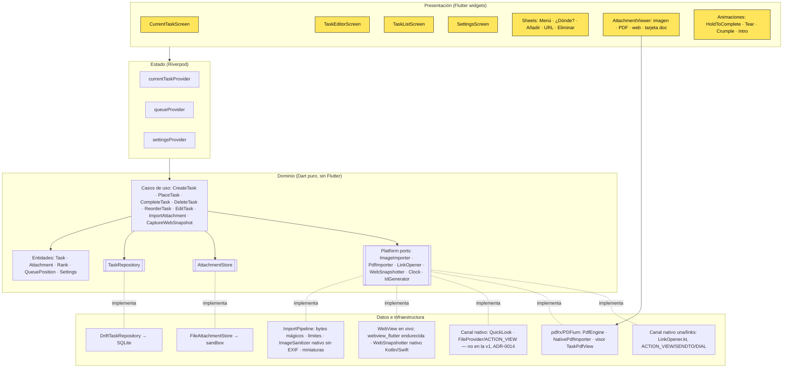
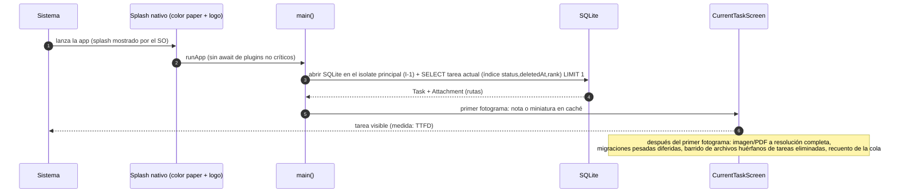
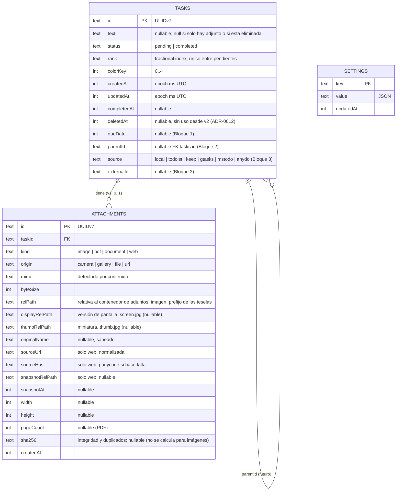
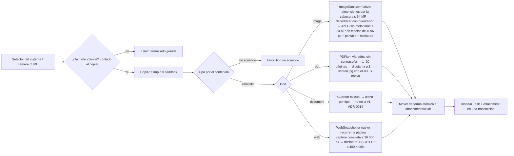

# Arquitectura

> Estado: diseño para la v1, pendiente de validación en los spikes (ADR-0001). Etiquetas: **[Hecho]**, **[Suposición]** y **[Pendiente]**.

## 1. Capas


```mermaid
flowchart TB
  subgraph UI["Presentación (Flutter widgets)"]
    S1[CurrentTaskScreen]:::ui
    S2[TaskEditorScreen]:::ui
    S3[TaskListScreen]:::ui
    S4[SettingsScreen]:::ui
    SH[Sheets: Menú · ¿Dónde? · Añadir · URL · Eliminar]:::ui
    V[AttachmentViewer: imagen · PDF · web · tarjeta doc]:::ui
    FX[Animaciones: HoldToComplete · Tear · Crumple · Intro]:::ui
  end
  subgraph STATE["Estado (Riverpod)"]
    P1[currentTaskProvider]
    P2[queueProvider]
    P3[settingsProvider]
  end
  subgraph DOMAIN["Dominio (Dart puro, sin Flutter)"]
    UC[Casos de uso: CreateTask · PlaceTask · CompleteTask · DeleteTask · ReorderTask · EditTask · ImportAttachment · CaptureWebSnapshot]
    E[Entidades: Task · Attachment · Rank · QueuePosition · Settings]
    RP[[TaskRepository]]
    AS[[AttachmentStore]]
    PF[[Platform ports: ImageImporter · PdfImporter · LinkOpener · WebSnapshotter · Clock · IdGenerator]]
  end
  subgraph DATA["Datos e infraestructura"]
    DR[DriftTaskRepository → SQLite]
    FS[FileAttachmentStore → sandbox]
    IMP[ImportPipeline: bytes mágicos · límites · ImageSanitizer nativo sin EXIF · miniaturas]
    WV[WebView en vivo: webview_flutter endurecida · WebSnapshotter nativo Kotlin/Swift]
    PDF[pdfrx/PDFium: PdfEngine · NativePdfImporter · visor TaskPdfView]
    LNK[Canal nativo una/links: LinkOpener.kt, ACTION_VIEW/SENDTO/DIAL]
    NV[Canal nativo: QuickLook · FileProvider/ACTION_VIEW — no en la v1, ADR-0014]
  end
  UI --> STATE --> UC
  UC --> E
  UC --> RP & AS & PF
  RP -.implementa.- DR
  AS -.implementa.- FS
  PF -.implementa.- IMP & WV & NV & PDF & LNK
  V --> PDF
  classDef ui fill:#FFE55C,stroke:#111,color:#111
```

**Reglas de dependencia:** `presentation → state → domain ← data`. El dominio **no importa** Flutter, drift ni plugins, y se prueba con tests de Dart puro. Toda la persistencia pasa por `TaskRepository` y `AttachmentStore` (así se puede añadir sincronización sin reescribir los casos de uso).

**Estructura prevista de `app/lib/`** (por funcionalidad y capas):

```
lib/
  app/            arranque, router, AppIdentity, FeatureFlags, tema (tokens.g.dart)
  l10n/           app_es.arb, app_en.arb (textos, fechas, plurales)
  domain/         entities/, usecases/, ports/ (interfaces)
  data/           db/ (drift: tablas, migraciones), attachments/, import/, web/, platform/
  features/
    current_task/ first_run/ editor/ placement/ complete/ delete/ task_list/ attachments/ settings/
  ui/             componentes base con tokens (StickyNote, BrutalButton, Sheet, Toast…)
```

**[Suposición]** Riverpod (sin generación de código) como gestor de estado, porque permite probar sin widgets y sobrescribir dependencias en los tests. Se confirma en el `plan.md` de la spec 001.

## 2. Arranque rápido (P2: < 1 s hasta ver la tarea actual)


```mermaid
sequenceDiagram
  autonumber
  participant OS as Sistema
  participant N as Splash nativo (color paper + logo)
  participant M as main()
  participant DB as SQLite
  participant UI as CurrentTaskScreen
  OS->>N: lanza la app (splash mostrado por el SO)
  N->>M: runApp (sin await de plugins no críticos)
  M->>DB: abrir SQLite en el isolate principal (I-1) + SELECT tarea actual (índice status,deletedAt,rank) LIMIT 1
  DB-->>M: Task + Attachment (rutas)
  M->>UI: primer fotograma: nota o miniatura en caché
  UI-->>OS: tarea visible (medida: TTFD)
  Note over UI: después del primer fotograma: imagen/PDF a resolución completa,<br/>migraciones pesadas diferidas, barrido de archivos huérfanos de tareas eliminadas, recuento de la cola
```

- Fuentes empaquetadas (ya en el primer fotograma) y *shaders* precompilados.
- Imagen: se muestra primero la **versión de pantalla** pregenerada al importar, **JPEG al ancho físico exacto de la pantalla** (I-2; ~20 % más rápido que PNG en S1); el original se carga al hacer zoom.
- PDF (spec 008): antes de `runApp`, y solo si la tarea actual tiene PDF (tope de 1 s), se leen `position.json` y se decodifica `screen.jpg`, que es **lo que se ve desde la última posición**; el primer fotograma la pinta y pdfrx abre el documento debajo, sin quitarla hasta que ha dibujado las páginas visibles (detalle en §4, «PDF»).
- Web: captura mostrada al instante; la WebView en vivo se inicializa detrás.
- Bienvenida (R1) **solo** en el primer uso; nunca retrasa R8.
- Migraciones: las de esquema se ejecutan al abrir la BD (rápidas); las de datos pesadas se trocean en segundo plano.

## 3. Modelo de datos (esquema v1)


```mermaid
erDiagram
  TASKS ||--o{ ATTACHMENTS : "tiene (v1: 0..1)"
  TASKS ||--o{ TASKS : "parentId (futuro)"
  TASKS {
    text id PK "UUIDv7"
    text text "nullable; null si solo hay adjunto o si está eliminada"
    text status "pending | completed"
    text rank "fractional index, único entre pendientes"
    int colorKey "0..4"
    int createdAt "epoch ms UTC"
    int updatedAt "epoch ms UTC"
    int completedAt "nullable"
    int deletedAt "nullable, sin uso desde v2 (ADR-0012)"
    int dueDate "nullable (Bloque 1)"
    text parentId "nullable FK tasks.id (Bloque 2)"
    text source "local | todoist | keep | gtasks | mstodo | anydo (Bloque 3)"
    text externalId "nullable (Bloque 3)"
  }
  ATTACHMENTS {
    text id PK "UUIDv7"
    text taskId FK
    text kind "image | pdf | document | web"
    text origin "camera | gallery | file | url"
    text mime "detectado por contenido"
    int byteSize
    text relPath "relativa al contenedor de adjuntos; imagen: prefijo de las teselas"
    text displayRelPath "versión de pantalla, screen.jpg (nullable)"
    text thumbRelPath "miniatura, thumb.jpg (nullable)"
    text originalName "nullable, saneado"
    text sourceUrl "solo web; normalizada"
    text sourceHost "solo web; punycode si hace falta"
    text snapshotRelPath "solo web; nullable"
    int snapshotAt "nullable"
    int width "nullable"
    int height "nullable"
    int pageCount "nullable (PDF)"
    text sha256 "integridad y duplicados; nullable (no se calcula para imágenes)"
    int createdAt
  }
  SETTINGS {
    text key PK
    text value "JSON"
    int updatedAt
  }
```

- **Índices:** `tasks(status, deletedAt, rank)`; `attachments(taskId)`; `tasks(parentId)` y `tasks(source, externalId)` único parcial (futuro).
- **Invariantes (se prueban en el dominio):** una tarea tiene `text` no vacío **o** un adjunto (o ambos); una tarea web no lleva texto en la v1 (como el prototipo); `rank` es único entre las pendientes; desde el esquema v2 (ADR-0012) solo se guardan tareas pendientes: completar y eliminar las borran, y `status`, `completedAt` y `deletedAt` quedan sin uso.
- **Ajustes v1:** `locale` (`system | es | en`), `keepScreenOn` (bool, true), `palette` (`classic`), `firstRunDone` (bool), `hasEverHadTasks` (bool: ya se guardó alguna tarea; decide entre "Todo hecho." y el editor de la primera tarea; lo activa `insert` en su transacción, ADR-0012), `notifications` (reservado). Las claves se versionan con el esquema.
- **Versionado:** `schemaVersion = 2` (v2, ADR-0012: la migración borra una vez las completadas y las marcas de borrado, y activa `hasEverHadTasks`; mismas tablas). Cada cambio → nueva versión, captura en `app/drift_schemas/`, paso de migración y **test de migración** generado (ADR-0002).

### Casos de uso ↔ reglas

| Caso de uso | Efecto en los datos | Regla |
|---|---|---|
| `CreateTask(text, position)` | inserta con `rank` antes de la primera (`top`) o después de la última (`end`); `colorKey` ≠ el de la actual | R3, R4 |
| `CreateTask(attachment)` | importa el archivo → inserta **top** siempre | R5 |
| `CompleteTask(current)` | `remove(id)`: borra la fila y las de sus adjuntos en una transacción; después, sus archivos (`AttachmentJanitor`). Sin histórico | R9, ADR-0012 |
| `DeleteTask(id)` | `remove(id)`, igual que completar; sin marca y sin deshacer | R10, ADR-0012 |
| `ReorderTask(id, newIndex)` | nuevo `rank` entre los vecinos; el índice 0 ⇒ pasa a ser la actual | R13 |
| `EditTask(id, text, attachment?)` | actualiza y conserva `rank` y `colorKey` | R11, R13 |

## 4. Adjuntos: canal de importación


```mermaid
flowchart LR
  A[Selector del sistema / cámara / URL] --> C{¿Tamaño ≤ límite? contado al copiar}
  C -- no --> Y[Error: demasiado grande]
  C -- sí --> D[Copiar a tmp del sandbox]
  D --> B{Tipo por el contenido}
  B -- no admitido --> X[Error: tipo no admitido]
  B -- admitido --> E{kind}
  E -- image --> F[ImageSanitizer nativo: dimensiones por la cabecera ≤ 64 MP → decodificar con orientación → JPEG sin metadatos ≤ 24 MP en teselas de 4096 px + pantalla + miniatura]
  E -- pdf --> G[PDFium vía pdfrx, sin contraseña → 1–20 páginas → dibujar la p.1 → screen.jpg con el JPEG nativo]
  E -- document --> H[Guardar tal cual → icono por tipo — no en la v1, ADR-0014]
  E -- web --> I[WebSnapshotter nativo → recorrer la página → captura completa ≤ 16 000 px → miniatura; SSL/HTTP ≥ 400 = fallo]
  F & G & H & I --> J[Mover de forma atómica a attachments/uuid/]
  J --> K[Insertar Task + Attachment en una transacción]
```

Límites: imagen 30 MB y 64 MP (se guarda como mucho a 24 MP), **PDF 10 MB** (D18; en la v1 el único documento, ADR-0014), captura web 20 000 px de alto. La importación no bloquea la UI (las imágenes y el JPEG del PDF, en un hilo nativo; PDFium, en el *isolate* de trabajo de pdfrx) y cancelar limpia los temporales. **[Hecho]** El `sha256` de la tabla no se calcula todavía (ni imágenes ni PDF): queda nulo. Detalle de seguridad en `docs/security/threat-model.md`.

### Imágenes (spec 007)

- **Rutas** (Android; almacenamiento privado de la app):
  - guardadas: `files/attachments/<id>/` (`getApplicationSupportDirectory`), con `full-<fila>-<columna>.jpg` (versión completa en teselas), `screen.jpg` (versión de pantalla) y `thumb.jpg` (miniatura);
  - preparación: `cache/import/<id>/` (`getTemporaryDirectory`); la copia del original (`source`) se borra en cuanto se limpia;
  - la BD, en `app_flutter/una.sqlite`. Las copias de seguridad llevan la BD y no las imágenes (ADR-0004, revisión de la spec 007).
- **Versión completa:** JPEG recodificado desde los píxeles (sin EXIF, GPS, XMP ni ningún otro metadato), orientado y en sRGB; se reduce solo si pasa de **24 MP**, sin límite de lado (una captura de 1080 × 20 000 se guarda entera). Se trocea en **teselas de 4096 px** como máximo (`ImageTiles`), porque la GPU no dibuja texturas mucho mayores; una foto de 12 MP es una sola tesela.
- **Versión de pantalla:** al ancho de la pantalla en vertical, en píxeles físicos, sin ampliar ni perder los lados; si es más alta, solo la parte de arriba. La dibuja la tarea actual en el primer fotograma (CA-001-09) y encima se colocan las teselas.
- **Miniatura:** cuadrada, recortada, de 176 px (44 dp × 4).
- **Rechazo antes de decodificar:** el tipo, por los primeros bytes (`sniffImageType`); las dimensiones, por la cabecera (más de 64 MP → error, sin reservar memoria para los píxeles). 20 s como máximo.
- **Tarea actual con imagen** (sin visor, ADR-0013): coloca las teselas al ancho de la pantalla, con desplazamiento vertical, y las decodifica a esa resolución (`AttachmentTiles`), así que la memoria no depende del tamaño original. El pellizco amplía esa imagen y vuelve al soltar.
- **Archivos que faltan** (CA-007-19): si faltan la versión de pantalla o la miniatura, se regeneran desde las teselas (`regenerateDerived`); si falta la completa, "Adjunto no disponible".
- **Borrado:** un solo servicio, `AttachmentJanitor`. El barrido (2 s después del primer fotograma) borra los adjuntos sin tarea y las preparaciones abandonadas; `ImportRegistry` protege las importaciones en curso.
- **Web de pruebas:** `WebImageImporter` hace lo mismo con el selector del navegador y un `canvas`, todo en memoria (`MemoryAttachmentStore`); HEIC no se admite.

### PDF (spec 008, ADR-0014)

- **Canal de importación:** el mismo de las imágenes (`una/images`, `ImageImport.kt`) con el origen `file`: `ACTION_OPEN_DOCUMENT` con `application/pdf` (sin permisos), el nombre visible (`OpenableColumns`, solo para mostrarlo), la copia acotada a **10 MB** contada al copiar y los primeros 1024 bytes para el tipo. Después, en Dart (`ImportPdf` + `NativePdfImporter`): el tipo por el contenido (`isPdf`: `%PDF-` en los primeros 1024 bytes y nada de marcado delante), abrir con PDFium **sin contraseña** (si la pide → `protected`), **1–20 páginas** (`tooManyPages`), dibujar la página 1 y codificarla como `screen.jpg` con `encodeJpeg` nativo (en Dart es 15 veces más lento). Cualquier error del motor = ilegible. 20 s como máximo. El nombre se sanea (`sanitizeFileName`: sin rutas, controles ni marcas bidi, 120 caracteres) y nunca se registra.
- **Rutas:** `files/attachments/<id>/` con `document.pdf` (el archivo tal cual, con nombre generado), `screen.jpg` (versión de pantalla) y `position.json` (última posición: página + fracción, escrita de forma atómica). Sin miniatura: el listado muestra la insignia "PDF". Sin cambio de esquema: `kind = pdf`, `origin = file`, `originalName` y `pageCount` en columnas que ya existían; `relPath` → `document.pdf`, `displayRelPath` → `screen.jpg`.
- **Motor:** `pdfrx` (PDFium de `chromium/7811`, sin V8: no ejecuta JavaScript ni rellena formularios), fijado por sha256 en `tools/pdfium.lock` y comprobado en CI (`threat-model.md §5`). Solo se abren archivos ya copiados (`openFile`/`openData`), nunca URL. En la web de pruebas, PDFium va como WASM de los assets del paquete (`MemoryPdfImporter`/`WebPdfImporter`, en memoria).
- **Tarea actual con PDF** (`TaskPdfView`): páginas al ancho con `FitWidthSizing`, zoom ×1–×4 que se queda (pasos ×1,5/×2,5/×4 por acciones y teclas), la banda del texto como capa que sigue a la matriz del visor en un hueco sobre la página 1 y la franja fija fuera del visor. La semántica propia de pdfrx se excluye y la sustituye `PdfSemanticsLayer` (un nodo por página visible con su texto y sus acciones, y un nodo enfocable por enlace).
- **Arranque (CA-008-08):** `pdf_boot.dart` lee `position.json` y decodifica `screen.jpg` antes de `runApp`; `TaskPdfFace` la pinta encima del visor hasta que pdfrx avisa de que ha dibujado (`onDocumentLoadFinished`), al primer toque o a los 10 s. Al salir de la tarea o pasar a segundo plano se guarda la posición y, si cambió, se redibuja `screen.jpg` con lo que se ve desde ella (`PdfEngine.renderView`).
- **Enlaces (CA-008-12):** `classifyLink` (dominio) decide: página interna, `http(s)` (sin `usuario@`, dominio en punycode si mezcla alfabetos), `mailto:` rehecho solo con destinatarios y asunto, `tel:` solo el número; el resto se bloquea. Tras la confirmación, el canal `una/links` (`LinkOpener.kt`) lanza `ACTION_VIEW` + `BROWSABLE`, `ACTION_SENDTO` o `ACTION_DIAL` solo si `resolveActivity` encuentra app (I-7; `<queries>` para esos tres).
- **Giro:** `AttachmentRotation` (Kotlin y Dart) sirve para imagen y PDF; sin "Volver a vertical" (ADR-0015).
- **Archivos que faltan (CA-008-18):** si falta `screen.jpg`, se redibuja desde el PDF en la última posición (`PdfImporter.renderScreen`); si falta o no se abre `document.pdf`, "Adjunto no disponible".
- **Completar y eliminar:** la cara de la rotura y del arrugado es una imagen fija de lo que se ve (`PdfFaceCapture`), no `screen.jpg`. El borrado es el mismo de la 007 (`AttachmentJanitor`: el directorio entero).

### Decisiones de implementación de los spikes (F1)

| ID | Decisión | Evidencia |
|---|---|---|
| I-1 | La consulta de arranque usa SQLite en el **isolate principal**; las escrituras pesadas van a un isolate en segundo plano después del primer fotograma | S1: de ~900 ms a ~80 ms en el emulador |
| I-2 | Versión de pantalla de las imágenes en **JPEG al ancho físico** de la pantalla | S1: −20 % frente a PNG |
| I-3 | **Precapturar** la nota actual tras el primer fotograma (o `ImageFilter.shader` sin captura) para completar y eliminar | S2: primer fotograma de 40–105 ms |
| I-4 | **`ImageSanitizer` nativo** (Android `ImageDecoder` + `Bitmap.compress`; iOS ImageIO) | S5: 12 MP en 0,77 s frente a 12 s en Dart puro |
| I-5 | Captura web: SSL inválido (siempre cancelado) y HTTP ≥ 400 del marco principal = fallo | S4: sin esto se guardaba una página en blanco |
| I-6 | Captura web: recorrer la página por pasos antes de capturar | S4: huecos en webs que animan al hacer *scroll* |
| I-7 | Visor del sistema: comprobar si hay app antes de lanzar el intent y mostrar nuestro mensaje (no se usa en la v1, ADR-0014; aplica a los enlaces `mailto:`/`tel:` del PDF) | S3: selector del sistema vacío y en inglés |

## 5. Plataforma e integración nativa

| Necesidad | iOS | Android |
|---|---|---|
| Fotos y archivos sin permisos amplios | PHPicker, UIDocumentPicker | Photo Picker, SAF (`ACTION_OPEN_DOCUMENT`) |
| Cámara | Permiso de cámara **al pulsar "Hacer foto"** | Ídem (o intent de cámara del sistema, que no necesita permiso) |
| Visor del sistema (no en la v1, ADR-0014) | QLPreviewController | `ACTION_VIEW` + FileProvider |
| Pantalla encendida | `isIdleTimerDisabled` mientras hay un adjunto visible | `FLAG_KEEP_SCREEN_ON` |
| Red | ATS por defecto (sin excepciones) | `network_security_config`: `cleartextTrafficPermitted=false` |
| Backup | Application Support incluido, Caches excluido | `dataExtractionRules` / `fullBackupContent` (ADR-0004) |
| Widgets (futuro) | WidgetKit (SwiftUI) + App Group | Glance/AppWidget + datos compartidos; puente `home_widget` |

## 6. Feature flags

`FeatureFlags` (constantes en compilación con `--dart-define`, sobrescribibles en desarrollo desde un menú oculto de debug):
`paletteThemes` (off), `historyScreen` (off), `dueDates` (off), `bulkCreate` (off), `imports` (off), `notifications` (off), `biometricLock` (off), `homeWidget` (off).
Regla: nada detrás de un flag llega a producción sin su spec aprobada.

## 7. Presupuestos de rendimiento y tamaño

| Métrica | Objetivo | Medición |
|---|---|---|
| Arranque en frío → tarea actual visible | p50 < 1,0 s, p90 < 1,3 s (Android de gama media); < 0,6 s (iPhone ≥ 12) | `integration_test` + marcas de tiempo; `flutter run --profile --trace-startup` |
| Arranque en caliente | < 300 ms | ídem |
| Animaciones | 60 fps, 0 fotogramas > 32 ms en el primer uso | DevTools / `FrameTiming` en un test de rendimiento |
| Abrir PDF (primera página) | < 500 ms | spike S3 |
| Tamaño de descarga | Android < 25 MB (por ABI, AAB); iOS < 40 MB | CI: cada APK de release por ABI, comprimido con `gzip -9` (las librerías nativas van sin comprimir en el APK; con PDFium, spec 008: 27 MB en disco y ~12,7 MB comprimido en arm64) |
| Memoria con imagen | La tarea actual con la imagen más grande que se guarda (24 MP) añade < 200 MB sobre la misma tarea con texto (decisión del propietario, 2026-09-27; el anterior, < 250 MB en total, era inalcanzable: la app ya ocupa ~350 MB de RSS en la pantalla principal del Xiaomi) | `dumpsys meminfo` (PSS y RSS totales, con la GPU) en un proceso nuevo |

## 8. Internacionalización

- `flutter gen-l10n` con ARB (`app_es.arb` como plantilla, `app_en.arb`); ICU para plurales y selectores; fechas con `intl` en el idioma activo.
- Resolución: ajuste `locale` ≠ `system` → ese idioma. Si no: cualquier `es-*` del dispositivo → `es`; el resto → `en` (R15).
- El nombre de la app es la clave `appName` + `AppIdentity`. El nombre nativo va en InfoPlist.strings (es/en) y `strings.xml` (values, values-es), generados desde una única fuente (`app/identity.yaml`).
- CI: test que compara las claves de ES y EN (sin huecos) y lint que prohíbe literales de texto en los widgets (`custom_lint` o un script).
