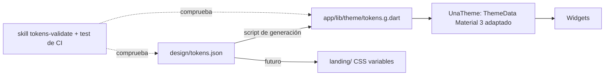

# Tokens de diseño

**Fuente única:** [`design/tokens.json`](../../design/tokens.json), en formato W3C Design Tokens (DTCG).
**Origen:** extraídos del prototipo (`design/prototype/Main.dc.html`) el 2026-09-24.

## Flujo

- Los valores **nunca** se escriben a mano en el código. Un test de CI compara `tokens.g.dart` con `tokens.json`, y un lint detecta colores literales (`Color(0x…)`) fuera del archivo generado.
- Material 3 se usa **solo como base** de componentes y accesibilidad: `ThemeData` se construye con los tokens y los componentes se sobrescriben (sin radios, bordes de 3 px, sombras duras).
- Preparado para *theming*: la paleta activa (`classic`, `neon`, `mono`) es un ajuste. Cada tarea guarda su índice de color (`colorKey`), no el valor.

## Grupos

| Grupo | Contenido | Notas |
|---|---|---|
| `color` | ink, paper, line, surface, textMuted, disabled, error, dangerFill, paperFiber, onInk, scrim, placeholder, pressed | `error #B3241A` para texto; `dangerFill #FF5A4E` para el botón Eliminar (texto en ink) |
| `palette` | `classic` (por defecto), `neon`, `mono` × 5 índices | Una tarea nueva nunca repite el color de la tarea actual |
| `font` | Archivo (500–900), Space Mono (400/700); tamaños; interletrado; cortes de longitud de nota | Las fuentes se **empaquetan** (licencia OFL); nunca se cargan de Google Fonts |
| `space` | 2 · 4 · 8 · 12 · 16 · 20 · 24 · 28 · 40 | 24 es el margen lateral |
| `size` | objetivo táctil de 44, icono de 22, trazo de 2,4 | En Android se usan 48 dp por las pautas de Material |
| `border` | ancho de 3, radio de 0 | |
| `shadow` | sombras duras sin desenfoque: 5/1 (botón), 3 (icono), 4/10/9 (listado) | |
| `motion` | duraciones y curvas del prototipo; ventana de deshacer de 6 s | Con "reducir movimiento": fundido de 400 ms |

## Tamaño del texto de la tarea

Longitud del texto → token: `< 40` → `noteXL 50` · `< 90` → `noteL 40` · `< 160` → `noteM 31` · resto → `noteS 26`.
Se multiplica por el `textScaler` del sistema con un **límite de ×1,6** para las notas (el texto sigue cupiendo con desplazamiento vertical). El resto de textos escala sin límite, con la maquetación preparada para ello.

## Contraste (WCAG 2.2 AA), calculado el 2026-09-24

| Combinación | Ratio | Resultado |
|---|---|---|
| ink sobre paper | 16,74 | AA |
| ink sobre cualquier nota (classic) | 9,84 – 14,94 | AA |
| ink sobre neon | 7,32 – 17,28 | AA |
| textMuted sobre paper / surface | 6,81 / 7,68 | AA |
| textMuted sobre nota rosa `#FF9EC4` | 4,00 | **Solo texto grande** → sobre las notas, el texto secundario usa `ink` |
| textMuted sobre neon rosa / naranja | 2,98 / 3,71 | **Falla** → misma regla |
| error sobre paper / surface | 5,85 / 6,60 | AA |
| ink sobre dangerFill | 6,14 | AA |
| onInk sobre ink | 18,88 | AA |
| placeholder 0,42 (prototipo) | 2,30 – 2,75 | **Falla** → se sube a **0,66** (≥ 4,59) |

`line` y `disabled` no transmiten información por sí solos: los controles siempre tienen borde `ink`.

## Validación

- La skill `/tokens-validate` y un test de CI comprueban que el JSON es válido, que están todos los grupos obligatorios, que el contraste de la tabla anterior se cumple y que el archivo generado está sincronizado.
